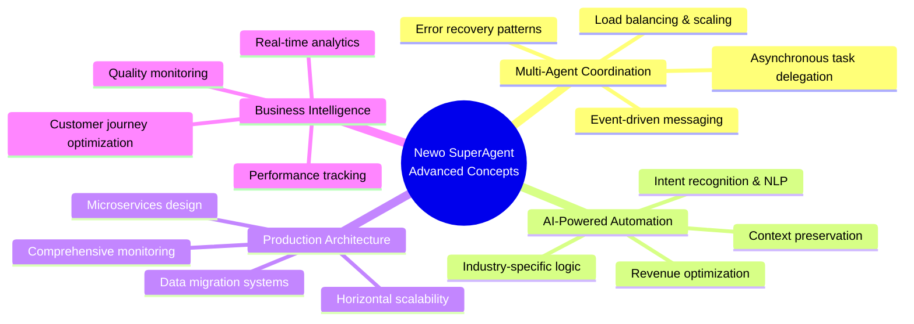

# Executive Summary: Newo SuperAgent Multi-Agent System

## What This Project Is

The **Newo SuperAgent Study** is a sophisticated **multi-agent conversational AI system** designed for business automation, particularly in hospitality, healthcare, and service industries. It represents a production-ready conversational AI platform that can handle complex customer interactions across multiple communication channels (phone, SMS, email, chat) while orchestrating backend business processes.

## Core Architecture

This is an **event-driven, microservices-based AI system** with 9 specialized agents that work together to provide comprehensive customer service automation:

### System Overview Diagram

```mermaid
graph TB
    subgraph "Customer Channels"
        Phone[📞 Phone/VoIP]
        SMS[💬 SMS]
        Chat[💻 Web Chat]
        Email[📧 Email]
        API[🔗 API/Webhook]
    end
    
    subgraph "Core Agent Ecosystem"
        CA[🤖 ConvoAgent<br/>Main Customer Interface]
        TM[⚙️ TaskManager<br/>Orchestration Engine]
        GMA[🛠️ GeneralManagerAgent<br/>System Administration]
    end
    
    subgraph "Specialized Workers"
        ACA[🔍 ApifyCheckAvailabilityWorker<br/>External Booking Integration]
        SW[📱 SmsWorker<br/>SMS Processing]
        MW[🎯 MagicWorker<br/>Complex Task Execution]
        MLA[🏢 MultiLocationAgent<br/>Multi-Location Support]
    end
    
    subgraph "Support Agents"
        TA[🧪 TestAgent<br/>Development & Testing]
        SAP[📋 SuperAgentProject<br/>Metadata Management]
    end
    
    subgraph "External Systems"
        Booking[🏨 Booking Systems<br/>Hotels, Restaurants]
        Payment[💳 Payment Processors]
        Calendar[📅 Calendar Systems<br/>Google, Outlook]
        CRM[📊 CRM Systems]
        Apify[🕷️ Apify Platform<br/>Web Scraping]
    end
    
    Phone --> CA
    SMS --> CA
    Chat --> CA
    Email --> CA
    API --> CA
    
    CA <--> TM
    CA <--> GMA
    TM --> ACA
    TM --> SW
    TM --> MW
    TM --> MLA
    
    ACA --> Booking
    ACA --> Apify
    SW --> SMS
    MW --> Payment
    MW --> Calendar
    MW --> CRM
    MLA --> Booking
    
    TA -.-> CA
    SAP -.-> GMA
    
    style CA fill:#e3f2fd,stroke:#1976d2,stroke-width:3px
    style TM fill:#f3e5f5,stroke:#7b1fa2,stroke-width:2px
    style GMA fill:#e8f5e8,stroke:#388e3c,stroke-width:2px
    style ACA fill:#fff3e0,stroke:#f57c00,stroke-width:2px
    style SW fill:#fff3e0,stroke:#f57c00,stroke-width:2px
    style MW fill:#fff3e0,stroke:#f57c00,stroke-width:2px
    style MLA fill:#fff3e0,stroke:#f57c00,stroke-width:2px
```

### Agent Ecosystem Details

#### 🤖 **ConvoAgent** (Primary Customer Interface)
- **25+ Business Flows**: Comprehensive conversation management across all customer touchpoints
- **Multi-Channel Support**: Phone, SMS, Email, Chat, API webhooks with channel-specific optimization
- **Industry Templates**: Pre-configured behaviors for hospitality, healthcare, cleaning, catering
- **AI-Powered Intent Recognition**: Advanced NLP for understanding customer requests and context
- **Memory & Context Management**: Persistent customer history and session state management
- **Tool Integration**: Orchestrates calls to specialized workers and external systems

#### ⚙️ **TaskManager** (Orchestration Engine)
- **Asynchronous Task Coordination**: Manages background processes and long-running operations
- **Worker Load Balancing**: Intelligent distribution of tasks across specialized agents
- **Retry Logic & Error Handling**: Robust error recovery with exponential backoff
- **Scheduled Execution**: Support for both immediate (ASAP) and time-delayed task execution
- **Task Lifecycle Management**: Complete tracking from creation to completion

#### 🛠️ **GeneralManagerAgent** (System Administration)
- **Account Onboarding**: Automated business setup and configuration
- **Industry Template Configuration**: Deployment of industry-specific AI behaviors
- **Migration Management**: Version updates and data migrations (50+ migration scripts)
- **Feature Flag Management**: A/B testing and gradual feature rollouts
- **Business Intelligence Setup**: Analytics and reporting configuration

#### Specialized Worker Agents:
- **🔍 ApifyCheckAvailabilityWorker**: Real-time booking system integration with external availability APIs
- **📱 SmsWorker**: SMS gateway integration with template processing and delivery tracking
- **🎯 MagicWorker**: Complex multi-step task execution with external service coordination
- **🏢 MultiLocationAgent**: Multi-location business context switching and location-specific configuration

#### Support & Development Agents:
- **🧪 TestAgent**: Comprehensive testing framework with automated conversation validation
- **📋 SuperAgentProject**: Version control, metadata management, and project lifecycle

## Key Capabilities

### Business Process Automation
- **Appointment Scheduling**: Complete booking workflows with availability checking
- **Customer Support**: Multi-channel customer service with intelligent routing
- **Cancellation Management**: Automated booking cancellation and modification
- **Information Delivery**: SMS/Email notifications and updates
- **Multi-Location Support**: Seamless switching between business locations

### Technical Features
- **Multi-Channel Communication**: Phone, SMS, Email, Chat, API webhooks
- **Event-Driven Architecture**: Decoupled agents communicating via system events
- **External Integrations**: Apify, booking systems, payment processors, calendars
- **Real-Time Processing**: Live conversation handling with context preservation
- **Scalable Design**: Worker pool architecture with load distribution

### Industry Specialization
- **Hospitality**: Restaurant reservations, hotel bookings
- **Healthcare**: Appointment scheduling, patient communication
- **Services**: Cleaning, catering, maintenance scheduling
- **Multi-Industry Templates**: Configurable for various business types

## System Value

### For Developers
- **Modular Architecture**: Each agent has clear responsibilities and interfaces
- **Extensible Design**: New business flows can be added without affecting core logic
- **Event-Driven**: Loose coupling enables independent agent development
- **Industry Templates**: Pre-built configurations for common business types

### For Businesses
- **24/7 Customer Service**: Automated handling of common customer requests
- **Multi-Channel Presence**: Consistent experience across all communication platforms
- **Process Automation**: Reduces manual work for booking, scheduling, and communication
- **Scalability**: Supports business growth with multi-location capabilities

## How to Approach This Project

### Understanding the System
1. **Start with ConvoAgent**: The main customer interaction hub
2. **Study flows.yaml**: Understand the event system and agent communication
3. **Examine business flows**: Look at specific use cases like scheduling or cancellation
4. **Follow the data flow**: See how information passes between agents and external systems

### Adding New Functionality
1. **Create new flows**: Add specialized business capabilities as flows within ConvoAgent
2. **Develop specialized agents**: Build new worker agents for specific business needs
3. **Extend event system**: Add new event types for inter-agent communication
4. **Integrate external systems**: Connect new APIs and services through workers

### Key Entry Points for Development
- **ConvoAgent/CAMainFlow/**: Start here for conversation logic
- **flows.yaml**: Central event configuration and routing
- **GeneralManagerAgent/**: System configuration and templates
- **TaskManager/**: Background task coordination

## Success Factors

This system demonstrates:
- **Mature Architecture**: Production-ready with error handling and reliability features
- **Business Focus**: Domain-specific capabilities for real business scenarios  
- **Technical Excellence**: Event-driven design with proper separation of concerns
- **Extensibility**: Clear patterns for adding new capabilities and integrations

## Production-Ready Multi-Agent Platform

The Newo SuperAgent system represents a **mature, enterprise-grade approach** to building conversational AI platforms for real business applications. Its sophisticated event-driven architecture, comprehensive error handling, and industry-focused design demonstrate advanced patterns in:

### **🏗️ Architectural Excellence**
- **Event-Driven Design**: 100+ event types with intelligent routing and error recovery
- **Microservices Pattern**: 9 specialized agents with clear separation of concerns
- **Scalable Communication**: Asynchronous processing with queue management
- **Industry Templates**: Pre-built configurations accelerating deployment across business types

### **💼 Business-Ready Features**
- **Multi-Industry Support**: Hospitality, healthcare, cleaning, catering with specialized logic
- **Revenue Intelligence**: Real-time conversation value tracking and analytics
- **Compliance Ready**: Industry-specific regulatory compliance and data handling
- **Performance Monitoring**: Comprehensive conversation quality and system health monitoring

### **🔧 Developer Excellence**
- **Skill-Based Architecture**: Atomic, reusable business logic components
- **Template System**: .guidance (AI) and .jinja (template) separation for maintainability
- **Comprehensive Testing**: TestAgent with automated conversation validation
- **Migration System**: Robust version management and data migration capabilities

### **🎓 Advanced System Concepts Demonstrated**

**Core Technical Innovations:**
- **🤖 Multi-Agent Coordination**: Sophisticated inter-agent communication with event-driven messaging
- **🏗️ Event-Driven Architecture**: Large-scale event routing with 100+ event types and intelligent queuing
- **🧠 AI-Powered Business Logic**: Industry-specific intelligence with context-aware decision making
- **🔄 Production Reliability**: Comprehensive error handling, retry logic, and system health monitoring
- **📊 Business Intelligence**: Real-time conversation analytics with revenue tracking and quality optimization

### **🎯 System Value Proposition**

This comprehensive analysis provides the foundation for understanding, extending, and leveraging one of the most sophisticated conversational AI platforms available for business automation. The Newo SuperAgent system serves as an **exemplary template** for building production-ready multi-agent systems that can:

- **🚀 Accelerate Business Automation**: Deploy industry-specific conversational AI in weeks, not months
- **📈 Scale Operations**: Handle thousands of concurrent conversations with intelligent load balancing
- **💰 Drive Revenue**: Real-time conversation value tracking and optimization
- **🔧 Enable Extension**: Clear architectural patterns for adding new capabilities and integrations
- **📊 Provide Intelligence**: Comprehensive analytics and business intelligence for continuous improvement

**Perfect for developers, architects, and businesses** looking to understand and implement sophisticated conversational AI solutions that deliver real business value.