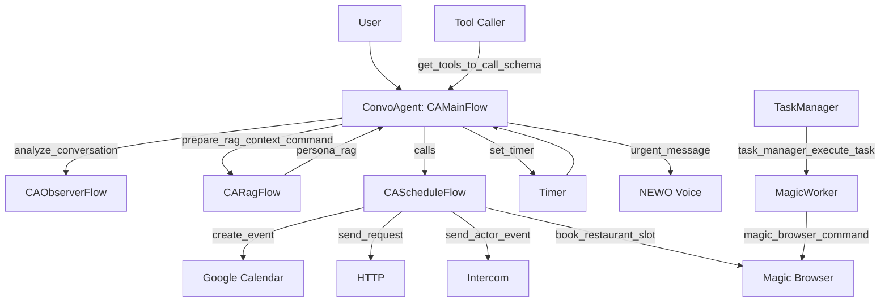

### Agents and Flows

A practical map of the system: who does what, and how they talk to each other.

#### ConvoAgent
- `CAMainFlow` — conversation lifecycle (start, reply, timers, RAG hooks)
- `CAScheduleFlow` — booking orchestration (intercom/http/magic browser)
- `CAExecuteExternalTasksFlow` — SMS/email/calls/meetings via schemas
- `CAObserverFlow` — ongoing quality evaluation and actions
- `CAEndSessionFlow` — end-session report and webhooks
- `CARagFlow` — RAG topic selection and persona enrichment
- `CAAction*` — telephony actions (transfer, DTMF, voicemail)

#### GeneralManagerAgent
- `GMmainFlow` — onboarding, attributes, migrations, and scenarios

#### TaskManager
- `TMManageTasksFlow` — classify, schedule (interval/fireAt), message workers

#### MagicWorker
- `MWmainFlow` — bake/validate tasks, magic browser automation

#### SmsWorker
- `SWmainFlow` — SMS validation, actor creation, sending

#### ApifyCheckAvailabilityWorker
- `ACAMainFlow` — utilities for availability request/receive
