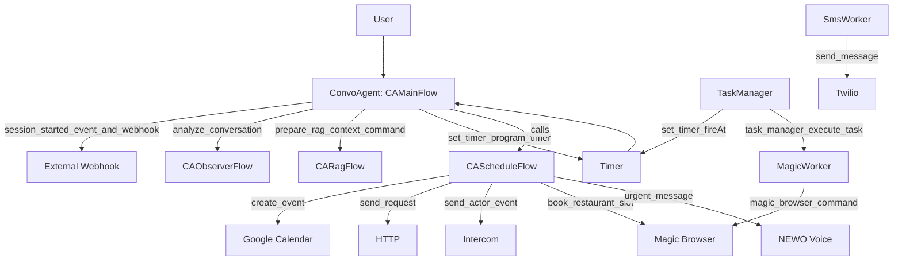
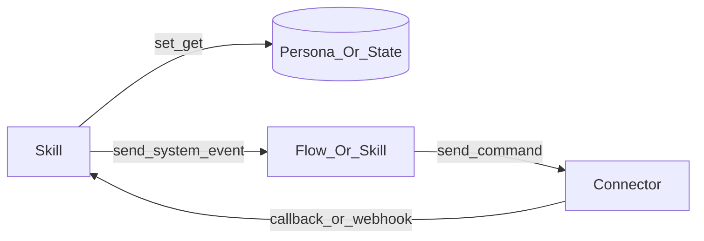

### Architecture Overview

- **Agents**: Directories under `project/` (e.g., `ConvoAgent`, `GeneralManagerAgent`, `MagicWorker`, `SmsWorker`, `ApifyCheckAvailabilityWorker`, `MultiLocationAgent`).
- **Flows**: Subfolders like `CAMainFlow`, `CAScheduleFlow`, etc. A flow hosts related skills.
- **Skills**: `.guidance` or `.jinja` scripts. Each is registered in `flows.yaml`.
- **Orchestration**: `SendSystemEvent(...)` (internal) and `SendCommand(...)` (external). Persona/actor state glues skills.

Key lifecycle (happy-path)
1) Session starts → add phone to pool, reset state, update meta, emit `session_started` and webhook.
2) User message → build fast prompt with RAG/thoughts, stream answer, emit `analyze_conversation`, clear buffers, optional follow-up timer.
3) Actions via flows → bookings, emails/SMS, transfers.
4) Long ops guarded by program_timer (`interval` or `fireAt`), results update user via `urgent_message`.
5) End-session summarization & reporting.

Layered model
- Interaction: actors (voice, SMS, chat), SendMessage
- Orchestration: events bus and flow calls
- Integration: connectors via SendCommand
- State: persona attributes, memory, transient state

Glossary
- Persona: user-specific durable record; use SetPersonaAttribute/GetPersonaAttribute
- Actor: communication endpoint (e.g., phone/SMS chat ID)
- Event: internal signal to orchestrate skills; side-effect free by design
- Command: external side effect via connectors (timers, HTTP, voice, SMS, calendar)
- Memory: retrieved conversation context via GetMemory(...)
