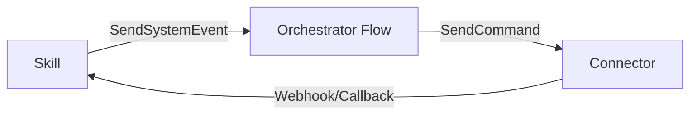

### Commands Catalog

System Events (SendSystemEvent)
- `session_started(actorId?)`
- `extend_session`
- `analyze_conversation(conversationChannel?, convoAgentAnswer?, toDate?)`
- `prepare_rag_context_command`, `prepare_injecting_data`
- `urgent_message(baseInstruction, uninterruptible?)`
- `book_slot(payload)`
- `worker_message(fromIdn, toIdn, message, ...)`
- `process_booking_fallback_custom(payloadMeta)`
- `task_manager_*` family: `task_manager_execute_task`, `task_manager_get_task_success`, `task_manager_get_task_error`
- `send_external_reply`, `handle_contact_details`

External Commands (SendCommand)
- program_timer
```guidance
{{SendCommand(commandIdn="set_timer", integrationIdn="program_timer", personaId=user_id, timerName="session_timer", interval="300", eventIdn="end_session")}}
```
- newo_voice
```guidance
{{SendCommand(commandIdn="set_turn_message", integrationIdn="newo_voice", connectorIdn="newo_voice_connector", instructions=prompt, actorId=last_convo_actor)}}
{{SendCommand(commandIdn="update_session", integrationIdn="newo_voice", connectorIdn="newo_voice_connector", instructions=prompt, actorId=last_convo_actor)}}
```
- twilio_messenger
```guidance
{{SendCommand(commandIdn="add_phone_to_pool", integrationIdn="twilio_messenger", connectorIdn="sms_connector")}}
```
- google_calendar
```guidance
{{SendCommand(commandIdn="create_event", integrationIdn="google_calendar", connectorIdn="calendar", eventId=uid, userPersonaId=user_id, startTime=time, eventDurationMinutes="60", title=title, attendees=attendees)}}
```
- http
```guidance
{{SendCommand(commandIdn="send_request", integrationIdn="http", connectorIdn="http_connector", method="POST", url=url, headers=headers, body=payload, targetAction="book_slot")}}
```
- customer_intercom
```guidance
{{SendCommand(commandIdn="get_or_create_actor", integrationIdn="customer_intercom", connectorIdn="connection", externalId=external_id, userPersonaId=userId)}}
{{SendCommand(commandIdn="send_actor_event", integrationIdn="customer_intercom", toActorId=intercom_actor, eventIdn="create_appointment", eventArguments=payload)}}
```
- magic_browser
```guidance
{{SendCommand(commandIdn="book_restaurant_slot", integrationIdn="magic_browser", connectorIdn="magic_browser_connector", payload=json.dumps(booking_details), targetAction="book_slot")}}
{{SendCommand(commandIdn="magic_browser_command", integrationIdn="magic_browser", connectorIdn="magic_browser_connector", session_name=session, payload=payload)}}
```
- api/webhook
```guidance
{{SendCommand(commandIdn="send_email", integrationIdn="api", connectorIdn="webhook", toEmail=email, subject=subject, bodyText=body)}}
{{SendCommand(commandIdn="onboarding_setup", integrationIdn="api", connectorIdn="webhook", customerIdn=customer_id)}}
```

Principles & tips
- **Idempotency**: use persona flags (e.g., `booking_submitted`) to prevent duplicates.
- **UX-safe timers**: extend follow-up timers before long operations to avoid premature replies.
- **Separation**: prefer events for orchestration; commands strictly for side effects.
- **Schema-first**: validate required fields before calling external systems.



Fields reference
- Common: `userPersonaId`, `actorId`, `toActorId`, `eventIdn`, `eventArguments`, `timerName`, `interval`, `method`, `headers`, `url`, `body`, `payload`, `targetAction`.
