# Interaction Diagrams: Newo SuperAgent System

## System Overview Diagram

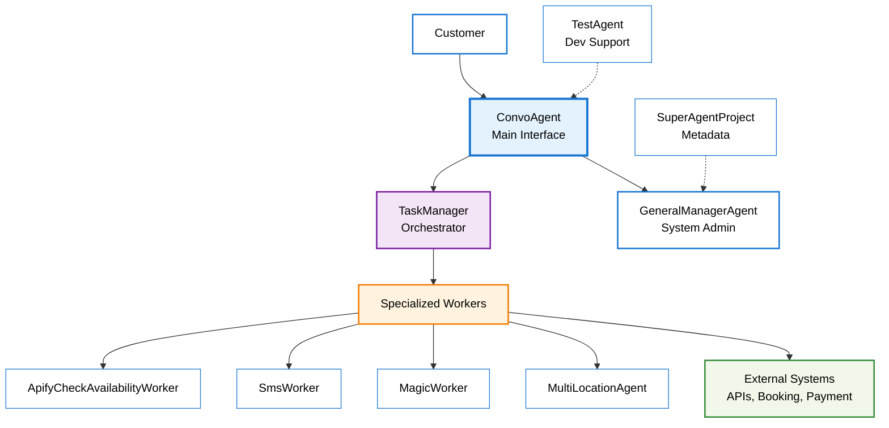
```mermaid
graph TB
    Customer[Customer] --> ConvoAgent[ConvoAgent<br/>Main Interface]
    ConvoAgent --> TaskManager[TaskManager<br/>Orchestrator]
    TaskManager --> Workers[Specialized Workers]
    
    Workers --> ApifyWorker[ApifyCheckAvailabilityWorker]
    Workers --> SmsWorker[SmsWorker]
    Workers --> MagicWorker[MagicWorker]
    Workers --> MultiLocationAgent[MultiLocationAgent]
    
    ConvoAgent --> GeneralManagerAgent[GeneralManagerAgent<br/>System Admin]
    
    Workers --> ExternalSystems[External Systems<br/>APIs, Booking, Payment]
    
    TestAgent[TestAgent<br/>Dev Support] -.-> ConvoAgent
    SuperAgentProject[SuperAgentProject<br/>Metadata] -.-> GeneralManagerAgent
    
    style ConvoAgent fill:#e3f2fd,stroke:#1976d2,stroke-width:3px,color:#000000
    style TaskManager fill:#f3e5f5,stroke:#7b1fa2,stroke-width:2px,color:#000000
    style Workers fill:#fff3e0,stroke:#f57c00,stroke-width:2px,color:#000000
    style ExternalSystems fill:#f1f8e9,stroke:#388e3c,stroke-width:2px,color:#000000
    style Customer fill:#ffffff,stroke:#1976d2,stroke-width:2px,color:#000000
    style GeneralManagerAgent fill:#ffffff,stroke:#1976d2,stroke-width:2px,color:#000000
    style ApifyWorker fill:#ffffff,stroke:#1976d2,stroke-width:1px,color:#000000
    style SmsWorker fill:#ffffff,stroke:#1976d2,stroke-width:1px,color:#000000
    style MagicWorker fill:#ffffff,stroke:#1976d2,stroke-width:1px,color:#000000
    style MultiLocationAgent fill:#ffffff,stroke:#1976d2,stroke-width:1px,color:#000000
    style TestAgent fill:#ffffff,stroke:#1976d2,stroke-width:1px,color:#000000
    style SuperAgentProject fill:#ffffff,stroke:#1976d2,stroke-width:1px,color:#000000
```

## Customer Interaction Flow

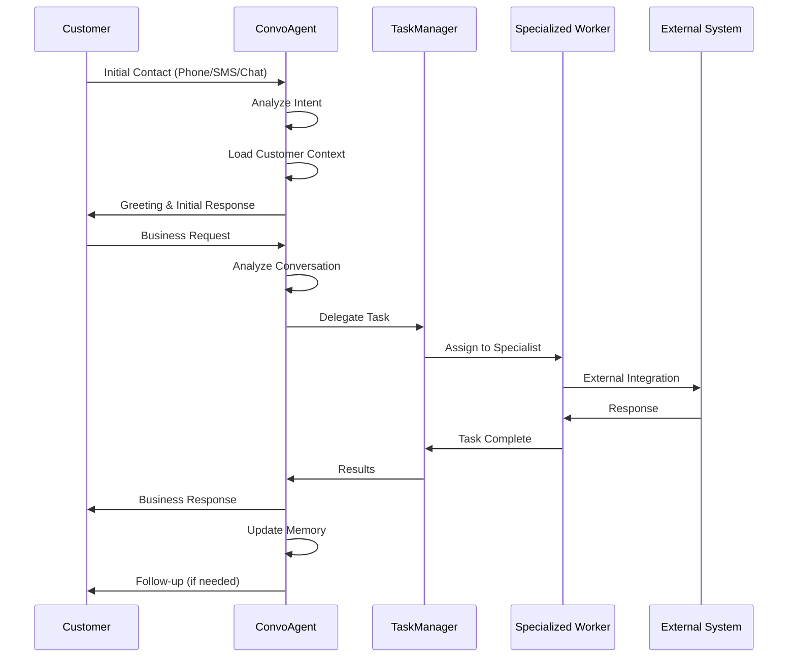
```mermaid
sequenceDiagram
    participant C as Customer
    participant CA as ConvoAgent
    participant TM as TaskManager
    participant W as Specialized Worker
    participant ES as External System
    
    C->>CA: Initial Contact (Phone/SMS/Chat)
    CA->>CA: Analyze Intent
    CA->>CA: Load Customer Context
    CA->>C: Greeting & Initial Response
    
    C->>CA: Business Request
    CA->>CA: Analyze Conversation
    CA->>TM: Delegate Task
    TM->>W: Assign to Specialist
    W->>ES: External Integration
    ES->>W: Response
    W->>TM: Task Complete
    TM->>CA: Results
    CA->>C: Business Response
    
    CA->>CA: Update Memory
    CA->>C: Follow-up (if needed)
```

## Event-Driven Communication Pattern

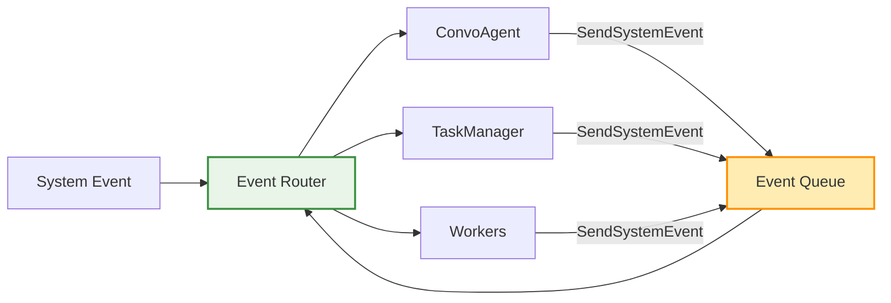
```mermaid
graph LR
    Event[System Event] --> EventRouter[Event Router]
    EventRouter --> ConvoAgent
    EventRouter --> TaskManager
    EventRouter --> Workers
    
    ConvoAgent --> |SendSystemEvent| EventQueue[Event Queue]
    TaskManager --> |SendSystemEvent| EventQueue
    Workers --> |SendSystemEvent| EventQueue
    
    EventQueue --> EventRouter
    
    style EventQueue fill:#ffecb3,stroke:#ff8f00,stroke-width:2px
    style EventRouter fill:#e8f5e8,stroke:#388e3c,stroke-width:2px
```

## ConvoAgent Internal Flow Architecture

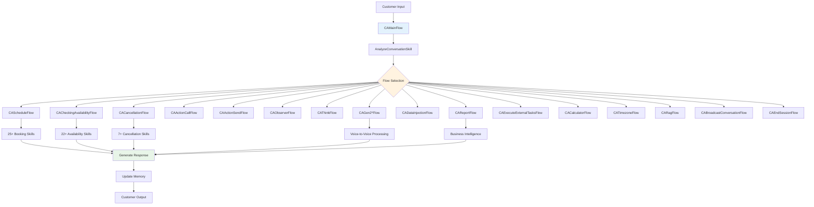
```mermaid
graph TD
    Input[Customer Input] --> MainFlow[CAMainFlow]
    MainFlow --> Analyze[AnalyzeConversationSkill]
    Analyze --> FlowRouter{Flow Selection}
    
    FlowRouter --> Schedule[CAScheduleFlow]
    FlowRouter --> Availability[CACheckingAvailabilityFlow]  
    FlowRouter --> Cancel[CACancellationFlow]
    FlowRouter --> ActionCall[CAActionCallFlow]
    FlowRouter --> ActionSend[CAActionSendFlow]
    FlowRouter --> Observer[CAObserverFlow]
    FlowRouter --> Think[CAThinkFlow]
    FlowRouter --> Report[CAReportFlow]
    FlowRouter --> DataInject[CADataInjectionFlow]
    FlowRouter --> Gen2[CAGen2*Flow]
    FlowRouter --> ExecuteTask[CAExecuteExternalTasksFlow]
    FlowRouter --> Calculator[CACalculatorFlow]
    FlowRouter --> Timezone[CATimezoneFlow]
    FlowRouter --> Rag[CARagFlow]
    FlowRouter --> Broadcast[CABroadcastConversationFlow]
    FlowRouter --> EndSession[CAEndSessionFlow]
    
    Schedule --> BookingLogic[25+ Booking Skills]
    Availability --> AvailabilityLogic[22+ Availability Skills]
    Cancel --> CancellationLogic[7+ Cancellation Skills]
    Gen2 --> VoiceLogic[Voice-to-Voice Processing]
    Report --> AnalyticsLogic[Business Intelligence]
    
    BookingLogic --> Response[Generate Response]
    AvailabilityLogic --> Response
    CancellationLogic --> Response
    VoiceLogic --> Response
    AnalyticsLogic --> Response
    
    Response --> Memory[Update Memory]
    Memory --> Output[Customer Output]
    
    style MainFlow fill:#e3f2fd
    style FlowRouter fill:#fff3e0
    style Response fill:#e8f5e8
```

## Booking Process Detailed Flow

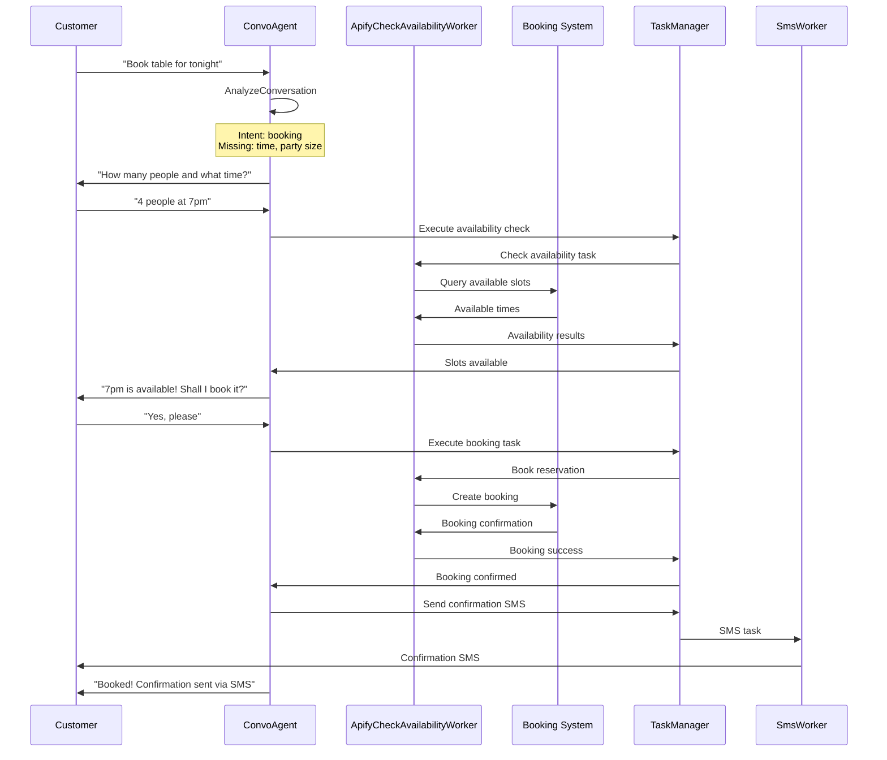
```mermaid
sequenceDiagram
    participant C as Customer
    participant CA as ConvoAgent
    participant ACW as ApifyCheckAvailabilityWorker
    participant BS as Booking System
    participant TM as TaskManager
    participant SW as SmsWorker
    
    C->>CA: "Book table for tonight"
    CA->>CA: AnalyzeConversation
    Note over CA: Intent: booking<br/>Missing: time, party size
    
    CA->>C: "How many people and what time?"
    C->>CA: "4 people at 7pm"
    
    CA->>TM: Execute availability check
    TM->>ACW: Check availability task
    ACW->>BS: Query available slots
    BS->>ACW: Available times
    ACW->>TM: Availability results
    TM->>CA: Slots available
    
    CA->>C: "7pm is available! Shall I book it?"
    C->>CA: "Yes, please"
    
    CA->>TM: Execute booking task
    TM->>ACW: Book reservation
    ACW->>BS: Create booking
    BS->>ACW: Booking confirmation
    ACW->>TM: Booking success
    TM->>CA: Booking confirmed
    
    CA->>TM: Send confirmation SMS
    TM->>SW: SMS task
    SW->>C: Confirmation SMS
    
    CA->>C: "Booked! Confirmation sent via SMS"
```

## Task Manager Orchestration Pattern

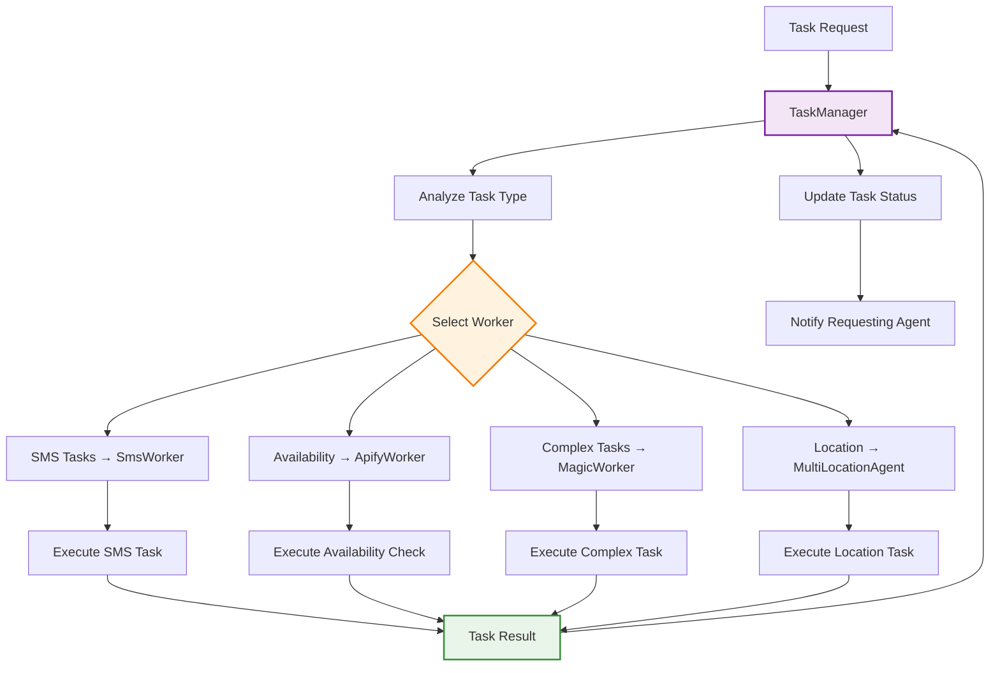
```mermaid
graph TB
    TaskRequest[Task Request] --> TaskManager[TaskManager]
    TaskManager --> Analysis[Analyze Task Type]
    Analysis --> WorkerSelection{Select Worker}
    
    WorkerSelection --> SMS[SMS Tasks → SmsWorker]
    WorkerSelection --> Availability[Availability → ApifyWorker]  
    WorkerSelection --> Complex[Complex Tasks → MagicWorker]
    WorkerSelection --> Location[Location → MultiLocationAgent]
    
    SMS --> SMSExec[Execute SMS Task]
    Availability --> AvailExec[Execute Availability Check]
    Complex --> ComplexExec[Execute Complex Task]
    Location --> LocationExec[Execute Location Task]
    
    SMSExec --> Result[Task Result]
    AvailExec --> Result
    ComplexExec --> Result
    LocationExec --> Result
    
    Result --> TaskManager
    TaskManager --> StatusUpdate[Update Task Status]
    StatusUpdate --> Notification[Notify Requesting Agent]
    
    style TaskManager fill:#f3e5f5,stroke:#7b1fa2,stroke-width:2px
    style WorkerSelection fill:#fff3e0,stroke:#f57c00,stroke-width:2px
    style Result fill:#e8f5e8,stroke:#388e3c,stroke-width:2px
```

## Error Handling and Recovery Flow

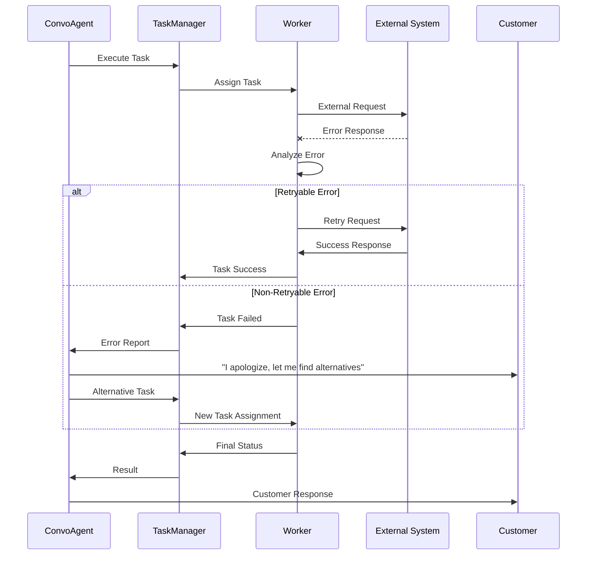
```mermaid
sequenceDiagram
    participant CA as ConvoAgent
    participant TM as TaskManager
    participant W as Worker
    participant ES as External System
    participant C as Customer
    
    CA->>TM: Execute Task
    TM->>W: Assign Task
    W->>ES: External Request
    ES--xW: Error Response
    
    W->>W: Analyze Error
    alt Retryable Error
        W->>ES: Retry Request
        ES->>W: Success Response
        W->>TM: Task Success
    else Non-Retryable Error
        W->>TM: Task Failed
        TM->>CA: Error Report
        CA->>C: "I apologize, let me find alternatives"
        CA->>TM: Alternative Task
        TM->>W: New Task Assignment
    end
    
    W->>TM: Final Status
    TM->>CA: Result
    CA->>C: Customer Response
```

## Multi-Channel Integration Architecture

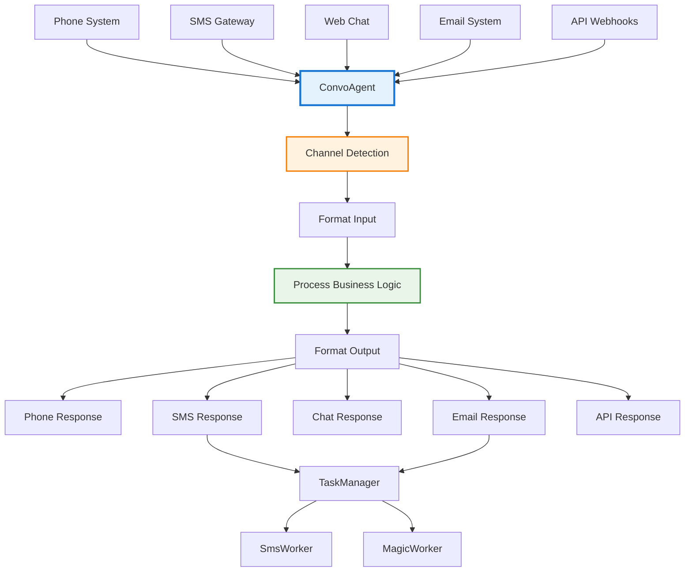
```mermaid
graph TB
    Phone[Phone System] --> ConvoAgent
    SMS[SMS Gateway] --> ConvoAgent
    Chat[Web Chat] --> ConvoAgent
    Email[Email System] --> ConvoAgent
    API[API Webhooks] --> ConvoAgent
    
    ConvoAgent --> ChannelDetection[Channel Detection]
    ChannelDetection --> FormatInput[Format Input]
    FormatInput --> ProcessLogic[Process Business Logic]
    ProcessLogic --> FormatOutput[Format Output]
    
    FormatOutput --> PhoneOut[Phone Response]
    FormatOutput --> SMSOut[SMS Response]
    FormatOutput --> ChatOut[Chat Response]
    FormatOutput --> EmailOut[Email Response]
    FormatOutput --> APIOut[API Response]
    
    SMSOut --> TaskManager
    EmailOut --> TaskManager
    
    TaskManager --> SmsWorker
    TaskManager --> MagicWorker
    
    style ConvoAgent fill:#e3f2fd,stroke:#1976d2,stroke-width:3px
    style ChannelDetection fill:#fff3e0,stroke:#f57c00,stroke-width:2px
    style ProcessLogic fill:#e8f5e8,stroke:#388e3c,stroke-width:2px
```

## System Administration and Configuration Flow

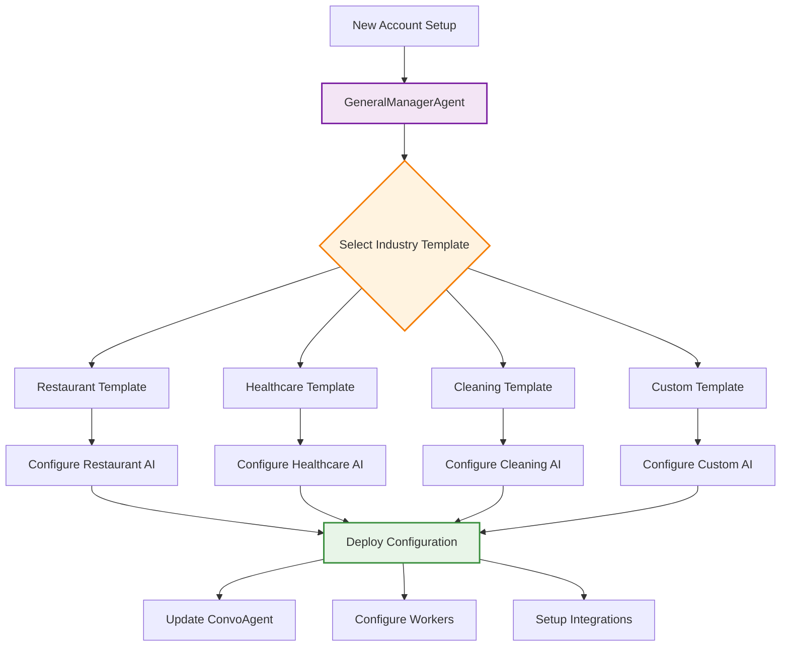
```mermaid
graph TD
    NewAccount[New Account Setup] --> GeneralManagerAgent[GeneralManagerAgent]
    GeneralManagerAgent --> IndustrySelection{Select Industry Template}
    
    IndustrySelection --> Restaurant[Restaurant Template]
    IndustrySelection --> Healthcare[Healthcare Template]
    IndustrySelection --> Cleaning[Cleaning Template]
    IndustrySelection --> Custom[Custom Template]
    
    Restaurant --> RestaurantConfig[Configure Restaurant AI]
    Healthcare --> HealthcareConfig[Configure Healthcare AI]
    Cleaning --> CleaningConfig[Configure Cleaning AI]
    Custom --> CustomConfig[Configure Custom AI]
    
    RestaurantConfig --> DeployConfig[Deploy Configuration]
    HealthcareConfig --> DeployConfig
    CleaningConfig --> DeployConfig
    CustomConfig --> DeployConfig
    
    DeployConfig --> ConvoAgent[Update ConvoAgent]
    DeployConfig --> Workers[Configure Workers]
    DeployConfig --> Integration[Setup Integrations]
    
    style GeneralManagerAgent fill:#f3e5f5,stroke:#7b1fa2,stroke-width:2px
    style IndustrySelection fill:#fff3e0,stroke:#f57c00,stroke-width:2px
    style DeployConfig fill:#e8f5e8,stroke:#388e3c,stroke-width:2px
```

## Data Flow and State Management

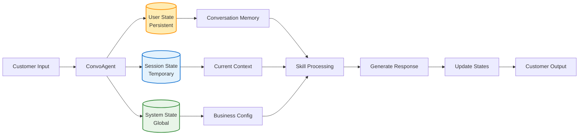
```mermaid
graph LR
    CustomerInput[Customer Input] --> ConvoAgent[ConvoAgent]
    ConvoAgent --> UserState[(User State<br/>Persistent)]
    ConvoAgent --> SessionState[(Session State<br/>Temporary)]
    ConvoAgent --> SystemState[(System State<br/>Global)]
    
    UserState --> Memory[Conversation Memory]
    SessionState --> Context[Current Context]
    SystemState --> Config[Business Config]
    
    Memory --> Processing[Skill Processing]
    Context --> Processing
    Config --> Processing
    
    Processing --> Response[Generate Response]
    Response --> UpdateStates[Update States]
    UpdateStates --> CustomerOutput[Customer Output]
    
    style UserState fill:#ffecb3,stroke:#ff8f00,stroke-width:2px
    style SessionState fill:#e3f2fd,stroke:#1976d2,stroke-width:2px
    style SystemState fill:#e8f5e8,stroke:#388e3c,stroke-width:2px
```

## External System Integration Patterns

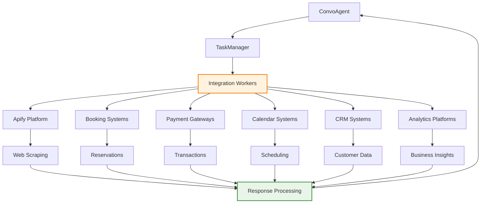
```mermaid
graph TB
    ConvoAgent --> TaskManager
    TaskManager --> IntegrationWorkers[Integration Workers]
    
    IntegrationWorkers --> ApifyPlatform[Apify Platform]
    IntegrationWorkers --> BookingSystems[Booking Systems]
    IntegrationWorkers --> PaymentGateways[Payment Gateways]
    IntegrationWorkers --> CalendarSystems[Calendar Systems]
    IntegrationWorkers --> CRMSystems[CRM Systems]
    IntegrationWorkers --> AnalyticsPlatforms[Analytics Platforms]
    
    ApifyPlatform --> WebScraping[Web Scraping]
    BookingSystems --> Reservations[Reservations]
    PaymentGateways --> Transactions[Transactions]
    CalendarSystems --> Scheduling[Scheduling]
    CRMSystems --> CustomerData[Customer Data]
    AnalyticsPlatforms --> BusinessInsights[Business Insights]
    
    WebScraping --> ResponseProcessing[Response Processing]
    Reservations --> ResponseProcessing
    Transactions --> ResponseProcessing
    Scheduling --> ResponseProcessing
    CustomerData --> ResponseProcessing
    BusinessInsights --> ResponseProcessing
    
    ResponseProcessing --> ConvoAgent
    
    style IntegrationWorkers fill:#fff3e0,stroke:#f57c00,stroke-width:2px
    style ResponseProcessing fill:#e8f5e8,stroke:#388e3c,stroke-width:2px
```

## Comprehensive Business Process Flows

### Restaurant Booking Complete Journey

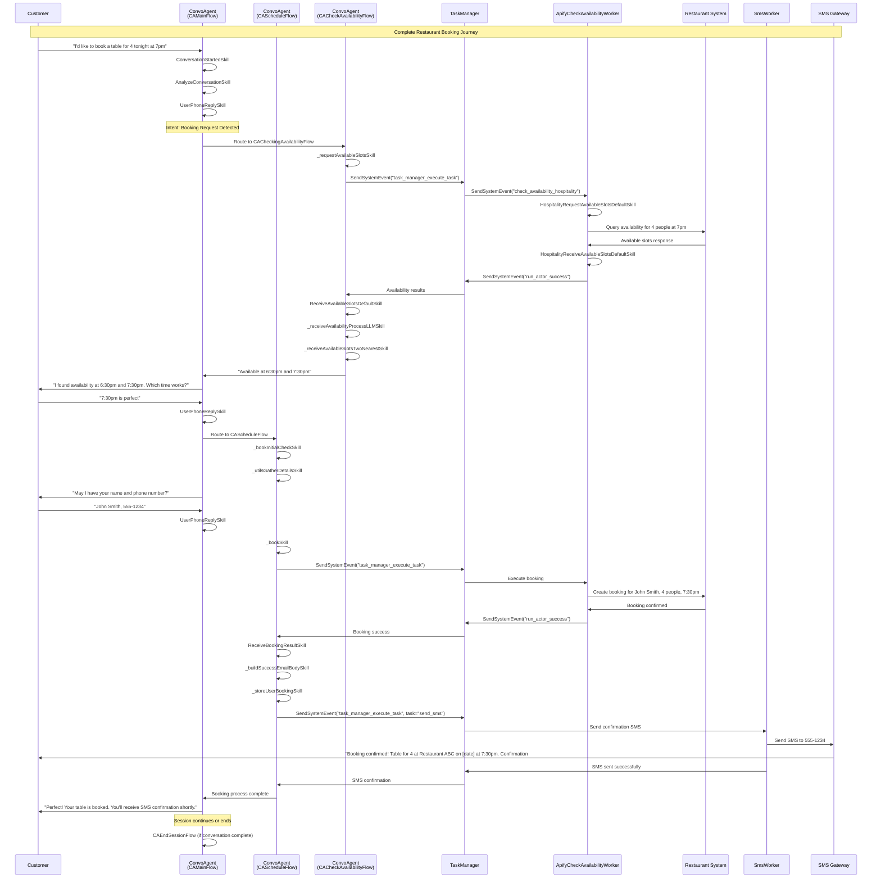
```mermaid
sequenceDiagram
    participant C as Customer
    participant CA as ConvoAgent<br/>(CAMainFlow)
    participant CS as ConvoAgent<br/>(CAScheduleFlow)  
    participant CCA as ConvoAgent<br/>(CACheckAvailabilityFlow)
    participant TM as TaskManager
    participant ACW as ApifyCheckAvailabilityWorker
    participant RS as Restaurant System
    participant SW as SmsWorker
    participant SMS as SMS Gateway
    
    Note over C,SMS: Complete Restaurant Booking Journey
    
    C->>CA: "I'd like to book a table for 4 tonight at 7pm"
    CA->>CA: ConversationStartedSkill
    CA->>CA: AnalyzeConversationSkill
    CA->>CA: UserPhoneReplySkill
    
    Note over CA: Intent: Booking Request Detected
    CA->>CCA: Route to CACheckingAvailabilityFlow
    CCA->>CCA: _requestAvailableSlotsSkill
    CCA->>TM: SendSystemEvent("task_manager_execute_task")
    TM->>ACW: SendSystemEvent("check_availability_hospitality")
    
    ACW->>ACW: HospitalityRequestAvailableSlotsDefaultSkill  
    ACW->>RS: Query availability for 4 people at 7pm
    RS->>ACW: Available slots response
    ACW->>ACW: HospitalityReceiveAvailableSlotsDefaultSkill
    ACW->>TM: SendSystemEvent("run_actor_success")
    
    TM->>CCA: Availability results
    CCA->>CCA: ReceiveAvailableSlotsDefaultSkill
    CCA->>CCA: _receiveAvailabilityProcessLLMSkill
    CCA->>CCA: _receiveAvailableSlotsTwoNearestSkill
    CCA->>CA: "Available at 6:30pm and 7:30pm"
    CA->>C: "I found availability at 6:30pm and 7:30pm. Which time works?"
    
    C->>CA: "7:30pm is perfect"
    CA->>CA: UserPhoneReplySkill
    CA->>CS: Route to CAScheduleFlow
    CS->>CS: _bookInitialCheckSkill
    CS->>CS: _utilsGatherDetailsSkill
    CA->>C: "May I have your name and phone number?"
    
    C->>CA: "John Smith, 555-1234"
    CA->>CA: UserPhoneReplySkill
    CS->>CS: _bookSkill
    CS->>TM: SendSystemEvent("task_manager_execute_task")
    TM->>ACW: Execute booking
    
    ACW->>RS: Create booking for John Smith, 4 people, 7:30pm
    RS->>ACW: Booking confirmed #R12345
    ACW->>TM: SendSystemEvent("run_actor_success")
    TM->>CS: Booking success
    
    CS->>CS: ReceiveBookingResultSkill
    CS->>CS: _buildSuccessEmailBodySkill
    CS->>CS: _storeUserBookingSkill
    CS->>TM: SendSystemEvent("task_manager_execute_task", task="send_sms")
    TM->>SW: Send confirmation SMS
    
    SW->>SMS: Send SMS to 555-1234
    SMS->>C: "Booking confirmed! Table for 4 at Restaurant ABC on [date] at 7:30pm. Confirmation #R12345"
    SW->>TM: SMS sent successfully
    TM->>CS: SMS confirmation
    
    CS->>CA: Booking process complete
    CA->>C: "Perfect! Your table is booked. You'll receive SMS confirmation shortly."
    
    Note over CA: Session continues or ends
    CA->>CA: CAEndSessionFlow (if conversation complete)
```

### Voice-to-Voice Conversation Flow (Gen2 System)

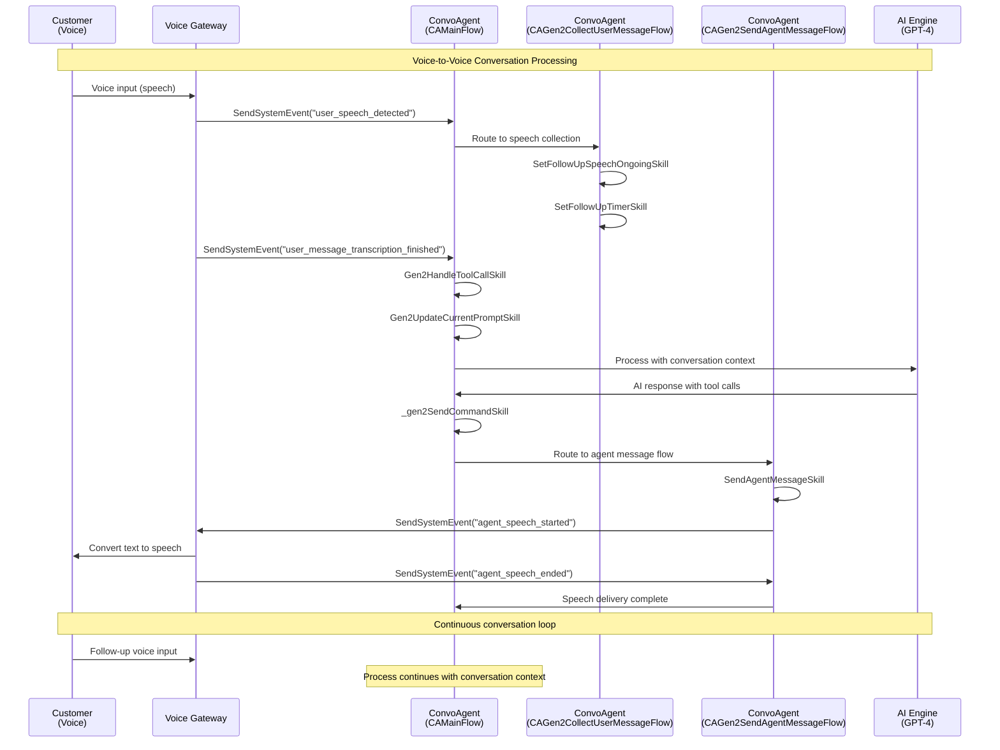
```mermaid
sequenceDiagram
    participant C as Customer<br/>(Voice)
    participant VG as Voice Gateway
    participant CA as ConvoAgent<br/>(CAMainFlow)
    participant G2C as ConvoAgent<br/>(CAGen2CollectUserMessageFlow)
    participant G2S as ConvoAgent<br/>(CAGen2SendAgentMessageFlow)
    participant AI as AI Engine<br/>(GPT-4)
    
    Note over C,AI: Voice-to-Voice Conversation Processing
    
    C->>VG: Voice input (speech)
    VG->>CA: SendSystemEvent("user_speech_detected")
    CA->>G2C: Route to speech collection
    G2C->>G2C: SetFollowUpSpeechOngoingSkill
    G2C->>G2C: SetFollowUpTimerSkill
    
    VG->>CA: SendSystemEvent("user_message_transcription_finished")
    CA->>CA: Gen2HandleToolCallSkill
    CA->>CA: Gen2UpdateCurrentPromptSkill
    CA->>AI: Process with conversation context
    
    AI->>CA: AI response with tool calls
    CA->>CA: _gen2SendCommandSkill
    CA->>G2S: Route to agent message flow
    G2S->>G2S: SendAgentMessageSkill
    G2S->>VG: SendSystemEvent("agent_speech_started")
    
    VG->>C: Convert text to speech
    VG->>G2S: SendSystemEvent("agent_speech_ended")
    G2S->>CA: Speech delivery complete
    
    Note over C,AI: Continuous conversation loop
    C->>VG: Follow-up voice input
    Note over CA: Process continues with conversation context
```

### Multi-Location Business Context Switching

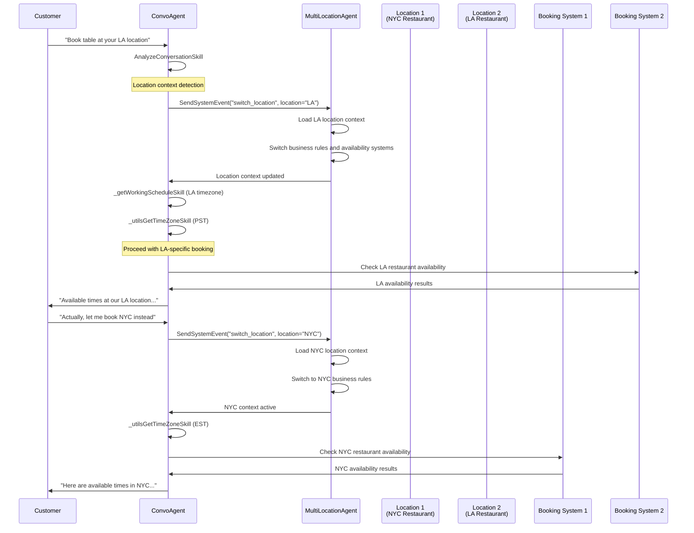
```mermaid
sequenceDiagram
    participant C as Customer
    participant CA as ConvoAgent
    participant MLA as MultiLocationAgent
    participant L1 as Location 1<br/>(NYC Restaurant)
    participant L2 as Location 2<br/>(LA Restaurant)
    participant BS1 as Booking System 1
    participant BS2 as Booking System 2
    
    C->>CA: "Book table at your LA location"
    CA->>CA: AnalyzeConversationSkill
    
    Note over CA: Location context detection
    CA->>MLA: SendSystemEvent("switch_location", location="LA")
    MLA->>MLA: Load LA location context
    MLA->>MLA: Switch business rules and availability systems
    MLA->>CA: Location context updated
    
    CA->>CA: _getWorkingScheduleSkill (LA timezone)
    CA->>CA: _utilsGetTimeZoneSkill (PST)
    
    Note over CA: Proceed with LA-specific booking
    CA->>BS2: Check LA restaurant availability
    BS2->>CA: LA availability results
    CA->>C: "Available times at our LA location..."
    
    C->>CA: "Actually, let me book NYC instead"
    CA->>MLA: SendSystemEvent("switch_location", location="NYC")
    MLA->>MLA: Load NYC location context
    MLA->>MLA: Switch to NYC business rules
    MLA->>CA: NYC context active
    
    CA->>CA: _utilsGetTimeZoneSkill (EST)
    CA->>BS1: Check NYC restaurant availability
    BS1->>CA: NYC availability results
    CA->>C: "Here are available times in NYC..."
```

### Business Intelligence & Analytics Flow

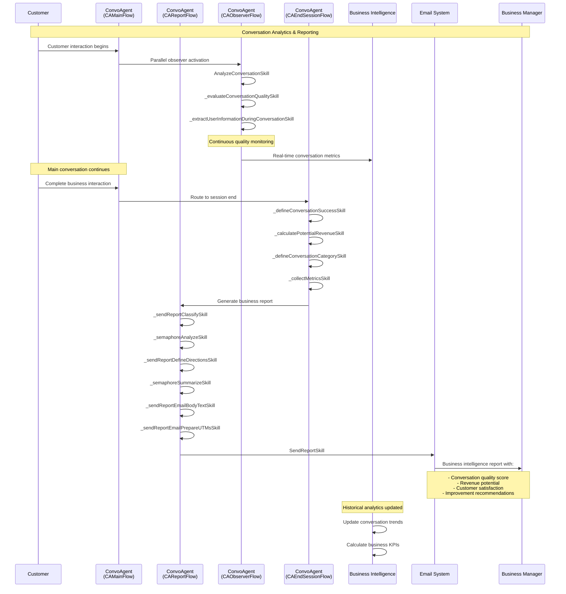
```mermaid
sequenceDiagram
    participant C as Customer
    participant CA as ConvoAgent<br/>(CAMainFlow)
    participant CR as ConvoAgent<br/>(CAReportFlow)
    participant CO as ConvoAgent<br/>(CAObserverFlow)
    participant CE as ConvoAgent<br/>(CAEndSessionFlow)
    participant BI as Business Intelligence
    participant EMAIL as Email System
    participant MANAGER as Business Manager
    
    Note over C,MANAGER: Conversation Analytics & Reporting
    
    C->>CA: Customer interaction begins
    CA->>CO: Parallel observer activation
    CO->>CO: AnalyzeConversationSkill
    CO->>CO: _evaluateConversationQualitySkill
    CO->>CO: _extractUserInformationDuringConversationSkill
    
    Note over CO: Continuous quality monitoring
    CO->>BI: Real-time conversation metrics
    
    Note over C,CA: Main conversation continues
    C->>CA: Complete business interaction
    CA->>CE: Route to session end
    CE->>CE: _defineConversationSuccessSkill
    CE->>CE: _calculatePotentialRevenueSkill
    CE->>CE: _defineConversationCategorySkill
    CE->>CE: _collectMetricsSkill
    
    CE->>CR: Generate business report
    CR->>CR: _sendReportClassifySkill
    CR->>CR: _semaphoreAnalyzeSkill
    CR->>CR: _sendReportDefineDirectionsSkill
    CR->>CR: _semaphoreSummarizeSkill
    
    CR->>CR: _sendReportEmailBodyTextSkill
    CR->>CR: _sendReportEmailPrepareUTMsSkill
    CR->>EMAIL: SendReportSkill
    EMAIL->>MANAGER: Business intelligence report with:
    Note over EMAIL,MANAGER: - Conversation quality score<br/>- Revenue potential<br/>- Customer satisfaction<br/>- Improvement recommendations
    
    Note over BI: Historical analytics updated
    BI->>BI: Update conversation trends
    BI->>BI: Calculate business KPIs
```

### External System Integration Error Handling

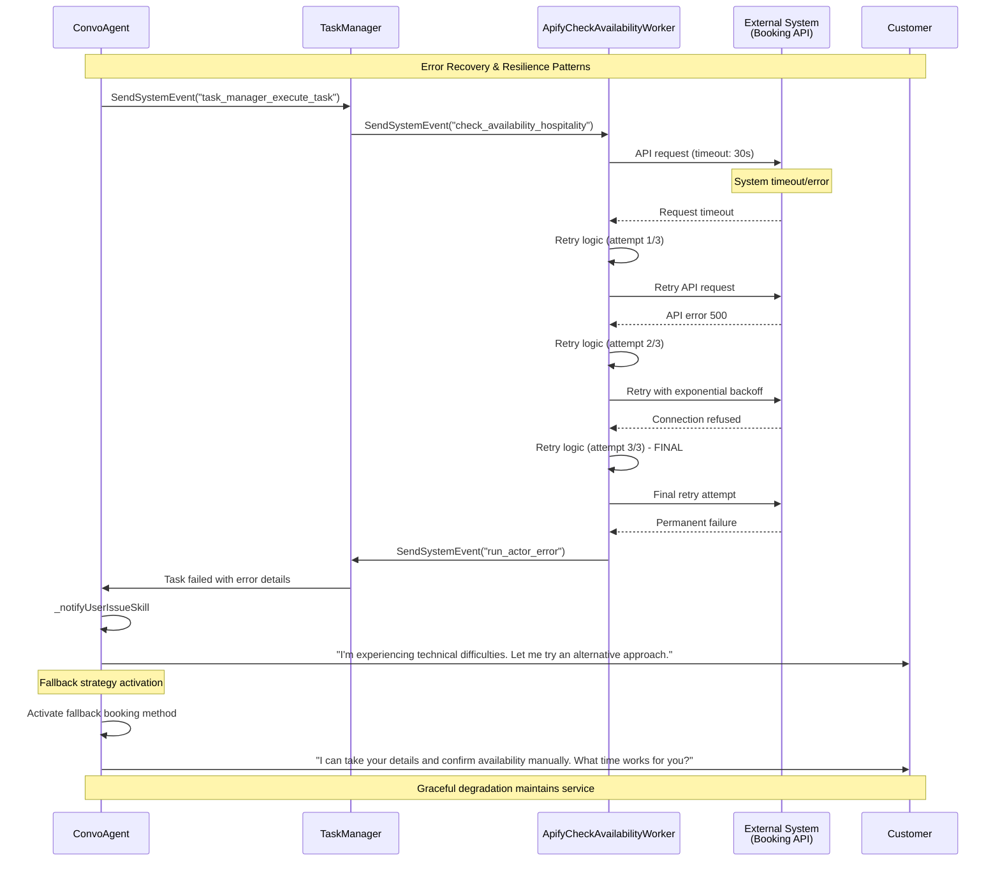
```mermaid
sequenceDiagram
    participant CA as ConvoAgent
    participant TM as TaskManager  
    participant ACW as ApifyCheckAvailabilityWorker
    participant ES as External System<br/>(Booking API)
    participant C as Customer
    
    Note over CA,C: Error Recovery & Resilience Patterns
    
    CA->>TM: SendSystemEvent("task_manager_execute_task")
    TM->>ACW: SendSystemEvent("check_availability_hospitality")
    ACW->>ES: API request (timeout: 30s)
    
    Note over ES: System timeout/error
    ES-->>ACW: Request timeout
    ACW->>ACW: Retry logic (attempt 1/3)
    ACW->>ES: Retry API request
    ES-->>ACW: API error 500
    
    ACW->>ACW: Retry logic (attempt 2/3)
    ACW->>ES: Retry with exponential backoff
    ES-->>ACW: Connection refused
    
    ACW->>ACW: Retry logic (attempt 3/3) - FINAL
    ACW->>ES: Final retry attempt
    ES-->>ACW: Permanent failure
    
    ACW->>TM: SendSystemEvent("run_actor_error")
    TM->>CA: Task failed with error details
    CA->>CA: _notifyUserIssueSkill
    CA->>C: "I'm experiencing technical difficulties. Let me try an alternative approach."
    
    Note over CA: Fallback strategy activation
    CA->>CA: Activate fallback booking method
    CA->>C: "I can take your details and confirm availability manually. What time works for you?"
    
    Note over CA,C: Graceful degradation maintains service
```

### Industry Template Configuration Flow

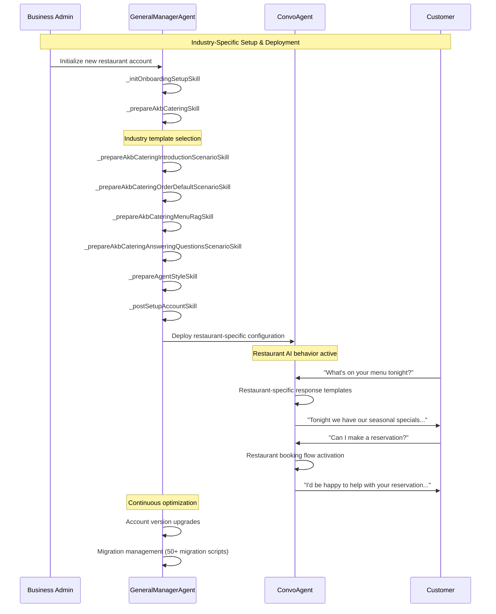
```mermaid
sequenceDiagram
    participant ADMIN as Business Admin
    participant GMA as GeneralManagerAgent
    participant CA as ConvoAgent
    participant CUSTOMER as Customer
    
    Note over ADMIN,CUSTOMER: Industry-Specific Setup & Deployment
    
    ADMIN->>GMA: Initialize new restaurant account
    GMA->>GMA: _initOnboardingSetupSkill
    GMA->>GMA: _prepareAkbCateringSkill
    
    Note over GMA: Industry template selection
    GMA->>GMA: _prepareAkbCateringIntroductionScenarioSkill
    GMA->>GMA: _prepareAkbCateringOrderDefaultScenarioSkill
    GMA->>GMA: _prepareAkbCateringMenuRagSkill
    GMA->>GMA: _prepareAkbCateringAnsweringQuestionsScenarioSkill
    
    GMA->>GMA: _prepareAgentStyleSkill
    GMA->>GMA: _postSetupAccountSkill
    GMA->>CA: Deploy restaurant-specific configuration
    
    Note over CA: Restaurant AI behavior active
    CUSTOMER->>CA: "What's on your menu tonight?"
    CA->>CA: Restaurant-specific response templates
    CA->>CUSTOMER: "Tonight we have our seasonal specials..."
    
    CUSTOMER->>CA: "Can I make a reservation?"
    CA->>CA: Restaurant booking flow activation
    CA->>CUSTOMER: "I'd be happy to help with your reservation..."
    
    Note over GMA: Continuous optimization
    GMA->>GMA: Account version upgrades
    GMA->>GMA: Migration management (50+ migration scripts)
```

## Advanced System Interaction Patterns

### Event-Driven Multi-Agent Coordination

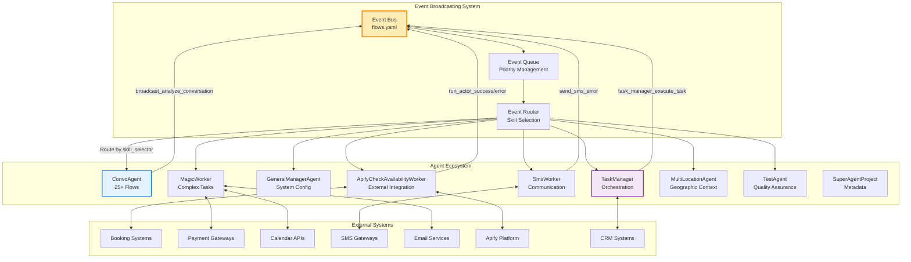
```mermaid
graph TB
    subgraph "Event Broadcasting System"
        EB[Event Bus<br/>flows.yaml]
        EQ[Event Queue<br/>Priority Management]
        ER[Event Router<br/>Skill Selection]
    end
    
    subgraph "Agent Ecosystem"
        CA[ConvoAgent<br/>25+ Flows]
        TM[TaskManager<br/>Orchestration]
        GMA[GeneralManagerAgent<br/>System Config]
        ACW[ApifyCheckAvailabilityWorker<br/>External Integration]
        SW[SmsWorker<br/>Communication]
        MW[MagicWorker<br/>Complex Tasks]
        MLA[MultiLocationAgent<br/>Geographic Context]
        TA[TestAgent<br/>Quality Assurance]
        SAP[SuperAgentProject<br/>Metadata]
    end
    
    subgraph "External Systems"
        BOOK[Booking Systems]
        PAY[Payment Gateways]
        CAL[Calendar APIs]
        SMS_GW[SMS Gateways]
        EMAIL[Email Services]
        APIFY[Apify Platform]
        CRM[CRM Systems]
    end
    
    CA -->|broadcast_analyze_conversation| EB
    TM -->|task_manager_execute_task| EB
    ACW -->|run_actor_success/error| EB
    SW -->|send_sms_error| EB
    
    EB --> EQ
    EQ --> ER
    
    ER -->|Route by skill_selector| CA
    ER --> TM
    ER --> GMA
    ER --> ACW
    ER --> SW
    ER --> MW
    ER --> MLA
    ER --> TA
    
    ACW <--> APIFY
    ACW <--> BOOK
    SW <--> SMS_GW
    MW <--> PAY
    MW <--> CAL
    MW <--> EMAIL
    TM <--> CRM
    
    style EB fill:#ffecb3,stroke:#ff8f00,stroke-width:3px
    style CA fill:#e3f2fd,stroke:#1976d2,stroke-width:2px
    style TM fill:#f3e5f5,stroke:#7b1fa2,stroke-width:2px
```

### Skill Execution & Composition Architecture

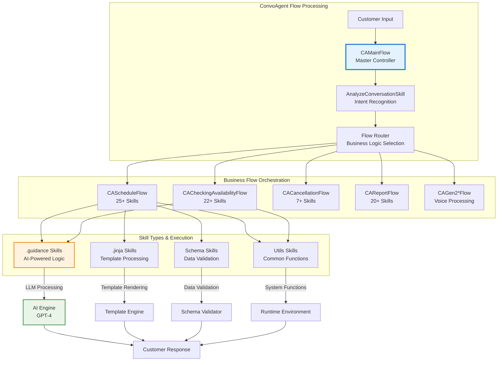
```mermaid
graph TD
    subgraph "ConvoAgent Flow Processing"
        INPUT[Customer Input] 
        MAIN[CAMainFlow<br/>Master Controller]
        ANALYZE[AnalyzeConversationSkill<br/>Intent Recognition]
        ROUTER[Flow Router<br/>Business Logic Selection]
    end
    
    subgraph "Skill Types & Execution"
        GUIDANCE[.guidance Skills<br/>AI-Powered Logic]
        JINJA[.jinja Skills<br/>Template Processing]  
        SCHEMA[Schema Skills<br/>Data Validation]
        UTILS[Utils Skills<br/>Common Functions]
    end
    
    subgraph "Business Flow Orchestration"
        BF1[CAScheduleFlow<br/>25+ Skills]
        BF2[CACheckingAvailabilityFlow<br/>22+ Skills]  
        BF3[CACancellationFlow<br/>7+ Skills]
        BF4[CAReportFlow<br/>20+ Skills]
        BF5[CAGen2*Flow<br/>Voice Processing]
    end
    
    INPUT --> MAIN
    MAIN --> ANALYZE
    ANALYZE --> ROUTER
    
    ROUTER --> BF1
    ROUTER --> BF2
    ROUTER --> BF3
    ROUTER --> BF4
    ROUTER --> BF5
    
    BF1 --> GUIDANCE
    BF1 --> JINJA
    BF1 --> SCHEMA
    BF1 --> UTILS
    
    BF2 --> GUIDANCE
    BF2 --> UTILS
    
    GUIDANCE -->|LLM Processing| AI_ENGINE[AI Engine<br/>GPT-4]
    JINJA -->|Template Rendering| TEMPLATE_ENGINE[Template Engine]
    SCHEMA -->|Data Validation| VALIDATOR[Schema Validator]
    UTILS -->|System Functions| RUNTIME[Runtime Environment]
    
    AI_ENGINE --> RESPONSE[Customer Response]
    TEMPLATE_ENGINE --> RESPONSE
    VALIDATOR --> RESPONSE  
    RUNTIME --> RESPONSE
    
    style MAIN fill:#e3f2fd,stroke:#1976d2,stroke-width:3px
    style GUIDANCE fill:#fff3e0,stroke:#f57c00,stroke-width:2px
    style AI_ENGINE fill:#e8f5e8,stroke:#388e3c,stroke-width:2px
```

These comprehensive interaction diagrams provide detailed visual understanding of how the Newo SuperAgent system processes complex business scenarios, manages multi-agent coordination, handles errors gracefully, and delivers sophisticated conversational AI experiences across multiple industries and communication channels.
