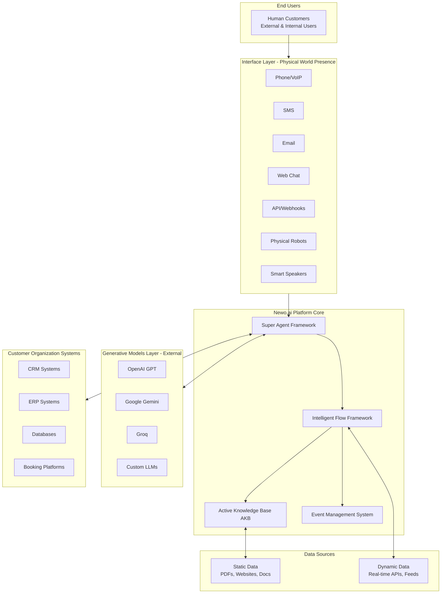

# System Architecture: Newo SuperAgent Multi-Agent System


## Architectural Overview: Newo Intelligent Framework

The Newo SuperAgent system is built on the **Newo Intelligent Flow Framework**, implementing a **Flow-based, event-driven architecture** where Digital Employees work in unison through the **Super Agent Framework**. This architecture enables rapid development of intelligent agents without special programming skills, creating true Digital Employees rather than just intelligent tools.

### Newo Platform Architecture Components



**Key Innovation**: The platform maps multiple communication channels from the same person into unified historical memory and persona, achieving true omniuser capability that distinguishes Digital Employees from regular intelligent agents.

## Core Design Principles

### 1. Event-Driven Architecture
- **Decoupled Agents**: Agents communicate via system events, not direct calls
- **Asynchronous Processing**: Tasks can be scheduled and executed independently
- **Scalable Communication**: Event system supports adding new agents without modifying existing ones
- **Reliable Messaging**: Queue-based event handling with error recovery

### 2. Separation of Concerns
- **ConvoAgent**: Customer interaction and conversation management
- **TaskManager**: Task orchestration and workflow coordination
- **Specialized Workers**: Domain-specific processing (SMS, availability, etc.)
- **GeneralManagerAgent**: System administration and configuration

### 3. Flow-Based Digital Employee Architecture
- **Skills**: Represent the logic of an agent - what the agent should do
- **Flows**: Process Digital Employees follow when communicating with users
- **Agent Personas**: Identity of the Digital Employee (one per Flow)
- **Flow Instances**: Objects responsible for specific Agent-User interactions
- **State Management**: Service for storing/issuing parameters within Flow Instances
- **Active Knowledge Base (AKB)**: Vector database storing corporate docs, scenarios, and work instructions

### 4. Newo Script Language Integration
- **System Blocks**: `{{#system~}}{{/system}}` - Pre-LLM calculations and context preparation
- **Assistant Blocks**: `{{#assistant~}}{{/assistant}}` - LLM processing instructions and settings
- **Template Processing**: Jinja-based data transformation and formatting
- **Event Orchestration**: SendSystemEvent and SendCommand functions for coordination

## Agent Architecture

### Agent Types and Responsibilities

#### **ConvoAgent** (Primary Interface)
```
Role: Customer-facing conversational AI
Responsibilities:
- Multi-channel communication handling
- Conversation flow management  
- Business process initiation
- Context and memory management
- Tool calling and external service coordination

Key Flows:
├── CAMainFlow (Core conversation logic)
├── CAScheduleFlow (Booking management)
├── CACheckingAvailabilityFlow (Real-time availability)
├── CACancellationFlow (Booking cancellation)
├── CAActionCall*Flow (Phone call management)
├── CAActionSend*Flow (Message sending)
├── CAObserverFlow (Quality monitoring)
└── CAEndSessionFlow (Session cleanup)
```

#### **TaskManager** (Orchestration Engine)
```
Role: Task coordination and workflow management
Responsibilities:
- Task scheduling (ASAP and timed)
- Worker coordination and load balancing
- Task lifecycle management
- Error handling and retry logic
- Inter-agent task delegation

Key Capabilities:
- Dynamic task assignment
- Worker health monitoring
- Task status tracking
- Scheduled execution
```

#### **ApifyCheckAvailabilityWorker** (Integration Specialist)
```
Role: External system integration for availability checking
Responsibilities:
- Real-time booking system queries
- API integration management
- Data format conversion
- Error handling for external services
- Response caching and optimization
```

#### **GeneralManagerAgent** (System Administrator)
```
Role: System configuration and business setup
Responsibilities:
- Account initialization and onboarding
- Business template configuration
- System migrations and updates
- Feature flag management
- Industry-specific AI behavior setup

Supported Industries:
├── Hospitality/Restaurant
├── Healthcare/Dental  
├── Cleaning Services
├── Catering
└── General Service Businesses
```

#### **Supporting Agents**
- **MultiLocationAgent**: Multi-location business context management
- **SmsWorker**: SMS communication processing
- **MagicWorker**: Complex task execution
- **TestAgent**: Development and debugging support
- **SuperAgentProject**: Version control and metadata

## Communication Architecture

### Event System Design

#### Event Structure
```yaml
events:
  - idn: "unique_event_identifier"
    skill_selector: "SkillSelector.skill_idn"
    skill_idn: "target_skill"
    integration_idn: "system|apify|api"
    connector_idn: "system|webhook|hospitality_availability"
    interrupt_mode: "InterruptMode.queue"
```

#### Primary Event Types
1. **Conversation Events**
   - `conversation_started` → Initialize customer session
   - `user_phone_reply` → Process phone interactions
   - `user_sms_reply` → Handle SMS messages
   - `conversation_ended` → Clean up and generate analytics

2. **Task Management Events**
   - `task_manager_execute_task` → Delegate work to specialized agents
   - `task_manager_update_task_status` → Track task progress
   - `execute_tasks` → Direct task execution

3. **Business Process Events**
   - `check_availability_hospitality` → Query booking systems
   - `book_appointment` → Execute booking workflow
   - `send_notification` → Trigger communications

4. **System Events**
   - `urgent_message` → Priority message handling
   - `broadcast_analyze_conversation` → Multi-agent analysis

### Data Flow Architecture

#### State Management Layers
```
┌─ User State (Persistent) ─────────────────┐
│  • Customer preferences and history       │
│  • Personal information and context       │
│  • Cross-session continuity               │
└─────────────────────────────────────────────┘

┌─ Agent State (Session) ───────────────────┐
│  • Conversation context and memory        │
│  • Current workflow status                │
│  • Temporary processing data              │
└─────────────────────────────────────────────┘

┌─ System State (Global) ───────────────────┐
│  • Configuration and feature flags        │
│  • Business rules and templates           │
│  • Integration credentials                │
└─────────────────────────────────────────────┘
```

#### Message Flow Pattern
```
Customer Input → ConvoAgent → Intent Analysis → Skill Selection
                     ↓
Business Flow Execution → TaskManager → Specialized Workers
                     ↓
External System Integration → Response Processing → Customer Output
```

## Integration Architecture

### External System Integrations

#### Communication Channels
- **Voice Systems**: VoIP integration for phone calls
- **Messaging**: SMS gateways, chat platforms
- **Email**: SMTP/email service providers
- **Web APIs**: REST API endpoints for external applications

#### Business Systems
- **Booking Systems**: Restaurant, hotel, service provider platforms
- **Calendar Systems**: Google Calendar, Outlook, specialized scheduling
- **Payment Processing**: Payment gateway integrations
- **CRM Systems**: Customer relationship management platforms

#### Development Tools
- **Apify Platform**: Web scraping and automation
- **Webhook Systems**: Real-time event notifications
- **Analytics Platforms**: Conversation and business analytics
- **Testing Infrastructure**: Automated testing and validation

### Scalability Features

#### Horizontal Scaling
- **Worker Pool Architecture**: Multiple instances of specialized agents
- **Event Queue Scaling**: Distributed event processing
- **Load Balancing**: Intelligent task distribution
- **Multi-Instance Support**: Cross-instance communication

#### Performance Optimization
- **Caching Strategies**: Conversation memory and external API responses
- **Asynchronous Processing**: Non-blocking operations
- **Resource Management**: Efficient memory and processing usage
- **Response Time Optimization**: Sub-second response targets

## Security Architecture

### Authentication & Authorization
- **API Key Management**: Secure credential storage and rotation
- **Role-Based Access**: Different permission levels for different agents
- **Secure Communication**: Encrypted inter-agent communication
- **Data Privacy**: Customer information protection

### Reliability Features
- **Error Handling**: Comprehensive error recovery mechanisms
- **Retry Logic**: Automatic retry with exponential backoff
- **Circuit Breakers**: Prevent cascade failures
- **Health Monitoring**: Real-time system health checks

## Development Architecture

### Code Organization
```
project/
├── Agent1/
│   ├── Flow1/
│   │   ├── Skill1.guidance    (Business logic)
│   │   ├── Skill2.jinja       (Data templates)
│   │   └── Schema.guidance    (Data validation)
│   └── Flow2/
├── Agent2/
└── flows.yaml (Event configuration)
```

### Skill Types
- **.guidance files**: LLM-powered business logic and decision making
- **.jinja files**: Template-based data processing and transformation
- **Schema files**: Data validation and structure definition
- **Utility skills**: Reusable common functionality

This architecture demonstrates a mature, production-ready approach to building scalable conversational AI systems with clear separation of concerns, robust error handling, and comprehensive business process automation capabilities.
