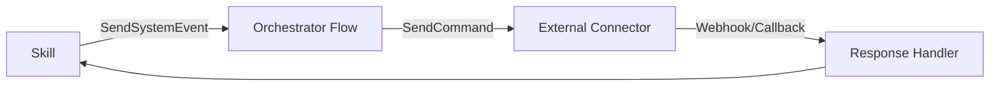

## Understanding the Extension Architecture

The **Newo SuperAgent system** is built on the **Newo Intelligent Flow Framework**, designed for rapid development of **Digital Employees** with clear patterns for extending capabilities. The **Super Agent Framework** enables multiple agents to work in unison using pre-built "workers" while maintaining the four key Digital Employee characteristics:

1. **Presence in the physical world**
2. **Omnichannel capabilities**  
3. **Omniflow capabilities**
4. **Omniuser capabilities**

### Active Knowledge Base (AKB) Integration

The **Newo AKB** is a unique vector database that doesn't just store corporate documents and communication histories, but also retains **scenarios and work instructions** - hence its designation as an "Active" Knowledge Base.

**Key AKB Features**:
- Stores static data (PDFs, websites, documentation)
- Maintains dynamic data (real-time information, API feeds)
- Contains work scenarios and business process instructions
- Enables workflow adjustments without reprogramming
- Provides semantic and fuzzy search capabilities

**AKB Actions for Skill Integration**:
```guidance
{{SetAKB(key="business_hours", value=schedule_data)}}
{{Set(name="knowledge", value=SearchSemanticAKB(query="booking policy", maxResults=3))}}
{{Set(name="procedures", value=SearchFuzzyAKB(query="cancellation process", maxResults=5))}}
```

## Core Extension Patterns

### 1. Adding New Business Flows

#### Flow Creation Pattern (Newo Framework Standard)
**Location**: `ConvoAgent/{FlowName}/`
**Flow Components** (Official Newo Structure):
- **Skills**: Logic units explaining what the agent should do
- **State**: Parameter storage/exchange service within Flow Instance
- **Agent Persona**: Digital Employee identity (one per Flow)
- **Flow Instance**: Objects managing specific Agent-User interactions

**Required Skill Files**:
- `AnalyzeConversationSkill.guidance` - Main entry point
- `_businessLogicSkill.guidance` - Core business logic
- `_schemasSkill.guidance` - Data validation schemas
- Supporting utility skills as needed

**Skill Structure** (Newo Script):
```guidance
{{#system~}}
  {{!-- System block: pre-LLM calculations --}}
  Context preparation and data retrieval
{{~/system}}

{{#assistant~}}
  {{!-- Assistant block: LLM processing instructions --}}
  {{gen(name="RESULT", temperature=0.7)}}
{{~/assistant}}

{{!-- Post-processing and event coordination --}}
{{SendSystemEvent(eventIdn="next_flow_step", result=RESULT)}}
```

#### Example: Adding Customer Feedback Flow
```
ConvoAgent/CAFeedbackFlow/
├── AnalyzeConversationSkill.guidance
├── _collectFeedbackSkill.guidance  
├── _processFeedbackSkill.guidance
├── _sendFeedbackConfirmationSkill.guidance
├── _schemasSkill.guidance
└── _utilsFormatFeedbackSkill.guidance
```

#### Integration Steps:
1. **Create Flow Directory Structure**
2. **Define Entry Point Skill** (AnalyzeConversationSkill.guidance)
3. **Implement Business Logic Skills**
4. **Add Event Configuration** (flows.yaml)
5. **Test and Validate Flow**

### 2. Creating Specialized Worker Agents

#### Agent Creation Pattern
**Location**: `project/{AgentName}/`
**Required Components**:
- Main flow directory
- Event handling skills
- Integration logic
- Error handling procedures

#### Example: Payment Processing Agent
```
PaymentProcessorAgent/
├── PPMainFlow/
│   ├── ProcessPaymentSkill.guidance
│   ├── ValidatePaymentSkill.guidance
│   ├── HandlePaymentErrorSkill.guidance
│   └── _paymentGatewayIntegrationSkill.guidance
└── flows.yaml entry for payment events
```

#### Worker Agent Requirements:
1. **Event Handler**: Respond to task_manager_execute_task
2. **Business Logic**: Core processing capabilities
3. **Error Handling**: Robust failure management
4. **Result Reporting**: Status updates to TaskManager

### 3. External System Integration

#### Integration Architecture Patterns

**API Integration Pattern**:
```
External Service → Webhook/API Call → Integration Agent → 
Business Logic → Response Processing → Customer Notification
```

**Apify Integration Pattern**:
```
Business Need → Apify Actor Spawn → Data Collection →
Format Conversion → Business Process Integration
```

**Database Integration Pattern**:
```
Data Request → Database Query → Result Processing →
Cache Update → Response Generation
```

#### Integration Implementation Steps:

1. **Define Integration Requirements**
   - API endpoints and authentication
   - Data formats and transformations
   - Error handling and retry logic
   - Performance and scaling needs

2. **Create Integration Skills**
   ```
   _integrationConnectSkill.guidance     # Connection handling
   _integrationRequestSkill.guidance     # Request formatting
   _integrationResponseSkill.guidance    # Response processing
   _integrationErrorSkill.guidance       # Error handling
   ```

3. **Configure Event Routing**
   ```yaml
   events:
     - idn: "external_system_request"
       skill_idn: "IntegrationRequestSkill"
       integration_idn: "api"
       connector_idn: "external_system"
   ```

4. **Implement Authentication and Security**
   - API key management
   - OAuth flow handling
   - Request signing
   - Rate limiting compliance

## Business Domain Extensions

### Adding New Industry Support

#### Industry Template Pattern
**Location**: `GeneralManagerAgent/GMMainFlow/_prepareAkb{Industry}*Skill.guidance`

#### Required Components for New Industry:
1. **Agent Methodology Integration (AMI)**
   - `_prepareAkb{Industry}AMISkill.guidance`
   - Core business principles and approach

2. **Scenario Skills**
   - `_prepareAkb{Industry}IntroductionScenarioSkill.guidance`
   - `_prepareAkb{Industry}AnsweringQuestionsScenarioSkill.guidance`
   - `_prepareAkb{Industry}FinishConversationScenarioSkill.guidance`
   - Industry-specific interaction patterns

3. **Business Process Skills**
   - Booking/scheduling procedures
   - Payment handling procedures
   - Service delivery procedures
   - Customer communication procedures

#### Example: Adding Legal Services Industry
```
_prepareAkbLegalAMISkill.guidance
_prepareAkbLegalIntroductionScenarioSkill.guidance
_prepareAkbLegalConsultationSchedulingScenarioSkill.guidance
_prepareAkbLegalDocumentRequestScenarioSkill.guidance
_prepareAkbLegalBillingInformationScenarioSkill.guidance
_prepareAkbLegalComplianceRequirementsSkill.guidance
```

### Multi-Location Business Extension

#### Location Management Pattern
**Agent**: MultiLocationAgent
**Key Features**:
- Dynamic location context switching
- Location-specific business rules
- Cross-location data management
- Location-based availability and scheduling

#### Extension Process:
1. **Location Configuration**: Define business locations and rules
2. **Context Switching Logic**: Implement location detection
3. **Data Isolation**: Separate location-specific data
4. **Business Rule Customization**: Location-specific operations

## Communication Channel Extensions

### Adding New Communication Channels

#### Channel Integration Pattern
1. **Input Handler**: Process incoming messages from new channel
2. **Format Converter**: Transform messages to internal format
3. **Response Formatter**: Convert responses to channel format
4. **Channel-Specific Logic**: Handle channel limitations and features

#### Example: Adding WhatsApp Integration
```
ConvoAgent/CAMainFlow/
├── UserWhatsAppReplySkill.guidance
├── _formatWhatsAppResponseSkill.guidance
├── _validateWhatsAppMessageSkill.guidance
└── _whatsAppMediaHandlingSkill.guidance

flows.yaml addition:
- idn: "user_whatsapp_reply"
  skill_idn: "UserWhatsAppReplySkill"
  integration_idn: "system"
  connector_idn: "whatsapp"
```

#### Channel Extension Requirements:
1. **Message Processing**: Handle channel-specific message formats
2. **Media Support**: Images, documents, voice messages as applicable
3. **Delivery Confirmation**: Track message delivery status
4. **Rate Limiting**: Respect channel API limits
5. **Error Handling**: Channel-specific error scenarios

### System Event Commands Reference

#### Internal System Events (SendSystemEvent)
**Core Session Events**:
```guidance
{{SendSystemEvent(eventIdn="session_started", actorId=user_id)}}
{{SendSystemEvent(eventIdn="extend_session")}}
{{SendSystemEvent(eventIdn="analyze_conversation", conversationChannel=channel, convoAgentAnswer=response, toDate=end_date)}}
{{SendSystemEvent(eventIdn="prepare_rag_context_command")}}
{{SendSystemEvent(eventIdn="prepare_injecting_data")}}
```

**Task Management Events**:
```guidance
{{SendSystemEvent(eventIdn="urgent_message", baseInstruction=message, uninterruptible=true)}}
{{SendSystemEvent(eventIdn="book_slot", payload=booking_data)}}
{{SendSystemEvent(eventIdn="worker_message", fromIdn=sender, toIdn=receiver, message=content)}}
{{SendSystemEvent(eventIdn="process_booking_fallback_custom", payloadMeta=metadata)}}
{{SendSystemEvent(eventIdn="task_manager_execute_task", taskType=type, taskData=data)}}
{{SendSystemEvent(eventIdn="task_manager_get_task_success", result=task_result)}}
{{SendSystemEvent(eventIdn="task_manager_get_task_error", error=error_details)}}
```

**Communication Events**:
```guidance
{{SendSystemEvent(eventIdn="send_external_reply", message=reply, recipient=target)}}
{{SendSystemEvent(eventIdn="handle_contact_details", contact=contact_info)}}
```

#### External System Commands (SendCommand)

**Timer Management**:
```guidance
{{SendCommand(
  commandIdn="set_timer",
  integrationIdn="program_timer",
  personaId=user_id,
  timerName="session_timer",
  interval="300",
  eventIdn="end_session"
)}}
```

**Voice System Integration**:
```guidance
{{SendCommand(
  commandIdn="set_turn_message",
  integrationIdn="newo_voice",
  connectorIdn="newo_voice_connector",
  instructions=prompt,
  actorId=last_convo_actor
)}}

{{SendCommand(
  commandIdn="update_session",
  integrationIdn="newo_voice",
  connectorIdn="newo_voice_connector",
  instructions=updated_prompt,
  actorId=active_actor
)}}
```

**SMS/Messaging Integration**:
```guidance
{{SendCommand(
  commandIdn="add_phone_to_pool",
  integrationIdn="twilio_messenger",
  connectorIdn="sms_connector",
  phoneNumber=phone,
  poolId=sms_pool
)}}
```

**Calendar Integration**:
```guidance
{{SendCommand(
  commandIdn="create_event",
  integrationIdn="google_calendar",
  connectorIdn="calendar",
  eventId=unique_id,
  userPersonaId=user_id,
  startTime=appointment_time,
  eventDurationMinutes="60",
  title=meeting_title,
  attendees=attendee_list
)}}
```

**HTTP API Calls**:
```guidance
{{SendCommand(
  commandIdn="send_request",
  integrationIdn="http",
  connectorIdn="http_connector",
  method="POST",
  url=api_endpoint,
  headers=request_headers,
  body=payload_data,
  targetAction="book_slot"
)}}
```

**Customer Management (Intercom)**:
```guidance
{{SendCommand(
  commandIdn="get_or_create_actor",
  integrationIdn="customer_intercom",
  connectorIdn="connection",
  externalId=external_customer_id,
  userPersonaId=userId
)}}

{{SendCommand(
  commandIdn="send_actor_event",
  integrationIdn="customer_intercom",
  toActorId=intercom_actor_id,
  eventIdn="create_appointment",
  eventArguments=appointment_data
)}}
```

**Browser Automation (Magic Browser)**:
```guidance
{{SendCommand(
  commandIdn="book_restaurant_slot",
  integrationIdn="magic_browser",
  connectorIdn="magic_browser_connector",
  payload=json.dumps(booking_details),
  targetAction="book_slot"
)}}

{{SendCommand(
  commandIdn="magic_browser_command",
  integrationIdn="magic_browser",
  connectorIdn="magic_browser_connector",
  session_name=browser_session,
  payload=command_payload
)}}
```

**Email and Webhooks**:
```guidance
{{SendCommand(
  commandIdn="send_email",
  integrationIdn="api",
  connectorIdn="webhook",
  toEmail=recipient_email,
  subject=email_subject,
  bodyText=email_content
)}}

{{SendCommand(
  commandIdn="onboarding_setup",
  integrationIdn="api",
  connectorIdn="webhook",
  customerIdn=customer_identifier
)}}
```

#### Integration Best Practices

**Idempotency**:
- Use persona flags (e.g., `booking_submitted`) to prevent duplicate operations
- Check state before executing commands to avoid repeated actions

**User Experience Safety**:
- Extend follow-up timers before long operations to prevent premature replies
- Use `{{SendSystemEvent(eventIdn="extend_session")}}` for lengthy processes

**Architecture Separation**:
- Prefer events for orchestration and internal communication
- Reserve commands strictly for external system side effects
- Maintain clear boundaries between internal and external operations

**Schema-First Development**:
- Validate all required fields before calling external systems
- Use schema validation to ensure data integrity
- Implement comprehensive error handling for external dependencies

#### Command Architecture Flow


**Common Field Reference**:
- `userPersonaId`: User identifier for persona management
- `actorId/toActorId`: Actor targeting for messages and events
- `eventIdn`: Event identifier for system routing
- `eventArguments`: Event payload data
- `timerName/interval`: Timer configuration parameters
- `method/headers/url/body`: HTTP request configuration
- `payload`: Generic data payload for commands
- `targetAction`: Expected response action identifier

## Advanced Extension Scenarios

### Custom AI Behavior and Personalities

#### Personality Configuration Pattern
**Location**: GeneralManagerAgent templates and configuration
**Components**:
- Conversation tone and style settings
- Industry-specific vocabulary and terminology
- Response patterns and interaction flows
- Escalation and transfer procedures

#### Implementation:
```
_prepareAgentStyleSkill.guidance:
- Define personality traits
- Set communication preferences  
- Configure response patterns
- Establish brand voice guidelines
```

### Complex Workflow Extensions

#### Multi-Step Process Pattern
**Use Case**: Insurance claim processing, loan applications, complex service requests

**Architecture**:
```
Process Initiation → Data Collection → External Verification →
Review and Approval → Documentation → Customer Communication
```

**Implementation Strategy**:
1. **State Machine Design**: Define process states and transitions
2. **Task Orchestration**: Use TaskManager for complex workflows
3. **Progress Tracking**: Maintain customer visibility into process status
4. **Exception Handling**: Manage process interruptions and errors

### Integration with Enterprise Systems

#### Enterprise Integration Pattern
**Systems**: CRM, ERP, Database systems, Analytics platforms

**Architecture Components**:
1. **Authentication Layer**: Enterprise SSO and security
2. **Data Mapping**: Transform between system formats
3. **Transaction Management**: Ensure data consistency
4. **Audit Trail**: Comprehensive logging and tracking
5. **Performance Optimization**: Caching and efficient queries

#### Example: CRM Integration
```
CRMIntegrationAgent/
├── CRMMainFlow/
│   ├── SyncCustomerDataSkill.guidance
│   ├── UpdateCustomerRecordSkill.guidance
│   ├── RetrieveCustomerHistorySkill.guidance
│   └── _crmAuthenticationSkill.guidance
└── Event handlers for CRM data synchronization
```

## Development and Testing Extensions

### Custom Testing Frameworks

#### Test Agent Enhancement
**Purpose**: Extend automated testing capabilities
**Components**:
- Custom test scenarios for business processes
- Performance testing and load simulation
- Integration testing with external systems
- Customer experience testing and validation

#### Testing Extension Pattern:
```
TestAgent/TAMainFlow/
├── _runCustomTestSuiteSkill.guidance
├── _validateBusinessProcessSkill.guidance
├── _performanceTestSkill.guidance
└── _integrationTestSkill.guidance
```

### Development Tools and Utilities

#### Developer Productivity Extensions
1. **Skill Generator**: Templates for creating new skills quickly
2. **Flow Visualizer**: Diagram generation for business flows
3. **Debug Console**: Real-time system state inspection
4. **Performance Profiler**: Identify bottlenecks and optimization opportunities

## Best Practices for Extensions

### Code Organization
1. **Consistent Naming**: Follow established patterns for files and skills
2. **Modular Design**: Create reusable components
3. **Clear Dependencies**: Document skill interdependencies
4. **Version Control**: Track changes and maintain backward compatibility

### Error Handling
1. **Comprehensive Logging**: Log all significant events and errors
2. **Graceful Degradation**: Maintain functionality when possible
3. **User Communication**: Keep customers informed of issues
4. **Recovery Procedures**: Implement automatic and manual recovery

### Performance Considerations
1. **Caching Strategies**: Cache frequently accessed data
2. **Async Processing**: Use background tasks for heavy operations
3. **Rate Limiting**: Respect external API limits
4. **Resource Management**: Monitor and optimize resource usage

### Security and Compliance
1. **Data Protection**: Secure customer and business data
2. **Access Control**: Implement proper authentication and authorization
3. **Audit Logging**: Maintain comprehensive audit trails
4. **Compliance**: Meet industry-specific regulatory requirements

This extension guide provides a comprehensive framework for customizing and extending the Newo SuperAgent system to meet specific business needs while maintaining the architectural integrity and reliability of the platform.
