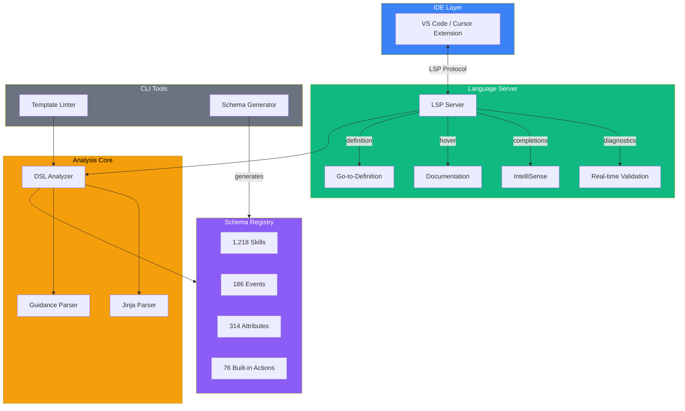

<p align="center">
  
</p>

<h1 align="center">Newo NSL Language Server</h1>

<p align="center">
  <strong>Full-featured Language Server Protocol implementation for the Newo Skill Language (NSL)</strong>
</p>

<p align="center">
  <a href="#packages">Packages</a> -
  <a href="#getting-started">Getting Started</a> -
  <a href="#architecture">Architecture</a> -
  <a href="#development">Development</a> -
  <a href="#contributing">Contributing</a>
</p>

---

## Overview

The Newo NSL Language Server provides a complete developer toolchain for the domain-specific language powering the [Newo SuperAgent](https://newo.ai) conversational AI platform. It delivers real-time diagnostics, intelligent code completion, hover documentation, and go-to-definition across two template languages - Jinja and Guidance - used to build AI agent behaviors.

### Schema Coverage

| Schema | Count | Description |
|--------|------:|-------------|
| Skills | 1,218 | Template functions with typed parameters |
| Events | 186 | System event definitions |
| Attributes | 314 | Customer and persona attributes |
| Flows | 59 | Agent flow definitions across 15 agents |
| Built-in Actions | 76 | Core DSL functions |
| Jinja Built-ins | 80+ | Python/Jinja2 functions and filters |

## Supported File Types

| Extension | Language | Format | Purpose |
|-----------|----------|--------|---------|
| `.jinja` | Newo Jinja | V1 | Procedural logic, data transformation |
| `.guidance` | Newo Guidance | V1 | LLM prompts, system instructions |
| `.nsl` | Newo NSL | V2 | Procedural logic (module-based format) |
| `.nslg` | Newo NSLG | V2 | LLM prompts (module-based format) |
| `flows.yaml` | YAML | V1 | Flow orchestration configuration |
| `metadata.yaml` | YAML | V1 | Skill and flow configuration |
| `FlowName.yaml` | YAML | V2 | Flow definition with inline skill parameters |

## Packages

This monorepo contains six workspaces organized into three layers:

```
newo-nsl-lsp/
├── packages/
│   ├── dsl-analyzer/        Core analysis library (parsers, validators, types)
│   ├── dsl-data/            Shared data (actions, builtins, validation rules)
│   └── dsl-lsp-server/      LSP server (diagnostics, completions, hover, go-to-def)
├── tools/
│   ├── dsl-spec/            Schema generator (extracts schemas from Newo codebase)
│   └── template-lint/       CLI static analyzer with SARIF output
└── vscode-extension/        VS Code / Cursor extension with full IDE support
```

| Package | Description | npm Name |
|---------|-------------|----------|
| **[dsl-analyzer](packages/dsl-analyzer/)** | Core analysis library with Jinja and Guidance parsers, validation engine, and type definitions | `@newo-dsl/analyzer` |
| **[dsl-data](packages/dsl-data/)** | Shared data definitions for 76 built-in actions, 81 Jinja builtins, validation rules, and string similarity | `@newo-dsl/data` |
| **[dsl-lsp-server](packages/dsl-lsp-server/)** | Language Server Protocol implementation with diagnostics, completions, hover docs, and go-to-definition | `@newo-dsl/lsp-server` |
| **[dsl-spec](tools/dsl-spec/)** | Schema generator that extracts skill, event, attribute, and flow definitions from the Newo codebase | `@newo-dsl/spec-generator` |
| **[template-lint](tools/template-lint/)** | CLI static analyzer with text, JSON, and SARIF output formats | `@newo-dsl/template-lint` |
| **[vscode-extension](vscode-extension/)** | VS Code and Cursor extension with syntax highlighting, snippets, file icons, and IntelliSense | `newo-dsl` |

## Getting Started

### Prerequisites

- **Node.js** >= 18.0.0
- **npm** >= 9.0.0
- **VS Code** >= 1.85.0 or **Cursor** (for the extension)

### Installation

```bash
# Clone the repository
git clone https://github.com/newo-ai/newo-nsl-lsp.git
cd newo-nsl-lsp

# Install all workspace dependencies
npm install
```

### Build

```bash
# Build all packages
npm run build

# Build and package the VS Code extension
cd vscode-extension
npm run package
```

### Install the Extension

```bash
# After building, install the .vsix file
code --install-extension vscode-extension/newo-dsl-*.vsix
```

### CLI Linter

```bash
# Lint all templates in a directory
npm run lint:templates -- ./path/to/templates

# Lint specific files
node tools/template-lint/cli.js file1.jinja file2.guidance

# Output as SARIF (for CI integration)
node tools/template-lint/cli.js --format sarif ./project
```

### Schema Generation

```bash
# Generate schemas from the Newo codebase
# Requires NEWO_ROOT env var or ../newo directory
npm run generate:schemas
```

## Architecture



## DSL Overview

The Newo DSL consists of two template languages for building AI agent behaviors, available in both V1 and V2 project formats:

### Jinja Templates (`.jinja` / `.nsl`)

Extended Jinja2 syntax for procedural logic and data transformation:

```jinja


  {{SendMessage(text="Hello " ~ user)}}

{{Return()}}
```

### Guidance Templates (`.guidance` / `.nslg`)

Handlebars-like syntax for LLM prompt engineering:

```handlebars
{{Set(name="context", value=GetCurrentPrompt())}}
{{#system~}}
You are a helpful assistant.
{{~/system}}
{{Return(val=context)}}
```

### Built-in Actions

The DSL includes 76 core actions organized by category:

| Category | Actions |
|----------|---------|
| **Flow Control** | `Return`, `Set`, `Gen`, `GenStream`, `FastPrompt`, `Do`, `Error`, `ResultError`, `ConnectorResultError` |
| **Messaging** | `SendMessage`, `SendCommand`, `SendSystemEvent`, `SendTypingStart`, `SendTypingStop` |
| **Customer** | `GetCustomerAttribute`, `SetCustomerAttribute`, `GetCustomerMetadataAttribute`, `SetCustomerMetadataAttribute`, `SetCustomerInfo`, `GetUser`, `UpdateUser` |
| **Persona** | `GetPersonaAttribute`, `SetPersonaAttribute`, `GetAgentPersona`, `CreatePersona`, `CreateActor` |
| **Project** | `GetProjectAttribute`, `SetProjectAttribute`, `SetProjectMetadataAttribute` |
| **Session** | `GetSessionInfo`, `EnableFollowUp`, `DisableFollowUp`, `StartNotInterruptibleBlock`, `StopNotInterruptibleBlock` |
| **Connectors** | `CreateConnector`, `GetConnectorInfo`, `SetConnectorInfo`, `DeleteConnector` |
| **Data/State** | `GetState`, `SetState`, `GetMemory`, `GetActors`, `GetActor`, `CreateArray` |
| **Utilities** | `GetCurrentPrompt`, `GetTriggeredAct`, `GetDatetime`, `GetValueJSON`, `UpdateValueJSON`, `Stringify`, `Concat`, `IsEmpty`, `IsSimilar` |

## Development

### Project Scripts

```bash
npm run build              # Build all packages (ordered by dependencies)
npm run clean              # Remove all build artifacts
npm test                   # Run 429+ tests across 18 test files
npm run test:coverage      # Run tests with V8 coverage report
npm run lint:templates     # Lint templates with CLI tool
npm run lint:flows         # Lint flow definitions
npm run generate:schemas   # Regenerate schemas from codebase
npm run version:sync       # Sync version across all packages
```

### Development Workflow

1. Make changes to the relevant package
2. Run `npm run build` from the root
3. Test the VS Code extension: press `F5` in the `vscode-extension/` workspace
4. Run the linter against sample templates to validate

### Extension Development

```bash
cd vscode-extension
npm run watch              # Start esbuild in watch mode
# Press F5 in VS Code to launch Extension Development Host
```

## Roadmap

- [x] **Phase 1** - Extract language model (1,218 skills, 186 events, 314 attributes)
- [x] **Phase 2** - CLI static analyzer with schema validation
- [x] **Phase 3** - LSP server with diagnostics, completions, and hover
- [x] **Phase 4** - VS Code extension with syntax highlighting, snippets, and icons
- [x] **Phase 5** - Enhanced DX (typo suggestions, quick-fixes, shared data package, CI/CD)
- [x] **Phase 6** - V2 format support (.nsl/.nslg, module-based projects, format auto-detection)
- [x] **Phase 7** - Variable Intelligence (variable tracking, object shapes, type inference, 12 shape definitions, attribute discovery)
- [x] **Phase 8** - Validation Hardening (string-aware brace counting, 6 FP categories eliminated, 429+ tests)

## Contributing

See [CONTRIBUTING.md](CONTRIBUTING.md) for development guidelines and contribution workflow.

## Security

See [SECURITY.md](SECURITY.md) for reporting vulnerabilities.

## License

Proprietary - [Newo AI](https://newo.ai). All rights reserved.
