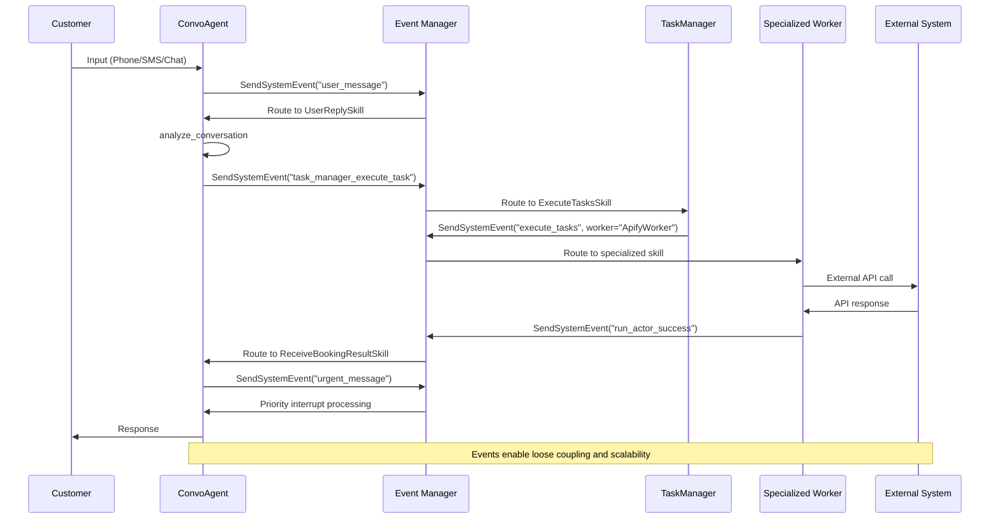
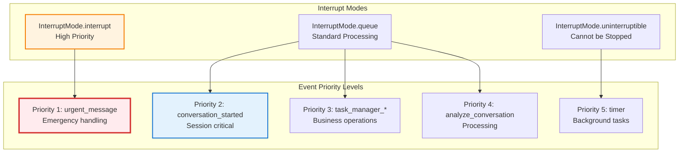

# Event System and Flow Analysis: Newo SuperAgent


## Event-Driven Architecture Overview

The Newo SuperAgent system is built on a sophisticated **event-driven architecture** where agents communicate through a centralized event routing system rather than direct method calls. This design enables loose coupling, scalability, and reliable message processing across the multi-agent ecosystem.

## Core Event System Design

### Event Structure and Configuration

#### Event Definition Format (flows.yaml)
```yaml
events:
  - idn: "unique_event_identifier"           # Unique event identifier
    skill_selector: "SkillSelector.skill_idn" # How to route the event
    skill_idn: "target_skill_name"            # Target skill to execute
    integration_idn: "system|apify|api|null"  # Integration context
    connector_idn: "system|webhook|specific"  # Connector type
    interrupt_mode: "InterruptMode.queue"     # Execution behavior
    args:                                     # Event-specific parameters
      param1: "value1"
      param2: "value2"
```

#### Key Event Components

**Event Identifier (idn)**
- Unique string identifying the specific event type
- Used for routing and debugging purposes
- Naming convention: `{verb}_{entity}_{context}`

**Skill Selector and Target**
- `skill_selector`: Routing mechanism (usually `SkillSelector.skill_idn`)
- `skill_idn`: Target skill within the receiving agent
- Enables dynamic routing to different implementations

**Integration Context**
- `integration_idn`: External system integration context
  - `system`: Internal system events
  - `apify`: Apify platform integration
  - `api`: Generic API integration
  - `null`: No external integration

**Execution Control**
- `interrupt_mode`: How events interact with ongoing processes
  - `InterruptMode.queue`: Standard queuing behavior
  - `InterruptMode.interrupt`: High-priority immediate processing
  - `InterruptMode.uninterruptible`: Cannot be interrupted

### Event Categories and Routing

#### 1. Conversation Lifecycle Events

**conversation_started**
```yaml
idn: "conversation_started"
skill_idn: "ConversationStartedSkill"
integration_idn: "system"
connector_idn: "system"
```
**Purpose**: Initialize customer session and conversation context
**Triggers**: New customer contact across any channel
**Flow**: Customer Contact → ConvoAgent → Session Setup → Greeting

**user_message** (Universal User Input)
```yaml
idn: "user_message"
skill_idn: "UserPhoneReplySkill|UserSMSReplySkill|UserAPIReplySkill|etc"
integration_idn: "system"
connector_idn: "system"
```
**Purpose**: Process customer messages from any communication channel
**Triggers**: Customer input received via phone, SMS, chat, API, proxy, etc.
**Flow**: Customer Input → Channel Detection → ConvoAgent → Response Generation
**Channel Variants**: user_message_proxy, user_speech_detected

**conversation_ended**
```yaml
idn: "conversation_ended"
skill_idn: "ConversationEndedSkill"
integration_idn: "system"
connector_idn: "system"
```
**Purpose**: Clean up session and generate analytics
**Triggers**: Session timeout, explicit end, or task completion
**Flow**: End Trigger → Analytics Collection → State Cleanup → Session Archive

#### 2. Task Management Events

**task_manager_execute_task**
```yaml
idn: "task_manager_execute_task"
skill_idn: "ExecuteTaskSkill"
integration_idn: "system"
connector_idn: "system"
```
**Purpose**: Delegate tasks to specialized workers
**Triggers**: ConvoAgent needs background task execution
**Flow**: Task Request → TaskManager → Worker Selection → Task Assignment

**task_manager_update_task_status**
```yaml
idn: "task_manager_update_task_status"  
skill_idn: "UpdateTaskStatusSkill"
integration_idn: "system"
connector_idn: "system"
```
**Purpose**: Track task progress and completion
**Triggers**: Worker status updates during task execution
**Flow**: Worker Progress → TaskManager → Status Update → Notification

#### 3. Business Process Events

**check_availability_hospitality**
```yaml
idn: "check_availability_hospitality"
skill_idn: "HospitalityReceiveAvailableSlotsDefaultSkill"
integration_idn: "apify"
connector_idn: "hospitality_availability"
```
**Purpose**: Query external booking systems for availability
**Triggers**: Customer availability requests
**Flow**: Availability Request → ApifyWorker → External API → Response Processing

**run_actor_success / run_actor_error**
```yaml
idn: "run_actor_success"
skill_idn: "ReceiveBookingResultSkill"
integration_idn: "apify" 
connector_idn: "system"
```
**Purpose**: Handle external system integration responses
**Triggers**: Apify actor completion (success or failure)
**Flow**: External System Response → Worker Processing → Result Formatting → Customer Response

#### 4. Communication Events

**urgent_message**
```yaml
idn: "urgent_message"
skill_idn: "UrgentMessage"
integration_idn: "system"
connector_idn: "system"
interrupt_mode: "InterruptMode.interrupt"
```
**Purpose**: Handle high-priority customer communications
**Triggers**: Emergency situations, escalations, VIP customers
**Flow**: Urgent Trigger → Immediate Processing → Priority Response

**broadcast_analyze_conversation**
```yaml
idn: "broadcast_analyze_conversation"
skill_idn: "BroadcastAnalyzeConversation"
integration_idn: "system"
connector_idn: "system"
```
**Purpose**: Multi-agent conversation analysis and coordination
**Triggers**: Complex conversations requiring multiple agent perspectives
**Flow**: Analysis Request → Multiple Agents → Consolidated Analysis → Action Plan

### Comprehensive Event System Map (Verified from flows.yaml)

#### **Core System Events** (100+ Verified Events)

```mermaid
graph TB
    subgraph "Conversation Lifecycle"
        CS[conversation_started]
        CE[conversation_ended] 
        UM[user_message]
        RUM[real_user_message]
        FU[follow_up_message]
        ES[extend_session]
        ENDS[end_session]
    end
    
    subgraph "Voice & Speech Events"
        ASS[agent_speech_started]
        ASE[agent_speech_ended]
        AMF[agent_message_finished]
        USD[user_speech_detected]
        UMTF[user_message_transcription_finished]
        SUM[send_user_message]
    end
    
    subgraph "Task Management"
        TMET[task_manager_execute_task]
        TMUT[task_manager_update_task_status]
        TMGT[task_manager_get_task]
        TMST[task_manager_schedule_tasks]
        TMTT[task_manager_trigger_task]
        ET[execute_tasks]
    end
    
    subgraph "Business Operations"
        CAH[check_availability_hospitality]
        RAS[receive_available_slots]
        CT[calculation_tool]
        CW[check_timezone_tool]
        RET[result_error]
        RS[result_success]
    end
    
    subgraph "External System Integration"
        RAE[run_actor_error]
        RASU[run_actor_success]
        CEE[create_event_error]
        CES[create_event_success]
        MBR[magic_browser_response]
        SSE[send_sms_error]
    end
    
    subgraph "AI & Intelligence"
        AC[analyze_conversation]
        BAC[broadcast_analyze_conversation]
        PRC[prepare_rag_context_command]
        TC[tool_called]
        TH[thoughts]
        GP[greeting_phrase]
    end
    
    subgraph "Data Management"  
        NDI[new_data_to_inject]
        PID[prepare_injecting_data]
        SPCS[set_prompt_custom_section]
        RPCS[remove_prompt_custom_section]
        CWH[calculate_working_hours]
        BOP[build_operating_phrase]
    end
    
    subgraph "Communication & Notifications"
        UM_MSG[urgent_message]
        SER[send_external_reply]
        TIMER[timer]
        WM[worker_message]
        ER[external_request]
    end
    
    CS --> UM
    UM --> AC
    AC --> BAC
    TMET --> ET
    CAH --> RAS
    RAE --> RET
    RASU --> RS
    ASS --> ASE
    
    style CS fill:#e3f2fd,stroke:#1976d2,stroke-width:2px
    style TMET fill:#f3e5f5,stroke:#7b1fa2,stroke-width:2px
    style UM_MSG fill:#ffebee,stroke:#d32f2f,stroke-width:2px
```


#### **Event Flow Categories & Integration Patterns**

**1. Apify Platform Integration Events**
- `run_actor_success` / `run_actor_error`: Apify actor execution results
- `check_availability_hospitality`: Hospitality booking system queries
- `magic_browser_response`: Automated browser interaction results

**2. Voice System Integration Events** 
- `agent_speech_started` / `agent_speech_ended`: Voice conversation timing
- `user_speech_detected`: Voice input detection
- `user_message_transcription_finished`: Speech-to-text completion
- `send_user_message`: Voice message routing

**3. Business Intelligence Events**
- `broadcast_analyze_conversation`: Multi-agent analysis coordination
- `prepare_rag_context_command`: Knowledge base integration
- `analyze_conversation`: Single-agent conversation analysis
- `tool_called`: Dynamic tool execution

**4. Data Synchronization Events**
- `new_data_to_inject`: External data integration triggers
- `set_prompt_custom_section`: Dynamic prompt customization
- `calculate_working_hours`: Business hours synchronization
- `build_operating_phrase`: Dynamic response generation

**5. Task Coordination Events**
- `task_manager_execute_task`: Task delegation to workers
- `task_manager_schedule_tasks`: Scheduled task management
- `task_manager_update_task_status`: Progress tracking
- `worker_message`: Inter-worker communication

### Event-Driven System Architecture



### Event Priority and Interrupt Handling



## Message Flow Patterns

### Primary Conversation Flow
```
Customer Input
    ↓
Channel Detection → ConvoAgent
    ↓
Intent Analysis → AnalyzeConversationSkill  
    ↓
Flow Selection → Specialized Business Flow
    ↓
Task Generation → TaskManager
    ↓
Worker Assignment → Specialized Agents
    ↓
External Integration → APIs/Services
    ↓
Response Processing → ConvoAgent
    ↓
Customer Response
```

### Task Delegation Flow
```
ConvoAgent (Business Need)
    ↓
SendSystemEvent("task_manager_execute_task")
    ↓
TaskManager (Task Analysis)
    ↓
Worker Selection (Based on task type)
    ↓
SendSystemEvent("execute_tasks") → Specialized Worker
    ↓
Task Execution → External Systems
    ↓
SendSystemEvent("task_manager_update_task_status")
    ↓
TaskManager (Status Tracking)
    ↓
SendSystemEvent("task_complete") → ConvoAgent
    ↓
Customer Notification
```

### Error Handling Flow
```
Agent Error Detection
    ↓
SendSystemEvent("error_occurred")
    ↓
Error Analysis and Classification
    ↓
Recovery Strategy Selection
    ↓
    ├── Retry Logic → Resubmit Task
    ├── Fallback System → Alternative Approach
    ├── Human Escalation → Manual Intervention
    └── Customer Notification → Transparent Communication
```

## Data Flow and State Management

### State Scopes and Persistence

#### User State (StateFieldScope.user)
**Purpose**: Persistent customer information across sessions
**Lifetime**: Permanent until explicitly cleared
**Contents**:
- Customer preferences and profile
- Historical interaction data
- Booking history and patterns
- Communication preferences

**Access Pattern**:
```jinja
{{GetPersonaAttribute(id=user_id, field="customer_preferences")}}
{{SetPersonaAttribute(id=user_id, field="last_booking_date", value=current_date)}}
```

#### Agent State (StateFieldScope.agent) 
**Purpose**: Session-specific conversation context
**Lifetime**: Duration of conversation session
**Contents**:
- Current conversation memory
- Active workflow status
- Temporary processing variables
- Context for current business process

**Access Pattern**:
```jinja
{{Set(name="conversation_context", value=analysis_result)}}
{{Get(name="current_workflow_state")}}
```

#### System State (Global Configuration)
**Purpose**: System-wide configuration and business rules
**Lifetime**: Persistent until configuration changes
**Contents**:
- Business operating rules
- Integration credentials
- Feature flags and toggles
- System performance settings

### Memory Management Patterns

#### Conversation Memory
```jinja
{{Set(name="memory", value=_utilsGetMemorySkill(
    userId=user_id, 
    count=300,
    includeLatestAgentResponse=false
))}}
```

**Memory Filtering**:
- **With latest response**: Full conversation context
- **Without latest response**: Customer messages only
- **Filtered by type**: System messages, customer messages, agent responses
- **Time-based**: Recent messages only for context relevance

#### Context Passing Between Skills
```jinja
Input Parameters:
- user_id: Customer identifier
- conversation_id: Session identifier  
- memory: Conversation context
- user_message: Current customer input
- additional_context: Business-specific data

Output Processing:
- Response generation
- State updates
- Event triggering
- External system calls
```

## Integration and External System Events

### Apify Platform Integration

#### Actor Execution Events
```yaml
# Start external availability check
idn: "check_availability_hospitality"
integration_idn: "apify"
connector_idn: "hospitality_availability"
args:
  actor_idn: "availability_checker_actor"
  input_data: 
    restaurant_id: "{restaurant_id}"
    date_range: "{requested_dates}"
    party_size: "{party_size}"
```

#### Response Processing Events
```yaml
# Handle successful actor completion
idn: "run_actor_success"
integration_idn: "apify"
connector_idn: "system"
args:
  actor_result: "{external_system_response}"
  context_data: "{original_request_context}"
```

### Webhook Integration Events

#### External System Callbacks
```yaml
idn: "webhook_received"
integration_idn: "api"
connector_idn: "webhook"
args:
  webhook_type: "booking_confirmation"
  payload: "{external_system_data}"
  verification: "{security_hash}"
```

### API Integration Events

#### Generic API Calls
```yaml
idn: "api_request"
integration_idn: "api" 
connector_idn: "rest_api"
args:
  endpoint: "{api_endpoint_url}"
  method: "POST|GET|PUT|DELETE"
  headers: "{request_headers}"
  payload: "{request_data}"
```

## Error Handling and Reliability

### Error Event Categories

#### System Errors
```yaml
idn: "system_error"
skill_idn: "HandleSystemErrorSkill"
interrupt_mode: "InterruptMode.interrupt"
args:
  error_type: "database|network|service_unavailable"
  error_context: "{error_details}"
  recovery_options: "{available_actions}"
```

#### Integration Errors
```yaml
idn: "integration_error"
skill_idn: "HandleIntegrationErrorSkill" 
args:
  integration_type: "apify|api|webhook"
  error_code: "{external_error_code}"
  retry_count: "{current_retry_number}"
  max_retries: 3
```

#### Business Logic Errors
```yaml
idn: "business_error"
skill_idn: "HandleBusinessErrorSkill"
args:
  business_context: "booking|availability|payment"
  error_reason: "{business_rule_violation}"
  customer_impact: "high|medium|low"
```

### Reliability Mechanisms

#### Retry Logic
- **Exponential Backoff**: Progressive delay between retries
- **Jitter**: Random variation to prevent thundering herd
- **Circuit Breaker**: Temporary failure prevention
- **Dead Letter Queue**: Failed message handling

#### Event Ordering and Delivery
- **At-Least-Once Delivery**: Ensures message processing
- **Idempotent Processing**: Handles duplicate messages safely
- **Event Sequencing**: Maintains order when required
- **Poison Message Handling**: Deals with permanently failing messages

This event system demonstrates a mature, production-ready approach to building scalable, reliable multi-agent systems with comprehensive error handling and sophisticated inter-agent communication patterns.
