# Detailed Agent Analysis: Newo SuperAgent System


## ConvoAgent: Primary Conversational Interface

### Purpose and Scope
ConvoAgent is the **central orchestrator** of customer interactions, serving as the primary interface between users and the entire business automation system. It manages conversation state, routes business processes, and coordinates with specialized agents.

### Core Capabilities

#### Multi-Channel Communication Support
- **Voice Calls**: Inbound/outbound phone integration with speech detection
- **SMS**: Text message handling with template support
- **Chat**: Web chat and messaging platform integration
- **Email**: Email communication and notification delivery
- **API**: Webhook and direct API integration

#### Conversation Management
- **Context Preservation**: Maintains conversation history and user preferences
- **Intent Recognition**: AI-powered analysis of user requests and goals
- **Flow Routing**: Directs conversations to appropriate business processes
- **Memory Management**: Stores and retrieves relevant conversation context
- **Session Handling**: Manages customer sessions across multiple interactions

### Flow Architecture Analysis

#### **CAMainFlow** (Master Orchestrator)
**Purpose**: Central conversation lifecycle management
```
Key Skills:
├── ConversationStartedSkill → Session initialization
├── AnalyzeConversationSkill → Intent recognition  
├── UserPhoneReplySkill → Voice interaction handling
├── UserSMSReplySkill → Text message processing
├── FollowUpSkill → Scheduled callback management
└── ConversationEndedSkill → Session cleanup
```

**Responsibilities**:
- User greeting and identification
- Channel detection and configuration
- Prompt generation and AI response management
- Tool calling and external service coordination
- Session state management

#### **CAScheduleFlow** (Booking Management)
**Purpose**: Complete appointment and reservation handling
```
Key Skills:
├── _bookInitialCheckSkill → Validation and prerequisites
├── _bookSkill → Core booking logic
├── ReceiveBookingResultSkill → Booking confirmation
├── ReceiveBookingErrorSkill → Error handling
├── _buildEmailBodyExtractValuesSkill → Email generation
└── _storeUserBookingSkill → Persistence
```

**Business Logic**:
- Availability validation
- Customer information gathering
- Booking system integration
- Confirmation and notification delivery
- Error recovery and alternative options

#### **CACheckingAvailabilityFlow** (Real-Time Availability)
**Purpose**: Live availability checking across multiple systems
```
Key Skills:
├── _requestAvailableSlotsSkill → Query initiation
├── ReceiveAvailableSlotsDefaultSkill → Response processing
├── _receiveAvailabilityProcessLLMSkill → AI analysis
├── _receiveAvailableSlotsTwoNearestSkill → Optimal slot selection
└── ResultSuccessIntercomSkill → Result delivery
```

**Integration Points**:
- External booking systems via Apify
- Calendar systems for availability
- Business hours and timezone handling
- Real-time data formatting

#### **CACancellationFlow** (Booking Modification)
**Purpose**: Booking cancellation and modification handling
```
Key Skills:
├── _cancelBookingInitialCheckSkill → Validation
├── _checkUserBookingsSkill → Booking retrieval
├── _cancelBookingSkill → Cancellation logic
├── _clearBookingSkill → Data cleanup
└── _getBookingIdSkill → Booking identification
```

**Capabilities**:
- Booking verification and validation
- Cancellation policy enforcement
- Refund processing coordination
- Customer notification management

#### **CAActionCall\*Flow** (Voice Management)
**Purpose**: Comprehensive phone call handling
```
Flows:
├── CAActionCallTransferFlow → Call transfer management
├── CAActionCallHangUpFlow → Call termination
├── CAActionCallDefineVoiceMailFlow → Voicemail handling
└── CAActionCallSendDialpadDigitsFlow → DTMF processing
```

**Voice Features**:
- Call transfer with destination validation
- Hold music and waiting management
- Voicemail recording and transcription
- Dialpad input processing
- Call quality monitoring

### Advanced Features

#### **CAObserverFlow** (Quality Monitoring)
**Purpose**: Real-time conversation quality assessment
- Customer satisfaction analysis
- Business process optimization
- Performance metrics collection
- Issue identification and escalation

#### **CAThinkFlow & CAThoughtsFlow** (AI Reasoning)
**Purpose**: Advanced AI decision making and reasoning
- Complex problem solving
- Multi-step logical reasoning
- Context-aware decision making
- Uncertainty handling

#### **CADataInjectionFlow** (External Data Integration)
**Purpose**: Dynamic business data integration and real-time business context management
```
Key Skills:
├── BuildTodaysScheduleSkill → Daily schedule compilation
├── FetchData → External data retrieval
├── InjectCustomSectionSkill → Dynamic content injection
├── PrepareInjectingDataSkill → Data preparation and validation
├── RetrieveDataSkill → Historical data access
├── _buildCustomSectionSkill → Custom content generation
├── _defineCalendarSkill → Calendar system integration
└── _summarizeInjectedData → Data processing summary
```
**Business Logic**:
- Real-time business schedule synchronization
- External system data integration and validation
- Custom business rule and content injection
- Calendar system coordination and scheduling optimization

### Additional ConvoAgent Flows (Comprehensive Coverage)

#### **CAGen2*Flow** (Generation 2 Conversation System)
**Purpose**: Advanced conversation management with modern AI integration
```
Generation 2 Flows:
├── CAGen2CollectAgentMessageFlow → AI message processing
├── CAGen2CollectUserMessageFlow → User input handling
├── CAGen2SendAgentMessageFlow → AI response delivery
└── CAGen2SendUserMessageFlow → User message routing
```
**Advanced Features**:
- Speech-to-speech conversation handling
- Real-time message processing with follow-up timers
- Advanced conversation state management
- Tool calling and function execution integration

#### **CAReportFlow** (Analytics & Business Intelligence)
**Purpose**: Comprehensive conversation analytics and business reporting
```
Key Skills:
├── AnalyzeConversationSkill → Conversation quality analysis
├── SendReportSkill → Report generation and delivery
├── _sendReportClassifySkill → Conversation classification
├── _sendReportDefineDirectionsSkill → Business insights
├── _sendReportEmailSkill → Report distribution
├── _semaphoreAnalyzeSkill → Advanced analytics
├── _semaphoreFormatSkill → Report formatting
└── _semaphoreSummarizeSkill → Summary generation
```
**Business Intelligence**:
- Real-time conversation quality evaluation
- Revenue potential analysis and tracking
- Customer satisfaction scoring
- Business performance reporting and insights
- Email-based report distribution with UTM tracking

#### **CARagFlow** (Retrieval Augmented Generation)
**Purpose**: Enhanced AI responses with external knowledge integration
```
Key Skills:
├── PrepareRagContextSkill → Knowledge base preparation
└── PrepareRagContextSchemaSkill → Data schema validation
```
**AI Enhancement**:
- Dynamic knowledge base integration
- Context-aware response enhancement
- External information retrieval and integration
- Personalized content delivery based on business data

#### **CAExecuteExternalTasksFlow** (External System Coordination)
**Purpose**: Complex external system task execution and coordination
```
Key Skills:
├── ExecuteTasksSkill → Task execution coordination
├── ReceiveRequestSkill → External request processing
├── _createActorsSkill → System actor management
├── _defineTasksSkill → Task definition and validation
├── _executeTasksWithoutPersonaSkill → System task execution
└── _updateTaskManagerStatusSkill → Status synchronization
```
**System Integration**:
- External API coordination and execution
- Multi-system task orchestration
- Actor and persona management
- Task status tracking and reporting

#### **CABroadcastConversationFlow** (Multi-Agent Communication)
**Purpose**: System-wide conversation broadcasting and analysis
```
Key Skills:
├── BroadcastAnalyzeConversation → Multi-agent analysis
├── GetConversation → Conversation retrieval
├── get_memory → Memory system access
└── get_prompt_memory → Prompt history management
```
**Multi-Agent Coordination**:
- System-wide conversation analysis
- Memory sharing across agent ecosystem
- Collaborative conversation processing
- Distributed intelligence coordination

#### **CANewoToolCaller** (Advanced Tool Integration)
**Purpose**: Sophisticated tool calling and function execution system
```
Key Skills:
├── AnalyzeConversation → Tool requirement analysis  
├── get_tools_to_call → Dynamic tool selection
└── get_tools_to_call_schema → Tool validation
```
**Tool Management**:
- Dynamic tool discovery and selection
- Context-aware function calling
- Tool execution validation and error handling
- Integration with external service APIs

#### **CAExternalReply** (External Platform Integration)
**Purpose**: Multi-platform communication and response handling
```
Key Skills:
├── ExternalReplySkill → Platform-specific responses
├── _getManyChatReplyRequestBodySkill → ManyChat integration
├── _getManyChatReplyRequestHeadersSkill → API configuration
└── _sendManyChatReplySkill → Response delivery
```
**Platform Support**:
- ManyChat integration for marketing automation
- Multi-platform response formatting
- External webhook handling and processing
- Cross-platform conversation continuity

#### **CACalculatorFlow** (Business Calculations)
**Purpose**: Industry-specific pricing and calculation logic
```
Key Skills:
├── CalculateSkill → General calculation processing
└── _reasonCleaningPricingSkill → Cleaning service pricing
```
**Calculation Features**:
- Industry-specific pricing algorithms
- Dynamic cost calculation based on service parameters
- Business rule application and validation
- Real-time quote generation

#### **CATimezoneFlow** (Global Time Management)
**Purpose**: Multi-timezone business operation support
```
Key Skills:
├── ReasonSkill → Timezone logic processing
└── _reasonTimeZoneSkill → Timezone calculation
```
**Global Operations**:
- Multi-timezone scheduling coordination
- Business hours calculation across regions
- Time-sensitive booking management
- Geographic scheduling optimization

### ConvoAgent Flow Architecture Diagram

```mermaid
graph TB
    subgraph "Core Conversation Management"
        CAM[CAMainFlow<br/>Master Orchestrator]
        CAS[CAScheduleFlow<br/>Booking Management]
        CAC[CACheckingAvailabilityFlow<br/>Availability Engine]
        CANC[CACancellationFlow<br/>Booking Modification]
    end
    
    subgraph "Communication Channels"
        CACE[CAActionCallTransferFlow<br/>Phone Management]
        CASE[CAActionSendSMSInformationFlow<br/>SMS Processing]
        CAEE[CAActionSendEmailInformationFlow<br/>Email Management]
        CAER[CAExternalReply<br/>Platform Integration]
    end
    
    subgraph "AI & Intelligence"
        CAG2[CAGen2*Flow<br/>Advanced Conversation]
        CARAG[CARagFlow<br/>Knowledge Integration]
        CATO[CAThoughtsFlow<br/>AI Reasoning]
        CANT[CANewoToolCaller<br/>Tool Integration]
    end
    
    subgraph "Business Operations"
        CARE[CAReportFlow<br/>Analytics & BI]
        CADI[CADataInjectionFlow<br/>Data Integration]
        CAET[CAExecuteExternalTasksFlow<br/>External Tasks]
        CALC[CACalculatorFlow<br/>Pricing Engine]
    end
    
    subgraph "System Coordination"
        CABO[CAObserverFlow<br/>Quality Monitoring]
        CABC[CABroadcastConversationFlow<br/>Multi-Agent Communication]
        CAES[CAEndSessionFlow<br/>Session Management]
        CATZ[CATimezoneFlow<br/>Global Operations]
    end
    
    CAM --> CAS
    CAM --> CAC  
    CAM --> CANC
    CAM --> CACE
    CAM --> CASE
    CAM --> CAEE
    
    CAS --> CALC
    CAC --> CAET
    
    CAM --> CAG2
    CAG2 --> CARAG
    CAG2 --> CANT
    
    CABO --> CARE
    CABC --> CADI
    
    style CAM fill:#e3f2fd,stroke:#1976d2,stroke-width:3px
    style CAS fill:#f3e5f5,stroke:#7b1fa2,stroke-width:2px
    style CAC fill:#f3e5f5,stroke:#7b1fa2,stroke-width:2px
    style CARE fill:#e8f5e8,stroke:#388e3c,stroke-width:2px
```



## TaskManager: Orchestration Engine

### Purpose and Architecture
TaskManager serves as the **central coordination hub** for all background tasks and inter-agent communication within the system.

### Core Capabilities

#### Task Lifecycle Management
```
Task States:
├── Created → Initial task definition
├── Scheduled → Queued for execution
├── Executing → In progress with assigned worker
├── Completed → Successfully finished
├── Failed → Error state with retry logic
└── Cancelled → Manually terminated
```

#### Worker Coordination
- **Dynamic Assignment**: Intelligent task routing to appropriate agents
- **Load Balancing**: Distribution based on agent capacity and specialization
- **Health Monitoring**: Real-time worker status tracking
- **Scaling**: Automatic worker scaling based on queue depth

#### Scheduling System
- **ASAP Execution**: Immediate task processing
- **Time-Based Scheduling**: Delayed execution with precise timing
- **Recurring Tasks**: Periodic task execution
- **Priority Queuing**: Task prioritization based on business rules

### Task Types and Routing

#### Communication Tasks
- SMS delivery → SmsWorker
- Email notifications → Specialized email workers
- Voice calls → Voice system integration
- Push notifications → Notification services

#### Business Process Tasks
- Availability checking → ApifyCheckAvailabilityWorker
- Booking confirmations → External system integration
- Payment processing → Payment gateway workers
- Calendar updates → Calendar integration workers

#### System Maintenance Tasks
- Data cleanup → System maintenance workers
- Analytics collection → Data processing workers
- Log management → Logging system workers
- Health checks → Monitoring workers

## ApifyCheckAvailabilityWorker: Integration Specialist

### Purpose and Integration Focus
Specialized agent for **real-time availability checking** through the Apify platform, enabling seamless integration with external booking and scheduling systems.

### Core Capabilities

#### Apify Platform Integration
- **Actor Management**: Dynamic Apify actor spawning and management
- **Data Extraction**: Real-time data scraping from booking websites
- **Format Conversion**: Translation between external formats and internal schemas
- **Rate Limiting**: Respectful API usage with throttling

#### Availability Processing
```
Processing Pipeline:
Input → External System Query → Data Extraction → 
Format Standardization → Availability Analysis → 
Response Generation → ConvoAgent Delivery
```

#### Error Handling and Reliability
- **Retry Logic**: Exponential backoff for failed requests
- **Fallback Systems**: Alternative availability sources
- **Cache Management**: Intelligent caching for performance
- **Circuit Breaker**: Protection against cascade failures

### Business System Integrations

#### Hospitality Systems
- Restaurant reservation platforms (OpenTable, Resy, etc.)
- Hotel booking systems
- Event venue scheduling
- Tour and activity bookings

#### Healthcare Systems
- Medical appointment scheduling
- Dental office management
- Specialist booking systems
- Lab and diagnostic scheduling

#### Service Industries
- Home service scheduling
- Professional service bookings
- Maintenance and repair scheduling
- Consultation and advisory services

## GeneralManagerAgent: System Administrator

### Purpose and System Management
GeneralManagerAgent handles **system-level operations**, business configuration, and account management across the entire multi-agent platform.

### Core Responsibilities

#### Account Lifecycle Management
- **Initial Setup**: New business onboarding and configuration
- **Template Selection**: Industry-specific AI behavior configuration
- **Feature Enablement**: Progressive feature rollout and management
- **Migration Management**: System updates and data migrations

#### Business Template System
```
Industry Templates:
├── Hospitality/Restaurant
│   ├── Reservation management flows
│   ├── Menu and pricing integration
│   ├── Special event handling
│   └── Customer preference management
├── Healthcare/Dental
│   ├── Appointment scheduling flows
│   ├── Insurance handling procedures
│   ├── Patient communication templates
│   └── Compliance management
├── Cleaning Services
│   ├── Service area validation
│   ├── Pricing calculation workflows
│   ├── Recurring service management
│   └── Quality assurance procedures
└── General Services
    ├── Flexible booking workflows
    ├── Custom pricing models
    ├── Multi-location support
    └── Industry-agnostic templates
```

#### Migration and Update Management
**Version Control**: Systematic database and configuration updates
- Migration scripts for schema changes
- Data transformation procedures
- Rollback capabilities
- Version compatibility management

### Configuration Management

#### Business Rule Configuration
- Operating hours and timezone management
- Service area and location definitions
- Pricing models and calculation rules
- Customer communication preferences

#### AI Behavior Customization
- Industry-specific conversation patterns
- Business terminology and vocabulary
- Response tone and personality configuration
- Escalation and transfer procedures

## Supporting Agents Analysis

### MultiLocationAgent: Geographic Orchestration
**Purpose**: Manages customer interactions across multiple business locations
**Key Features**:
- Location detection from customer queries
- Context switching without conversation disruption
- Location-specific business rules and configurations
- Multi-location analytics and reporting

### SmsWorker: SMS Communication Specialist
**Purpose**: Dedicated SMS message processing and delivery
**Capabilities**:
- Template-based message generation
- Phone number validation and formatting
- Delivery status tracking and retry logic
- Multi-provider SMS gateway integration

### MagicWorker: Advanced Task Processor
**Purpose**: Complex, multi-step task execution with external integrations
**Features**:
- Advanced workflow orchestration
- External service integration management
- Error recovery with notification systems
- Session isolation for task security

### TestAgent: Development Support
**Purpose**: Development, testing, and debugging assistance
**Tools**:
- Automated browser testing for booking flows
- AI prompt optimization and testing
- System debugging and diagnostics
- Development workflow shortcuts

## Agent Communication Patterns

### Inter-Agent Message Flows
```
Primary Flow:
Customer → ConvoAgent → TaskManager → Specialized Workers → External Systems

Response Flow:
External Systems → Workers → TaskManager → ConvoAgent → Customer

Emergency Flow:
Any Agent → Urgent Event → ConvoAgent → Immediate Customer Response
```

### Event-Driven Communication
- **Loose Coupling**: Agents don't directly call each other
- **Scalability**: New agents can be added without modifying existing ones
- **Reliability**: Message queuing with retry and error handling
- **Monitoring**: Full event tracing and logging

This detailed analysis reveals a sophisticated, production-ready multi-agent system with clear specialization, robust error handling, and comprehensive business process automation capabilities designed for real-world deployment.
