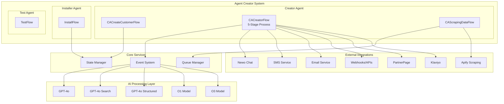
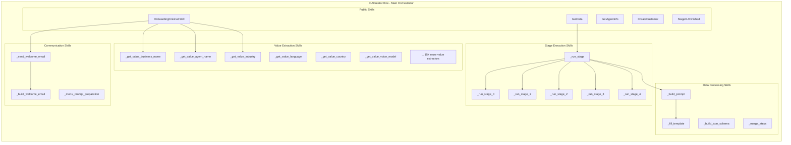
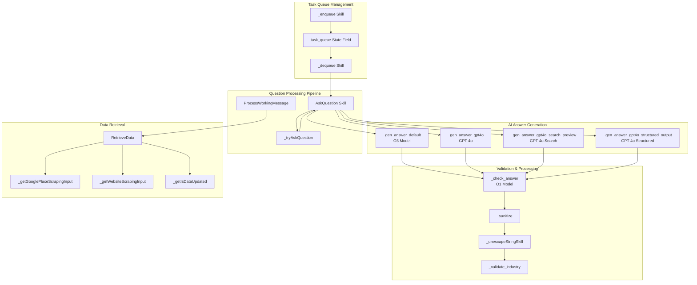
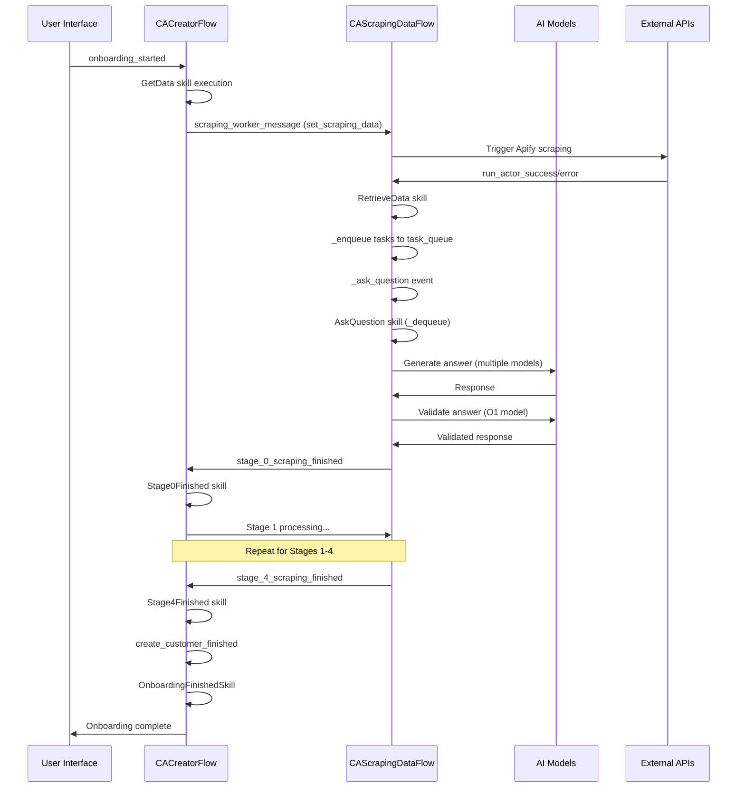
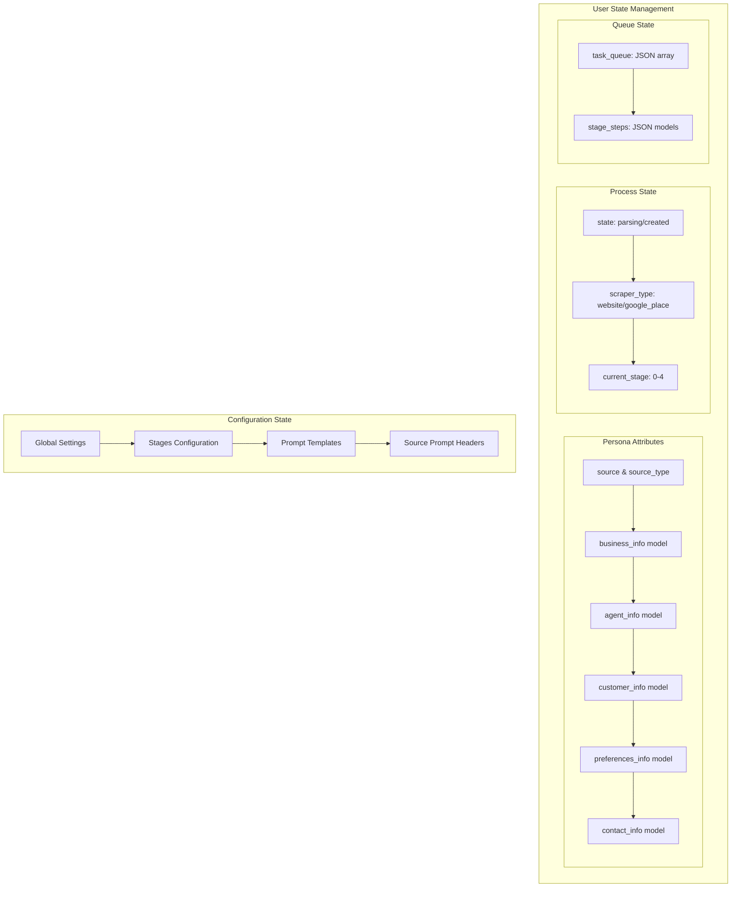
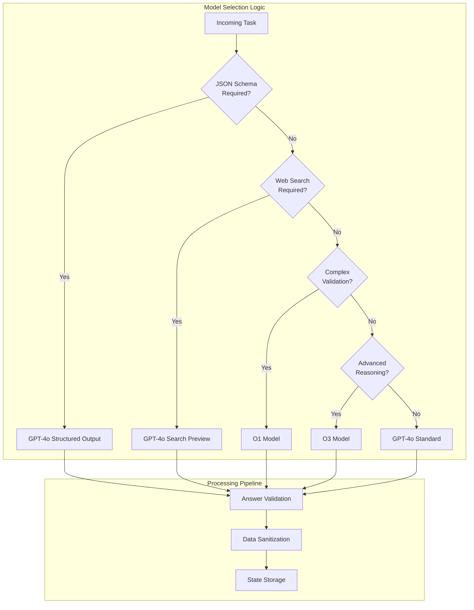
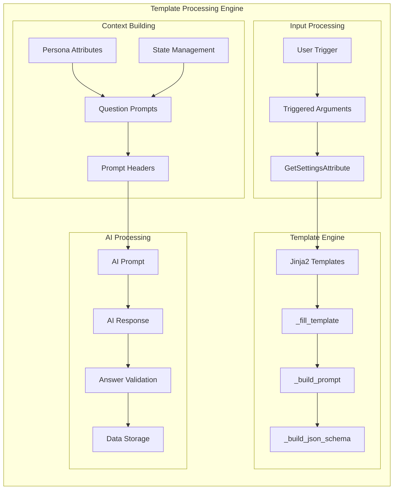
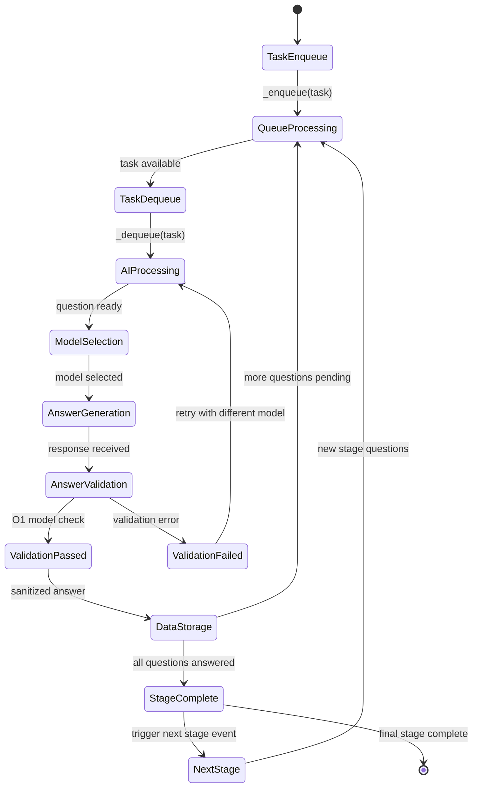
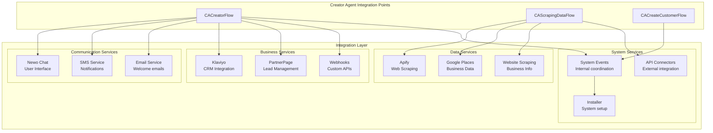
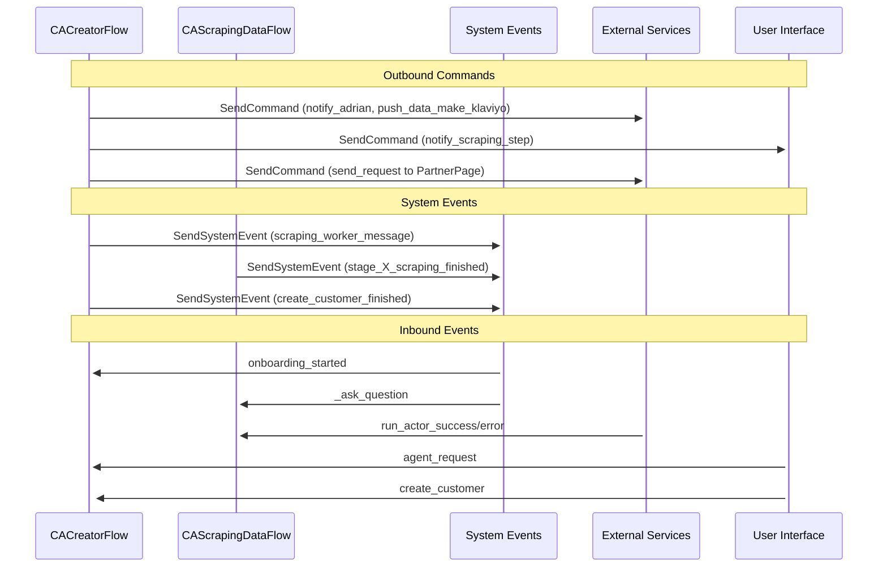

# Agent Creator Architecture

This document provides a comprehensive technical overview of the Newo Agent Creator's architecture, including component interactions, data flow patterns, and implementation details.

## System Architecture Overview

The Agent Creator follows a **multi-agent, event-driven architecture** with sophisticated AI orchestration and external service integration.

## Component Deep Dive

### Creator Agent Architecture

The Creator Agent implements a **hierarchical flow structure** with specialized responsibilities:

### Data Scraping Flow Architecture

The `CAScrapingDataFlow` implements a **queue-based, AI-powered processing pipeline**:

## Event-Driven Orchestration

### Event Flow Mapping

The system uses **12 major events** to coordinate workflow execution:

### State Management Architecture

## AI Model Integration Strategy

### Model Selection Matrix

The system employs **5 different AI models** with specific use cases:

| Model | Use Case | Optimization | Skills Using |
|-------|----------|--------------|-------------|
| **GPT-4o** | General reasoning, text processing | Speed & versatility | 90% of skills |
| **GPT-4o Search Preview** | Web-enhanced queries | Real-time data access | AskQuestion |
| **GPT-4o Structured Output** | JSON schema compliance | Data consistency | _gen_answer_gpt4o_structured_output |
| **O1** | Complex validation & reasoning | Accuracy & logic | _check_answer |
| **O3** | Advanced reasoning tasks | Deep analysis | _gen_answer_default |

### Dynamic Model Selection

## Data Processing Pipeline

### Template Processing Architecture

### Queue-Based Processing

The system implements **asynchronous task processing** using state-managed queues:

## Integration Architecture

### External Service Coordination  

### Command & Event Architecture

The system uses **bidirectional communication** between internal components and external services:

## Performance & Scalability Considerations

### Asynchronous Processing Design

- **Queue-based task management** prevents blocking operations
- **Event-driven architecture** enables loose coupling and scalability
- **State persistence** allows for crash recovery and session continuity
- **AI model load balancing** through intelligent model selection

### Resource Optimization

- **Template caching** for frequently used prompts and schemas
- **State field optimization** for minimal storage overhead  
- **Conditional processing** to avoid unnecessary AI calls
- **Error handling** with exponential backoff for external services

---

This architecture demonstrates advanced AI orchestration patterns, sophisticated state management, and comprehensive integration capabilities, making it a robust foundation for enterprise-grade AI agent creation systems.