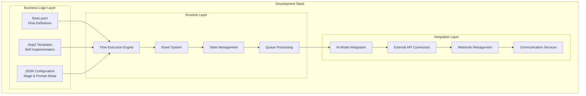

# Agent Creator Development Guide

This comprehensive guide provides developers with everything needed to understand, customize, and extend the Newo Agent Creator system. Whether you're modifying existing flows or building new capabilities, this guide covers all technical aspects and best practices.

## Development Architecture Overview

The Agent Creator follows a **modular, template-driven architecture** that provides multiple extension points for customization:



## Core Components Deep Dive

### Flow Definition Structure

All agent flows are defined in `flows.yaml` using a hierarchical structure:

```yaml
flows:
  - agent_idn: Creator
    agent_flows:
      - idn: CACreatorFlow
        title: Main Creator Flow
        default_runner_type: "!enum \"RunnerType.guidance\""
        default_provider_idn: openai
        default_model_idn: gpt4o
        skills:
          - idn: GetData
            prompt_script: flows/CACreatorFlow/GetData.jinja
            runner_type: "!enum \"RunnerType.nsl\""
            model:
              model_idn: gpt4o
              provider_idn: openai
            parameters: []
        events:
          - idn: onboarding_started
            skill_selector: "!enum \"SkillSelector.skill_idn\""
            skill_idn: GetData
            integration_idn: newo_chat
            connector_idn: newo_chat
        state_fields:
          - idn: task_queue
            default_value: "[]"
            scope: "!enum \"StateFieldScope.user\""
```

#### Key Configuration Elements:

**Flow Properties:**
- `agent_idn`: Unique agent identifier
- `default_runner_type`: Execution engine (guidance/nsl)
- `default_provider_idn`: AI provider (openai)
- `default_model_idn`: Default AI model

**Skill Properties:**
- `idn`: Unique skill identifier
- `prompt_script`: Path to Jinja2 template
- `runner_type`: Execution mode
- `model`: AI model configuration
- `parameters`: Input parameters with defaults

**Event Properties:**
- `idn`: Event identifier
- `skill_selector`: Skill selection method
- `skill_idn`: Target skill
- `integration_idn`: External integration
- `connector_idn`: Connector type

### Jinja2 Template Development

Skills are implemented as Jinja2 templates with access to the Newo SuperAgent runtime API:

#### Template Structure

```jinja2
{# Skill: GetData - Initialize customer onboarding #}


{# Extract and validate input parameters #}




{# Set default values #}

    


{# Normalize URL format #}

    


{# Store data in persona attributes #}
{{ SetPersonaAttribute(id=user_id, field="source", value=source) }}
{{ SetPersonaAttribute(id=user_id, field="source_type", value=source_type) }}

{# Trigger downstream processing #}

{{SendSystemEvent(
    eventIdn="scraping_worker_message", 
    command="set_scraping_data", 
    url=source, 
    scraper_type=scraper_type
)}}

{# Execute next stage #}
{{ _run_stage_0() }}
```

#### Available Runtime Functions

**User & Context Functions:**
- `GetUser()`: Current user information
- `GetActor()`: Current actor context
- `GetTriggeredAct()`: Event trigger data
- `GetPersonaAttribute(id, field)`: Retrieve user data
- `SetPersonaAttribute(id, field, value)`: Store user data
- `UpdateUser(field, value)`: Update user record

**State Management:**
- `GetState()`: Current flow state
- `SetState(value)`: Update flow state
- `GetMemory()`: Persistent memory
- `GetSettingsAttribute(field)`: System configuration

**Communication Functions:**
- `SendCommand()`: External service commands
- `SendSystemEvent()`: Internal event triggers
- `SendMessage()`: User messaging

**Utility Functions:**
- `Return(val)`: Return value from skill
- `Do(actionName, ...)`: Execute another skill
- `json.loads()`, `json.dumps()`: JSON processing
- `DUMMY(value)`: Debug output

### State Management System

The system uses **persona attributes** for persistent state management:

#### State Structure

```json
{
  "user_persona_attributes": {
    "source": "https://example.com",
    "source_type": "website",
    "scraper_type": "website", 
    "state": "parsing",
    "business_info": "{\"name\": \"Example Corp\", \"industry\": \"Technology\"}",
    "agent_info": "{\"name\": \"Alex\", \"title\": \"Assistant\"}",
    "customer_info": "{\"name\": \"John Doe\", \"email\": \"john@example.com\"}",
    "contact_info": "{\"phone\": \"+1234567890\", \"address\": \"123 Main St\"}",
    "preferences_info": "{\"language\": \"en\", \"voice_model\": \"nova\"}"
  },
  "flow_state_fields": {
    "task_queue": "[]"
  }
}
```

#### State Access Patterns

**Reading State:**
```jinja2




```

**Writing State:**
```jinja2

{{ SetPersonaAttribute(id=user_id, field="business_info", value=json.dumps(updated_info)) }}
```

**Queue Management:**
```jinja2
{# Add task to queue #}

{{ _enqueue(queue_name="task_queue", item=json.dumps(task)) }}

{# Process task from queue #}

```

## AI Model Integration

### Model Selection Strategy

The system supports multiple OpenAI models with intelligent selection:

```jinja2
{# Dynamic model selection based on task requirements #}



    

    

    

    

    

```

### Custom AI Processing Skills

#### Answer Generation Template

```jinja2
{# _gen_answer_custom.jinja - Custom AI processing skill #}




{# Execute AI model with custom prompt #}
{{ Return(val=Gen(prompt=enhanced_prompt, model="gpt4o")) }}
```

#### Validation Skill Template

```jinja2
{# _validate_custom.jinja - Custom validation logic #}
{% set validation_prompt = "
Validate this business information for accuracy and completeness:

QUESTION: " ~ question ~ "
ANSWER: " ~ answer ~ "
CONTEXT: " ~ scraping_prompt ~ "

Validation criteria:
1. Is the answer factually accurate?
2. Is it relevant to the question?
3. Is it appropriately formatted?
4. Does it contain any obvious errors?

Provide validation result as JSON:
{
  \"valid\": true/false,
  \"confidence\": 0.0-1.0,
  \"issues\": [\"list of any issues found\"],
  \"corrected_answer\": \"corrected version if needed\"
}
" %}





    {{ Return(val=answer) }}

    {{ Return(val=result.corrected_answer|default("", true)) }}

```

## Creating Custom Flows

### New Flow Definition

1. **Define Flow in flows.yaml:**

```yaml
- idn: CustomBusinessFlow
  title: Custom Business Onboarding
  default_runner_type: "!enum \"RunnerType.guidance\""
  default_provider_idn: openai
  default_model_idn: gpt4o
  skills:
    - idn: InitializeCustomFlow
      prompt_script: flows/CustomBusinessFlow/InitializeCustomFlow.jinja
      parameters:
        - name: business_type
          default_value: "general"
    - idn: ProcessCustomData
      prompt_script: flows/CustomBusinessFlow/ProcessCustomData.jinja
  events:
    - idn: custom_business_started
      skill_selector: "!enum \"SkillSelector.skill_idn\""
      skill_idn: InitializeCustomFlow
      integration_idn: custom_api
      connector_idn: business_connector
```

2. **Implement Flow Skills:**

Create `flows/CustomBusinessFlow/InitializeCustomFlow.jinja`:

```jinja2
{# Custom business flow initialization #}



{# Extract business-specific parameters #}



{# Initialize custom state #}
{{ SetPersonaAttribute(id=user_id, field="custom_business_type", value=business_type) }}
{{ SetPersonaAttribute(id=user_id, field="custom_industry", value=industry_focus) }}
{{ SetPersonaAttribute(id=user_id, field="custom_state", value="initialized") }}

{# Trigger custom processing #}
{{SendSystemEvent(
    eventIdn="custom_processing_started",
    business_type=business_type,
    industry=industry_focus
)}}

{# Execute custom data processing #}
{{ ProcessCustomData() }}
```

### Stage Configuration System

The system supports configurable stages defined in JSON:

#### Stage Configuration Template

```json
{
  "stage_config": {
    "stage_0": {
      "name": "Business Discovery",
      "steps": [
        {
          "field_name": "company_name",
          "model_name": "business_info",
          "prompt_attribute": "company_name_prompt",
          "llm_model": "auto",
          "validation_skill": "_validate_company_name",
          "json_schema": "",
          "is_hidden": "false",
          "title": "Company Name"
        },
        {
          "field_name": "industry",
          "model_name": "business_info", 
          "prompt_attribute": "industry_classification_prompt",
          "llm_model": "openai/gpt4o_structured_output",
          "validation_skill": "_validate_industry",
          "json_schema": "industry_schema",
          "is_hidden": "false", 
          "title": "Industry Classification"
        }
      ]
    }
  }
}
```

#### Dynamic Stage Execution

```jinja2
{# _run_custom_stage.jinja - Dynamic stage processor #}





    
    
    
    {{SendSystemEvent(
        eventIdn="custom_question_processing",
        stage=stage_name,
        step=step,
        prompt=enhanced_prompt
    )}}

```

## External Integration Development

### Custom Connector Implementation

#### Webhook Integration

```jinja2
{# Custom webhook integration skill #}







{{SendCommand(
    commandIdn="send_request",
    integrationIdn="http", 
    connectorIdn="custom_webhook",
    method="POST",
    url=webhook_url,
    headers=json.dumps(headers),
    body=json.dumps(payload)
)}}
```

#### CRM Integration Template

```jinja2
{# Custom CRM integration #}



{% set lead_data = {
    "contact": {
        "first_name": _get_value_customer_first_name(),
        "last_name": GetPersonaAttribute(id=user_id, field="input_customer_name"),
        "email": GetPersonaAttribute(id=user_id, field="input_customer_email"),
        "phone": GetPersonaAttribute(id=user_id, field="input_customer_phone")
    },
    "company": {
        "name": _get_value_business_name(),
        "website": _get_value_business_website(),
        "industry": _get_value_industry(),
        "address": _get_value_business_address()
    },
    "agent_config": {
        "agent_name": _get_value_agent_name(),
        "agent_title": _get_value_agent_title(),
        "voice_model": _get_value_voice_model(),
        "phone_number": GetPersonaAttribute(id=user_id, field="customer_agent_phone_number")
    },
    "source": "newo_agent_creator",
    "created_at": GetDateTime()
} %}

{{SendCommand(
    commandIdn="create_lead",
    integrationIdn="api",
    connectorIdn="custom_crm",
    endpoint=config.lead_endpoint,
    api_key=config.api_key,
    data=json.dumps(lead_data)
)}}
```

## Advanced Customization Patterns

### Industry-Specific Templates

Create specialized onboarding flows for different industries:

#### Healthcare Industry Template

```jinja2
{# Healthcare-specific business information extraction #}



    
    
    {{_queue_healthcare_question(field=field, prompt=enhanced_prompt)}}

```

#### E-commerce Industry Template

```jinja2
{# E-commerce specific data extraction #}




{# Process with structured output for e-commerce data #}

    {{_queue_structured_question(
        field=field, 
        prompt=prompt,
        schema=ecommerce_schema,
        model="openai/gpt4o_structured_output"
    )}}

```

### Multi-Language Support

Implement localized onboarding flows:

```jinja2
{# Multi-language template processing #}





    
    
    
    
    {# Adjust prompts for cultural context #}
    
    
    {{_process_localized_question(
        prompt=localized_prompt,
        language=user_language,
        cultural_adaptations=cultural_context
    )}}

```

## Testing & Debugging

### Development Testing Skills

Create specialized testing skills for development:

```jinja2
{# TestCustomFlow.jinja - Development testing skill #}



    {{ DUMMY("Testing scenario: " ~ scenario.name) }}
    
    {# Execute test scenario #}
    
    
    {# Validate results #}
    
    
    {{ DUMMY("Test result: " ~ validation.status ~ " - " ~ validation.message) }}

```

### Debug Output Utilities

```jinja2
{# Debug utilities for development #}



    {{ DUMMY("=== DEBUG INFO ===") }}
    {{ DUMMY("User ID: " ~ GetUser().id) }}
    {{ DUMMY("Current State: " ~ GetPersonaAttribute(id=user_id, field="state")) }}
    {{ DUMMY("Stage: " ~ current_stage) }}
    {{ DUMMY("Queue Length: " ~ _get_queue_length("task_queue")) }}
    {{ DUMMY("================") }}

```

## Performance Optimization

### Template Caching

```jinja2
{# Template caching for performance #}




    
    
    
    {# Cache for future use #}
    {{ SetPersonaAttribute(id="system", field=cache_key, value=processed_template) }}
    

    

```

### Batch Processing

```jinja2
{# Batch processing for efficiency #}



{# Group questions for batch processing #}



    
    
    
    
    {# Process each response in the batch #}
    
        {{_store_batch_response(response)}}
    

```

---

This development guide provides comprehensive coverage of the Agent Creator system's architecture, customization options, and best practices. Use it as a foundation for building sophisticated, AI-powered customer onboarding and agent creation solutions.