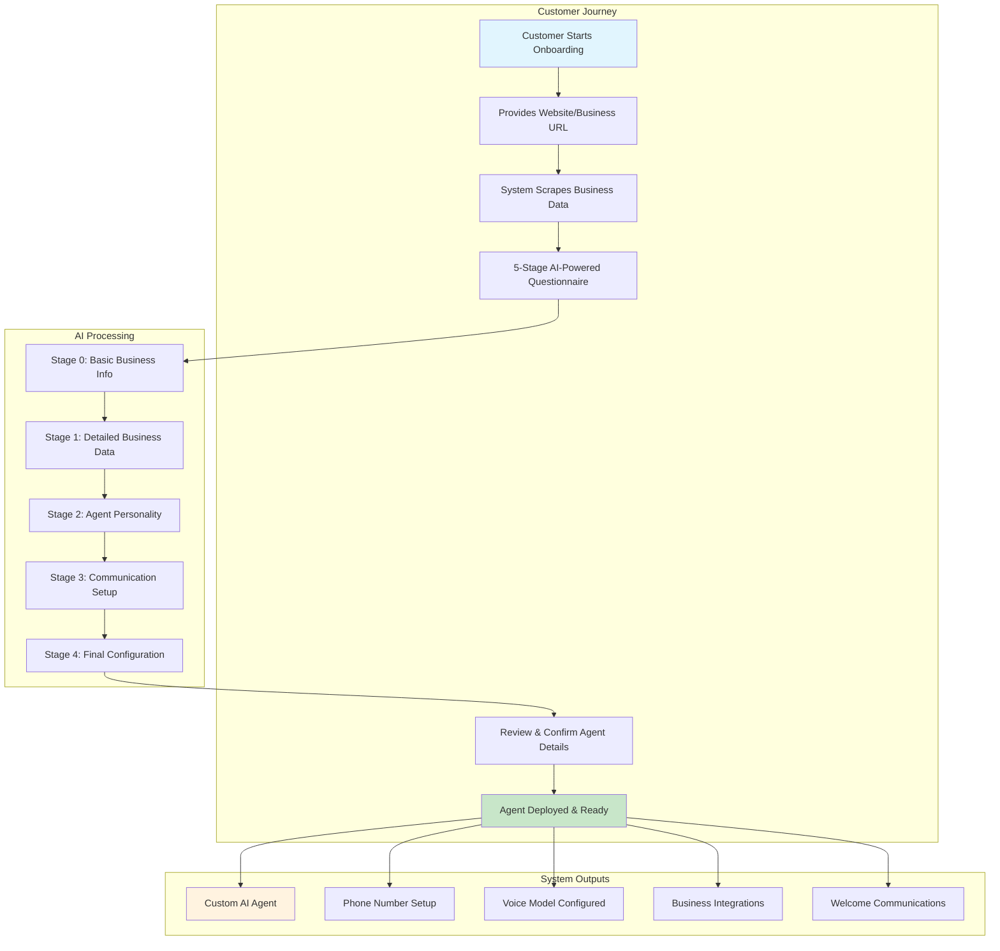
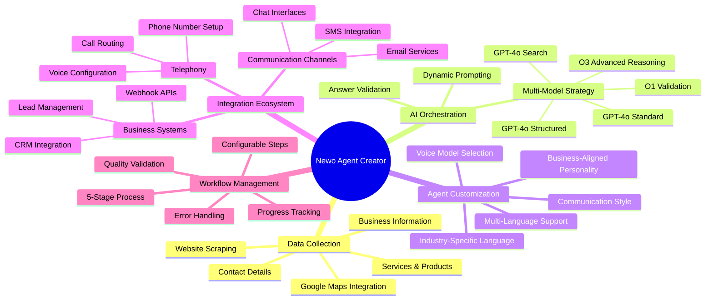
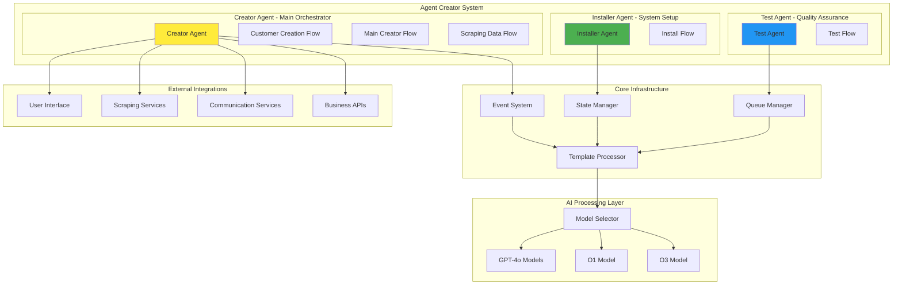
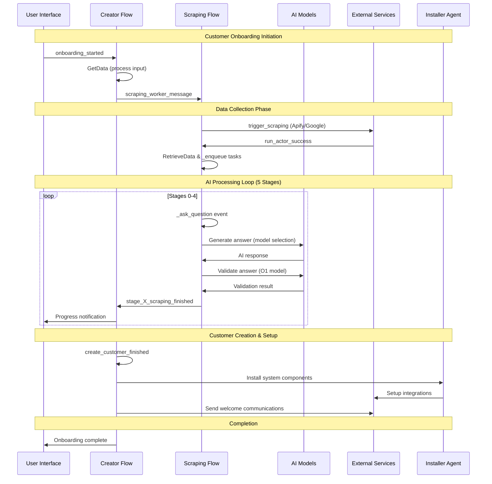
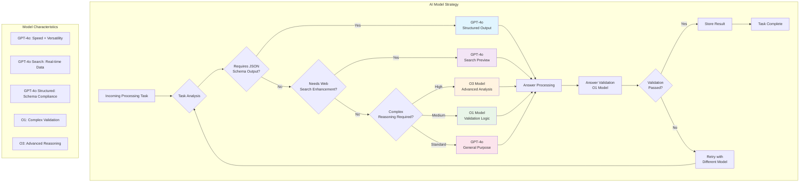
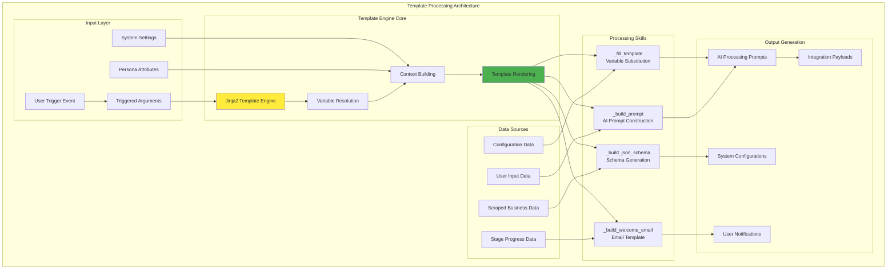
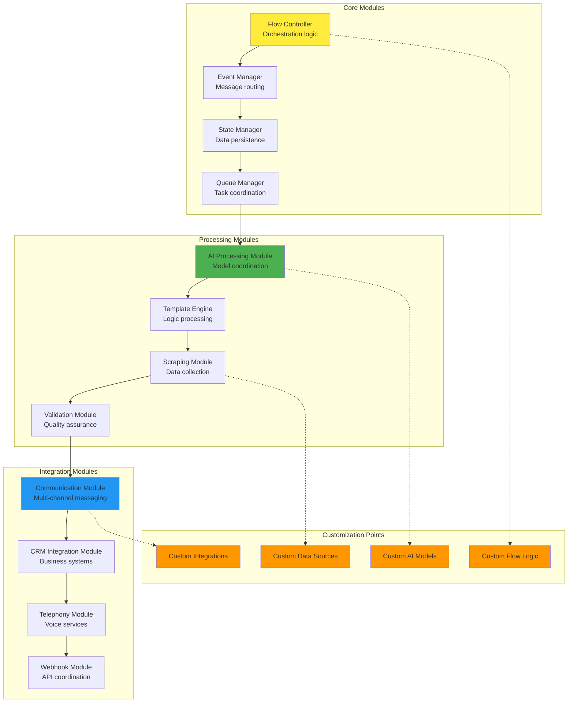

# Agent Creator System Diagrams

This page provides comprehensive visual diagrams that explain the Newo Agent Creator system from business concepts to technical implementation details. The diagrams progress from high-level understanding to detailed technical architecture.

## High-Level System Overview

### Business Process Flow

This diagram shows how customers interact with the Agent Creator system from a business perspective:

### System Capabilities Overview

This diagram illustrates the core capabilities and customization options available in the Agent Creator:

## System Architecture Diagrams

### Multi-Agent Architecture

This diagram shows how the three specialized agents work together:

### Data Flow Architecture

This diagram illustrates how data flows through the system during customer onboarding:

```mermaid
flowchart TB
    subgraph "Input Processing"
        INPUT[Customer Input<br/>URL + Preferences]
        VALIDATE[Input Validation<br/>& Normalization]
        SETUP[User Context<br/>Setup]
    end
    
    subgraph "Data Collection"
        SCRAPER[Scraping Service<br/>Selection]
        WEBSITE[Website Scraping<br/>Apify Integration]
        GOOGLE[Google Places<br/>Business Data]
        EXTRACT[Raw Data<br/>Extraction]
    end
    
    subgraph "AI Processing Pipeline"
        QUEUE[Task Queue<br/>Management]
        PROMPT[Dynamic Prompt<br/>Generation]
        MODEL[AI Model<br/>Selection]
        GENERATE[Answer<br/>Generation]
        VALIDATE_AI[AI-Powered<br/>Validation]
        SANITIZE[Data<br/>Sanitization]
    end
    
    subgraph "State Management"
        PERSONA[Persona Attributes<br/>Storage]
        STAGE[Stage Progress<br/>Tracking]
        BUSINESS[Business Model<br/>Data]
        AGENT[Agent Configuration<br/>Data]
    end
    
    subgraph "Output Generation"
        CUSTOMER[Customer Record<br/>Creation]
        CONFIGS[Agent Configuration<br/>Setup]
        INTEGRATIONS[External Service<br/>Integration]
        NOTIFICATIONS[Customer<br/>Notifications]
    end
    
    INPUT --> VALIDATE
    VALIDATE --> SETUP
    SETUP --> SCRAPER
    
    SCRAPER --> WEBSITE
    SCRAPER --> GOOGLE
    WEBSITE --> EXTRACT
    GOOGLE --> EXTRACT
    
    EXTRACT --> QUEUE
    QUEUE --> PROMPT
    PROMPT --> MODEL
    MODEL --> GENERATE
    GENERATE --> VALIDATE_AI
    VALIDATE_AI --> SANITIZE
    
    SANITIZE --> PERSONA
    PERSONA --> STAGE
    STAGE --> BUSINESS
    BUSINESS --> AGENT
    
    AGENT --> CUSTOMER
    CUSTOMER --> CONFIGS
    CONFIGS --> INTEGRATIONS
    INTEGRATIONS --> NOTIFICATIONS
    
    style INPUT fill:#e3f2fd
    style NOTIFICATIONS fill:#e8f5e8
```

## Technical Implementation Diagrams

### Event-Driven Orchestration

This diagram shows the sophisticated event system that coordinates all components:

### AI Model Orchestration

This diagram details how different AI models are selected and coordinated:

### Template Processing Engine

This diagram shows how the Jinja2 template system processes business logic:

## Developer Customization Diagrams

### Extension Points Architecture

This diagram shows how developers can customize and extend the system:

```mermaid
graph TB
    subgraph "Customization Layers"
        subgraph "Business Logic Layer"
            STAGES[Stage Configuration<br/>JSON-based setup]
            PROMPTS[Prompt Templates<br/>Jinja2 customization]
            VALIDATION[Validation Rules<br/>Custom logic]
            WORKFLOWS[Workflow Definitions<br/>Event-driven setup]
        end
        
        subgraph "Integration Layer"
            CONNECTORS[Custom Connectors<br/>API integrations]
            COMMANDS[Custom Commands<br/>External actions]
            EVENTS[Custom Events<br/>System coordination]
            WEBHOOKS[Webhook Handlers<br/>External triggers]
        end
        
        subgraph "AI Layer"
            MODELS[Model Selection<br/>Custom strategies]
            SCHEMAS[JSON Schemas<br/>Structured output]
            PROMPTS_AI[AI Prompts<br/>Dynamic generation]
            VALIDATION_AI[AI Validation<br/>Quality checks]
        end
        
        subgraph "Data Layer"
            SCRAPERS[Custom Scrapers<br/>Data sources]
            PROCESSORS[Data Processors<br/>Transformation logic]
            STORAGE[Storage Adapters<br/>State management]
            CACHE[Caching Strategies<br/>Performance optimization]
        end
    end
    
    subgraph "Extension Points"
        EXT1[New Industry Templates]
        EXT2[Additional AI Models]
        EXT3[Custom Integrations]
        EXT4[Specialized Workflows]
        EXT5[Advanced Analytics]
    end
    
    STAGES --> EXT1
    PROMPTS --> EXT1
    
    MODELS --> EXT2
    SCHEMAS --> EXT2
    
    CONNECTORS --> EXT3
    WEBHOOKS --> EXT3
    
    WORKFLOWS --> EXT4
    EVENTS --> EXT4
    
    PROCESSORS --> EXT5
    STORAGE --> EXT5
    
    style STAGES fill:#e3f2fd
    style MODELS fill:#f3e5f5
    style CONNECTORS fill:#fff3e0
    style SCRAPERS fill:#e8f5e8
```

### Module Interaction Diagram

This diagram shows how different modules interact and can be customized:

---

These diagrams provide comprehensive visual documentation of the Newo Agent Creator system, progressing from high-level business concepts to detailed technical implementation. They serve as essential reference materials for understanding, developing, and extending the system's capabilities.