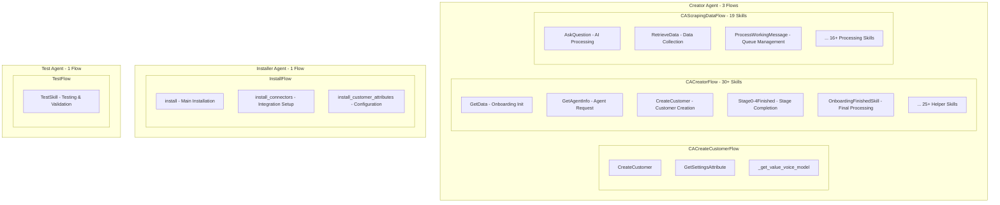
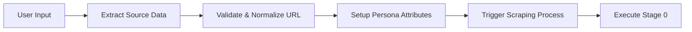
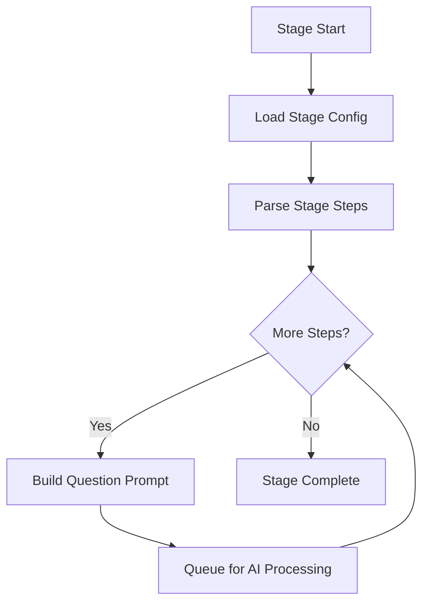
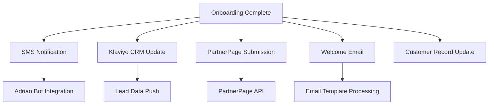
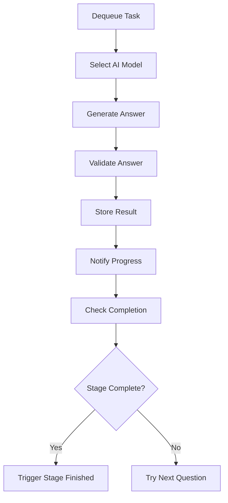

# Agent Creator Flows & Skills

This comprehensive guide documents all flows and skills in the Newo Agent Creator system, providing detailed insights into the business logic, data processing, and orchestration mechanisms.

## Flow Architecture Overview

The Agent Creator implements **3 specialized agents** with **5 distinct flows** and **65+ individual skills**:



## CACreatorFlow - Main Orchestrator

The primary flow managing the **5-stage customer onboarding process** with sophisticated AI-driven data collection.

### Public Entry Point Skills

#### GetData - Onboarding Initialization
**Purpose**: Processes initial user input and triggers the scraping workflow

**Key Operations**:
- Extracts and validates source URL (website or Google Maps)
- Sets up persona attributes for user tracking
- Configures scraping parameters based on source type
- Triggers Stage 0 execution



**Template Logic** (`GetData.jinja`):
```jinja2
{# Process source URL and type #}


    


{# Configure scraper based on source type #}

    

    


{# Trigger scraping workflow #}
{{SendSystemEvent(
    eventIdn="scraping_worker_message", 
    command="set_scraping_data", 
    url=source, 
    scraper_type=scraper_type
)}}
```

#### GetAgentInfo - Agent Information Request
**Purpose**: Handles agent information requests during the onboarding process

#### CreateCustomer - Customer Record Creation  
**Purpose**: Creates the customer record and triggers final setup processes

#### Stage0-4Finished - Stage Completion Handlers
**Purpose**: Process completion of each onboarding stage and trigger next stage

### Stage Execution Engine

#### _run_stage - Dynamic Stage Orchestrator
**Purpose**: Executes configurable stages based on JSON configuration

**Processing Logic**:
1. Loads stage configuration from settings
2. Iterates through stage steps
3. Builds AI prompts dynamically  
4. Queues questions for AI processing
5. Tracks progress and completion



**Configuration Structure**:
```json
{
  "steps": [
    {
      "field_name": "business_name",
      "model_name": "business_info", 
      "prompt_attribute": "business_name_prompt",
      "llm_model": "auto",
      "validation_skill": "_validate_business_name",
      "json_schema": "business_name_schema"
    }
  ]
}
```

### Data Processing Skills

#### _build_prompt - Dynamic Prompt Construction
**Purpose**: Constructs AI prompts with context-aware headers and templates

**Template Processing**:
```jinja2
{# Load base prompt template #}



{# Add contextual header based on scraper type #}




{# Combine header and prompt #}

```

#### _fill_template - Template Variable Substitution
**Purpose**: Performs Jinja2 template variable substitution with user context

#### _build_json_schema - Schema Construction
**Purpose**: Builds JSON schemas for structured AI output

#### _merge_steps - Step Combination Logic
**Purpose**: Combines multiple stage steps for complex workflows

### Value Extraction Skills (15+ Skills)

The system includes specialized skills for extracting and processing different types of business data:

#### Business Information Extractors
- `_get_value_business_name` - Company name extraction
- `_get_value_business_website` - Website URL processing  
- `_get_value_business_address` - Physical address extraction
- `_get_value_industry` - Industry classification
- `_get_value_country` - Country/location identification

#### Agent Configuration Extractors  
- `_get_value_agent_name` - AI agent name generation
- `_get_value_agent_title` - Agent role/title definition
- `_get_value_agent_phone_number` - Phone number setup
- `_get_value_voice_model` - Voice selection for telephony
- `_get_value_language` - Primary language configuration

#### Customer Data Extractors
- `_get_value_customer_first_name` - Customer name processing
- `_get_value_available_languages` - Multi-language support
- `_get_value_gender` - Gender identification (for personalization)

**Extraction Pattern**:
```jinja2



{{ Return(val=parsed_data.field_name|string) }}
```

### Communication & Notification Skills

#### _send_welcome_email - Welcome Email Orchestration
**Purpose**: Sends personalized welcome emails to new customers

#### _build_welcome_email - Email Template Construction  
**Purpose**: Builds dynamic email content based on customer data

#### OnboardingFinishedSkill - Completion Processing
**Purpose**: Handles all post-onboarding activities and integrations

**Integration Points**:
- SMS notifications via Adrian bot
- CRM integration with Klaviyo
- PartnerPage lead submission  
- Welcome email delivery
- Customer record finalization



## CAScrapingDataFlow - AI Processing Engine

The intelligent data processing flow that powers AI-driven information extraction and validation.

### Core Processing Skills

#### AskQuestion - Main AI Processing Orchestrator
**Purpose**: Dequeues tasks and orchestrates AI-powered answer generation

**Processing Pipeline**:
1. Dequeue task from `task_queue`
2. Select appropriate AI model based on requirements
3. Generate answer using selected model
4. Validate answer quality
5. Store result in persona attributes
6. Send progress notification to user
7. Check for stage completion



#### AI Model Selection Logic
```jinja2

    

    

    

    

```

### AI Answer Generation Skills

#### _gen_answer_default - O3 Model Processing
**Model**: OpenAI O3  
**Use Case**: Complex reasoning and advanced analysis tasks

#### _gen_answer_gpt4o - Standard GPT-4O Processing
**Model**: OpenAI GPT-4O  
**Use Case**: General-purpose text processing and reasoning

#### _gen_answer_gpt4o_search_preview - Enhanced Web Search
**Model**: OpenAI GPT-4O Search Preview  
**Use Case**: Web-enhanced queries requiring real-time data

#### _gen_answer_gpt4o_structured_output - Schema-Compliant Output
**Model**: OpenAI GPT-4O Structured Output  
**Use Case**: JSON schema-compliant responses for structured data

### Data Validation & Processing Skills

#### _check_answer - AI-Powered Validation
**Model**: OpenAI O1  
**Purpose**: Validates answer quality and relevance using advanced reasoning

**Validation Process**:
```jinja2
{# Advanced validation using O1 model #}

```

#### _sanitize - Data Cleaning
**Purpose**: Cleans and normalizes extracted text data

#### _unescapeStringSkill - String Processing
**Purpose**: Handles string unescaping and character encoding

#### _validate_industry - Industry Classification
**Purpose**: Validates and normalizes industry classifications

### Data Retrieval & Integration Skills

#### RetrieveData - Scraping Results Processing
**Purpose**: Processes results from external scraping services (Apify)

#### _getGooglePlaceScrapingInput - Google Places Configuration
**Purpose**: Configures Google Places API scraping parameters

#### _getWebsiteScrapingInput - Website Scraping Configuration  
**Purpose**: Sets up website scraping parameters for Apify

#### _getIsDataUpdated - Data Freshness Check
**Purpose**: Checks if scraped data needs to be refreshed

### Queue Management Skills

#### _enqueue - Task Queue Addition
**Purpose**: Adds tasks to the processing queue

#### _dequeue - Task Queue Retrieval
**Purpose**: Retrieves and removes tasks from the processing queue

**Queue Structure**:
```json
{
  "question": "What is the business name?",
  "model_idn": "business_info", 
  "llm_model": "openai/gpt4o",
  "answer_key": "business_name",
  "stage": "stage_1",
  "step_number": "3",
  "validation_skill": "_validate_business_name"
}
```

## CACreateCustomerFlow - Customer Management

Simple flow focused on customer record creation and voice model configuration.

### Skills Overview

#### CreateCustomer - Customer Record Creation
**Purpose**: Creates customer records in the system

#### GetSettingsAttribute - Configuration Access
**Purpose**: Retrieves system configuration values

#### _get_value_voice_model - Voice Configuration
**Purpose**: Configures voice models for telephony integration

## InstallFlow - System Configuration

Handles system installation, connector setup, and customer attribute configuration.

### Installation Skills

#### install - Main Installation Orchestrator
**Purpose**: Coordinates system installation process

**Installation Process**:
1. Extract installation parameters
2. Install customer attributes
3. Setup connectors and integrations
4. Configure API keys and security
5. Return client secrets for integration

#### install_connectors - Integration Setup
**Purpose**: Sets up external service connectors and integrations

#### install_customer_attributes - Attribute Configuration
**Purpose**: Configures customer-specific attributes and settings

**Configuration Parameters**:
- Tenant settings
- Account manager assignments
- Support team configurations
- Notification preferences
- Welcome email templates
- API security credentials

## TestFlow - Quality Assurance

Simple testing framework for system validation.

### TestSkill - System Testing
**Purpose**: Provides testing and validation capabilities for the system

## Event Integration Matrix

### Event Triggers & Handlers

| Event | Triggering Flow | Handling Skill | Purpose |
|-------|----------------|---------------|---------|
| `onboarding_started` | External UI | GetData | Initialize customer onboarding |
| `scraping_worker_message` | CACreatorFlow | ProcessWorkingMessage | Queue management |
| `_ask_question` | System | AskQuestion | Process AI questions |
| `run_actor_success/error` | Apify | RetrieveData | Handle scraping results |
| `stage_0-4_scraping_finished` | CAScrapingDataFlow | Stage0-4Finished | Progress stage completion |
| `create_customer_finished` | System | OnboardingFinishedSkill | Finalize customer setup |
| `trigger_create_customer` | CACreatorFlow | CreateCustomer | Create customer record |

### Integration Command Matrix

| Command | Target Service | Purpose | Flow |
|---------|---------------|---------|------|
| `notify_scraping_step` | Newo Chat | Progress notifications | CAScrapingDataFlow |
| `onboarding_finished` | Newo Chat | Completion notification | CACreatorFlow |
| `notify_adrian` | API Webhook | SMS coordination | CACreatorFlow |
| `push_data_make_klaviyo` | API Webhook | CRM integration | CACreatorFlow |
| `send_request` | HTTP Connector | PartnerPage API | CACreatorFlow |

---

This comprehensive flow and skill documentation provides the foundation for understanding, customizing, and extending the Newo Agent Creator system's sophisticated AI-driven customer onboarding and agent creation capabilities.