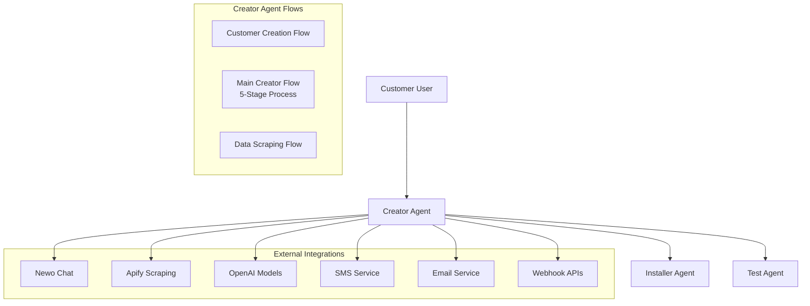
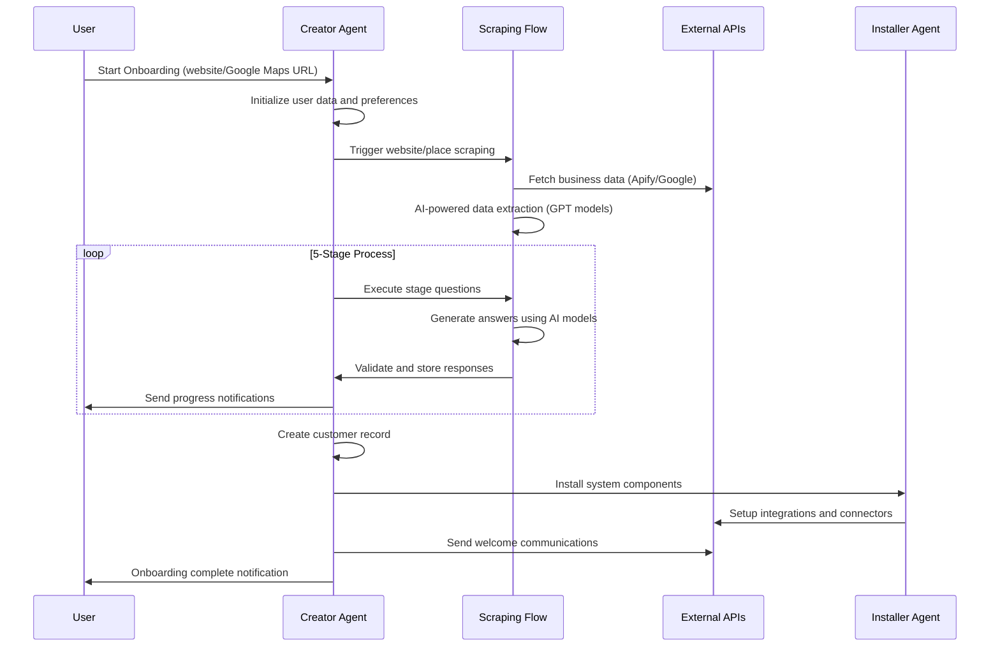

# Newo Agent Creator Overview

The **Newo Agent Creator** is an intelligent, multi-stage system designed to automatically onboard customers and create customized AI agents based on business data scraping and intelligent configuration. This system represents a sophisticated implementation of the Newo SuperAgent platform, demonstrating advanced AI orchestration, data processing, and customer lifecycle management.

## System Architecture

The Agent Creator consists of three specialized agents working in concert:

## Core Components

### 1. Creator Agent
**Primary orchestrator** with three specialized flows:

- **CACreateCustomerFlow**: Handles customer creation and voice model configuration
- **CACreatorFlow**: Manages the complex 5-stage onboarding process
- **CAScrapingDataFlow**: Powers intelligent data extraction and processing

### 2. Installer Agent
**System configuration** specialist responsible for:

- Installing system connectors and integrations
- Setting up customer-specific attributes and configurations
- Managing API keys and security settings
- Configuring notification and communication channels

### 3. Test Agent
**Quality assurance** component providing:

- Sandbox testing capabilities
- System validation and health checks
- Development and debugging support

## Key Features & Capabilities

### 🎯 Multi-Stage Onboarding Process
5-stage configurable onboarding workflow:
- **Stage 0**: Initial data collection and website scraping
- **Stage 1**: Business information extraction and validation
- **Stage 2**: Agent personality and communication setup
- **Stage 3**: Service configuration and integration settings
- **Stage 4**: Final validation and agent deployment

### 🤖 AI-Powered Data Extraction
Leverages multiple OpenAI models for optimal results:
- **GPT-4O**: General-purpose reasoning and text processing
- **GPT-4O Search Preview**: Enhanced web search capabilities
- **GPT-4O Structured Output**: JSON schema-compliant responses
- **O1 & O3 Models**: Advanced reasoning for complex validation tasks

### 🌐 Multi-Modal Scraping
Intelligent data collection from multiple sources:
- **Website Scraping**: Business information extraction from company websites
- **Google Maps Integration**: Location and business data from Google Places
- **Dynamic Content Processing**: Real-time data extraction and validation

### 📋 Template-Based Architecture
Flexible, maintainable system design:
- **Jinja2 Templates**: All business logic implemented in templates
- **Dynamic Prompt Generation**: Context-aware AI prompt construction
- **Configurable Workflows**: Easily customizable onboarding stages
- **Modular Skills**: Reusable functionality across flows

### 🔄 Event-Driven Communication
Sophisticated orchestration system:
- **System Events**: Trigger workflow transitions and state changes
- **Command Integration**: External service communication and control
- **Queue-Based Processing**: Asynchronous task management
- **State Persistence**: Maintains user context across sessions

### 🔗 Integration Ecosystem
Comprehensive external service connectivity:
- **Communication**: SMS, Email, Chat interfaces
- **CRM Integration**: Klaviyo, PartnerPage, webhook APIs
- **Telephony**: Phone number setup and voice model configuration
- **Notifications**: Multi-channel customer and internal notifications

## Business Logic Flow

### Customer Onboarding Journey

### Data Processing Pipeline

1. **Input Processing**: URL or location data validation and normalization
2. **Scraping Orchestration**: Intelligent scraper selection (website vs. Google Place)
3. **AI Enhancement**: Multiple AI models for data extraction and validation
4. **Quality Assurance**: Answer validation and sanitization workflows
5. **Integration Setup**: Customer-specific system configuration
6. **Notification Delivery**: Multi-channel customer communication

## Technical Capabilities

### Advanced AI Orchestration
- **Model Selection Strategy**: Automatic AI model selection based on task requirements
- **Prompt Engineering**: Dynamic, context-aware prompt generation
- **Answer Validation**: Multi-step validation using specialized AI models
- **Error Handling**: Robust fallback mechanisms for AI processing failures

### State Management System
- **Persona Attributes**: Persistent user-specific data storage
- **Session Continuity**: Maintains context across multiple interactions
- **Progress Tracking**: Real-time onboarding stage and step monitoring
- **Data Validation**: Ensures data integrity throughout the process

### Integration Architecture
- **Webhook Management**: Bi-directional API communication
- **Service Orchestration**: Coordinated external service interactions  
- **Authentication**: Secure API key and credential management
- **Error Recovery**: Graceful handling of integration failures

## Use Cases & Applications

### 🏢 Business Onboarding Automation
- Automated collection of business information from websites
- Intelligent extraction of contact details, services, and company data
- Dynamic agent personality creation based on business context

### 📞 Customer Service Agent Setup
- Voice model selection and phone number configuration
- Communication channel setup (SMS, Email, Chat)
- Integration with existing customer service workflows

### 🎨 Brand-Aligned Agent Creation
- Business-specific language and communication style adaptation
- Industry-appropriate agent personality development
- Custom integration with business systems and processes

### 📊 Lead Generation & CRM Integration
- Automatic lead capture and qualification
- CRM system integration and data synchronization
- Multi-channel marketing automation setup

## Developer Integration

The Agent Creator provides multiple integration points for developers:

### Template Customization
- **Stage Configuration**: Modify onboarding stages and questions
- **Prompt Templates**: Customize AI prompts for specific industries
- **Validation Logic**: Implement custom data validation rules
- **Integration Adapters**: Add support for additional external services

### API Extensions  
- **Custom Commands**: Extend system capabilities with new commands
- **Event Handlers**: Add custom logic for system events
- **Integration Connectors**: Build new external service integrations
- **Skill Libraries**: Create reusable skill templates

### Workflow Modifications
- **Flow Customization**: Modify existing agent flows or create new ones
- **State Management**: Extend persona attributes and state fields
- **AI Model Integration**: Add support for additional AI models
- **Processing Pipelines**: Customize data processing workflows

---

The Newo Agent Creator represents a sophisticated example of AI-driven customer onboarding, demonstrating the power of the Newo SuperAgent platform for creating intelligent, automated business processes. Its modular architecture, advanced AI integration, and comprehensive feature set make it an excellent foundation for building customer-facing AI agent creation systems.