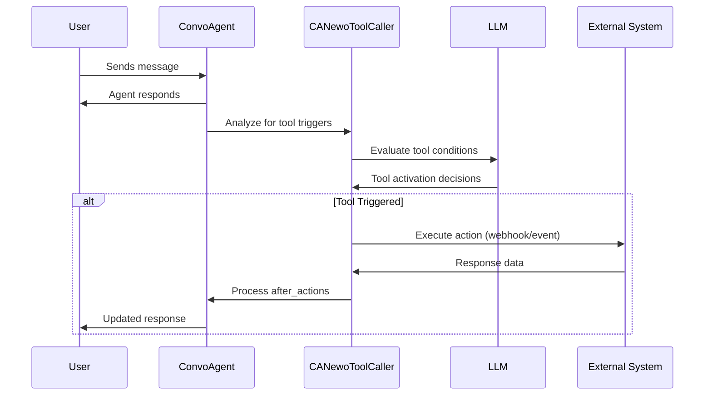
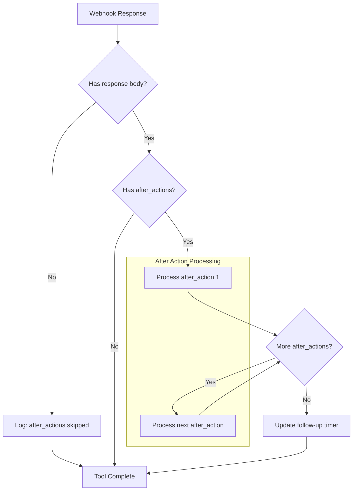

# Newo Tools: Custom Agent Tool Configuration

The **Newo Tools** system allows you to configure custom tools that agents can invoke during conversations. This powerful feature enables integration with external systems, automated workflows, and dynamic data processing without requiring code modifications.

## Overview

Newo Tools extends your Digital Employee's capabilities by defining:

- **Custom webhook integrations** - Call external APIs during conversations
- **System events** - Trigger internal workflows based on conversation context
- **After-actions** - Process webhook responses and update conversation state
- **Condition-based triggering** - AI-powered tool activation based on conversation analysis

## Configuration Attribute

Tools are configured through the `project_attributes_settings_newo_tools` project attribute:

**Attribute Name:** `project_attributes_settings_newo_tools`
**Title:** Conversation - Tools [C]
**Type:** JSON configuration object

:::caution Development Status
This feature is under active development. The interface may change in future releases. Use with caution and only when necessary.
:::

## Core Concepts

### Tool Structure

Each tool definition includes:

| Property | Type | Description |
|----------|------|-------------|
| `description` | string | Optional description of what the tool does |
| `conditions` | object | Boolean conditions that determine when to call the tool |
| `action` | object | The primary action to execute (`send_event` or `send_webhook`) |
| `after_actions` | array | Optional post-action processors (only for `send_webhook`) |
| `useConversationHistory` | boolean | Whether to include full conversation context |

### How Tools Work



## Actions

Actions define what happens when a tool is triggered.

### 1. send_event

Fire a named system event. This is the simplest action type and is used when you want to handle the event completely within the Newo platform.

**Options:**
- `type`: `"send_event"` (optional, defaults to this if no action specified)

**Example:**
```json
{
  "tools": {
    "escalation_tool": {
      "description": "Escalates the conversation to a human agent",
      "conditions": {
        "userRequestedHuman": {
          "type": "boolean",
          "description": "The user explicitly asked to speak with a human representative"
        }
      }
    }
  }
}
```

:::tip When to Use
Use `send_event` when you need to trigger internal Newo workflows or notify other parts of your system about conversation events without requiring external data.
:::

### 2. send_webhook

Make an HTTP request to an external endpoint. This action supports after_actions for processing the response.

**Options:**

| Option | Type | Required | Description |
|--------|------|----------|-------------|
| `type` | string | Yes | Must be `"send_webhook"` |
| `options.url` | string | Yes | Target URL for the HTTP request |
| `options.method` | string | No | HTTP method: `GET`, `POST`, `PUT`, `PATCH`, `DELETE`. Default: `GET` |
| `options.query` | object | No | JSON Schema for URL query parameters |
| `options.headers` | object | No | JSON Schema for HTTP headers |
| `options.body` | object | No | JSON Schema for request body (JSON) |

**Example:**
```json
{
  "tools": {
    "customer_lookup_tool": {
      "description": "Looks up customer information from the CRM",
      "conditions": {
        "agentNeedsCustomerData": {
          "type": "boolean",
          "description": "The agent stated they will look up the customer's information"
        }
      },
      "action": {
        "type": "send_webhook",
        "options": {
          "method": "GET",
          "url": "https://api.example.com/customers/lookup",
          "query": {
            "type": "object",
            "properties": {
              "email": {
                "type": "string",
                "description": "Customer's email address from the conversation"
              },
              "phone": {
                "type": "string",
                "description": "Customer's phone number if provided"
              }
            }
          },
          "headers": {
            "type": "object",
            "properties": {
              "Authorization": {
                "type": "string",
                "enum": ["Bearer YOUR_API_KEY"]
              },
              "Content-Type": {
                "type": "string",
                "enum": ["application/json"]
              }
            }
          }
        }
      },
      "after_actions": [
        {
          "type": "send_urgent_message"
        }
      ],
      "useConversationHistory": true
    }
  }
}
```

## Using Webhook Response Data in Conversations

When a tool calls a webhook and receives JSON data, there are two main approaches to use that data in the ongoing conversation:

### Approach 1: send_urgent_message (Immediate, Less Flexible)

This approach immediately speaks the response to the user:

1. **Agent triggers**: In your agent's instruction, the agent says something like: *"Let me look up that information for you, I'll get back to you shortly..."*
2. **Tool fires**: The webhook executes and receives the response
3. **Process with prefix**: Using the `prefix` option, you control how the response is introduced
4. **Agent speaks**: The information is printed directly in the conversation
5. **Continue naturally**: The conversation continues with the information now in the history

**Best for**: Simple data lookups, order status, quick confirmations

### Approach 2: set_prompt_section (Flexible, Context-Based)

This approach stores the data for the agent to reference naturally:

1. **Agent triggers**: According to your agent's instruction, the agent says a trigger phrase like: *"Let me check your account details..."*
2. **Tool fires**: The webhook executes and receives the response
3. **LLM formats**: Using `llm_process_instruction`, the data is formatted appropriately
4. **Stored in context**: The formatted data is written to a custom prompt section
5. **Agent references**: In your agent's instruction, you reference this section so the agent knows to use this information

**Best for**: Complex data that the agent should naturally incorporate, personalization data, business rules

### When to Use Each Approach

| Scenario | Recommended Approach | Why |
|----------|---------------------|-----|
| Order tracking lookup | `send_urgent_message` | User expects immediate, direct information |
| Customer verification | `set_prompt_section` | Agent should remember verified status throughout conversation |
| Price quote | `send_urgent_message` | Specific data that should be stated clearly |
| Customer preferences | `set_prompt_section` | Agent should naturally adapt behavior based on preferences |
| Inventory check | `send_urgent_message` | Direct answer to a specific question |
| Account history | `set_prompt_section` | Context that informs future responses |

## After Actions

After actions process the response from a `send_webhook` action. Multiple after actions can be chained and execute in order.

:::warning Important: Webhook Response Body Required
If your webhook returns **no response body** (empty response), all `after_actions` will be **skipped**. The system requires response data to process after_actions. Ensure your webhook endpoint returns valid JSON, even if it's just `{"status": "success"}`.
:::

### A. send_urgent_message

Immediately send a high-priority message to the user based on the webhook response.

**Options:**

| Option | Type | Default | Description |
|--------|------|---------|-------------|
| `prefix` | string | `""` | Text placed on a line above the message content |
| `uninterruptible` | boolean | `true` | If true, the message won't be interrupted by other flows |
| `call_analyze_conversation_skill` | boolean | `false` | Request follow-up conversation analysis |
| `call_manage_task_skill` | boolean | `false` | Request task handling after the message |

**Example:**
```json
{
  "after_actions": [
    {
      "type": "send_urgent_message",
      "options": {
        "prefix": "Here's what I found:",
        "uninterruptible": true,
        "call_analyze_conversation_skill": true
      }
    }
  ]
}
```

**Use Case Flow:**

1. Agent says: *"Let me look up your order status..."*
2. Tool triggers webhook to order tracking API
3. API returns: `{"status": "shipped", "tracking": "1Z999AA10123456784"}`
4. `send_urgent_message` with prefix delivers: *"Here's what I found: Your order has shipped! Tracking number: 1Z999AA10123456784"*
5. Conversation continues with the information available

### B. set_persona_attribute

Write a value into the user's persona/profile for persistent storage.

**Options:**

| Option | Type | Required | Description |
|--------|------|----------|-------------|
| `attribute_name` | string | Yes | The persona field to set |
| `llm_process_instruction` | string | No | Instruction for AI to transform the input before storing |

**Example:**
```json
{
  "after_actions": [
    {
      "type": "set_persona_attribute",
      "options": {
        "attribute_name": "verified_customer_id",
        "llm_process_instruction": "Extract only the customer ID number from the response. If verification failed, output 'UNVERIFIED'."
      }
    }
  ]
}
```

**Use Case:**
- Storing verification status from an external identity service
- Saving customer tier information from a CRM lookup
- Recording preference data from external systems

### C. set_prompt_section

Store text into a named custom section of the user's prompt for future conversation turns.

**Options:**

| Option | Type | Required | Description |
|--------|------|----------|-------------|
| `section_name` | string | Yes | The prompt section identifier |
| `llm_process_instruction` | string | No | Instruction for AI to transform the input before storing |

**Example:**
```json
{
  "after_actions": [
    {
      "type": "set_prompt_section",
      "options": {
        "section_name": "CustomerContext",
        "llm_process_instruction": "Summarize the customer data into a brief context paragraph that the agent can reference in future responses."
      }
    }
  ]
}
```

**Use Case:**
- Injecting real-time pricing data into agent context
- Adding customer history summaries for personalized responses
- Storing dynamic business rules from external systems

## Writing Effective llm_process_instruction

The `llm_process_instruction` option tells the AI how to transform webhook response data before storing it. Well-crafted instructions produce better results.

### Instruction Format Best Practices

**Be specific about the output format:**
```json
{
  "llm_process_instruction": "Extract the customer's membership tier (Gold, Silver, or Bronze) from the response. Output ONLY the tier name, nothing else."
}
```

**Handle error cases:**
```json
{
  "llm_process_instruction": "If the API returned a customer record, summarize it as: 'Customer: [name], Account #[id], Status: [status]'. If the API returned an error or no data, output 'Customer not found'."
}
```

**Format for agent consumption:**
```json
{
  "llm_process_instruction": "Convert the JSON pricing data into a readable summary the agent can quote to the customer. Format: 'Base price: $X, with Y discount applied, final price: $Z'"
}
```

### Examples of Good Instructions

| Use Case | llm_process_instruction |
|----------|------------------------|
| Verification result | `"Output 'VERIFIED' if the status field is 'success', otherwise output 'NOT VERIFIED'"` |
| Customer summary | `"Create a brief 2-3 sentence summary of the customer's account including their name, account type, and any special notes"` |
| Availability data | `"List available time slots in a comma-separated format: 'Monday 9am, Monday 2pm, Tuesday 10am'"` |
| Order status | `"Format as: 'Order #[number] - Status: [status] - Expected delivery: [date]'"` |

### Technical Details

The AI processing uses specific parameters for consistent, deterministic output:

- **Temperature**: 0.2 (low creativity, high consistency)
- **Top P**: 0 (most probable tokens only)
- **Thinking Budget**: Limited tokens for efficient processing

The AI receives additional context during processing:
- User information (name, persona attributes)
- Conversation metadata (timezone, current date/time)
- Calendar data if available
- The raw webhook response as input

## Configuring Agent Instructions for Tool Triggers

For tools to work correctly, your agent's main instruction must be configured to say the right trigger phrases.

### Setting Up Trigger Phrases in Agent Instructions

Add guidance to your agent's instruction that tells it when and how to trigger tools:

**Example instruction addition for order lookup:**
```
When the customer asks about their order status, say something like:
"Let me look up your order right now, I'll have that information for you in just a moment..."
Then wait for the order information to be provided before continuing.
```

**Example instruction addition for customer verification:**
```
If you need to verify the customer's identity before proceeding, say:
"Let me verify your account details, please hold on for a moment..."
After verification, the customer's profile information will be available in the CustomerProfile section.
```

### Referencing Prompt Sections in Agent Instructions

When using `set_prompt_section`, you must tell the agent how to use that section:

**Example instruction that references a custom prompt section:**
```
## Customer Context
If customer information has been retrieved, it will appear in the <CustomerProfile> section.
Use this information to personalize your responses and address the customer by name.
Do not ask for information that is already available in the CustomerProfile section.
```

**Example with pricing data:**
```
## Pricing Information
When pricing data has been retrieved, it will be available in the <CurrentPricing> section.
Always quote prices from this section rather than making up prices.
If the CurrentPricing section is empty, inform the customer you need to check current rates.
```

### Complete Workflow Example

Here's a complete example showing agent instruction, tool configuration, and how they work together:

**1. Agent Instruction (partial):**
```
When a customer provides their email address and asks about their account,
respond with: "Let me look up your account details, one moment please..."

After the lookup, customer information will be available in the <AccountInfo> section.
Use this information to provide personalized assistance. Reference their name and
account status naturally in your responses.
```

**2. Tool Configuration:**
```json
{
  "tools": {
    "account_lookup_tool": {
      "conditions": {
        "agentLookingUp": {
          "type": "boolean",
          "description": "The agent said they will look up the account details now"
        }
      },
      "action": {
        "type": "send_webhook",
        "options": {
          "method": "GET",
          "url": "https://api.example.com/accounts/lookup",
          "query": {
            "type": "object",
            "properties": {
              "email": {
                "type": "string",
                "description": "Customer's email address from the conversation"
              }
            }
          }
        }
      },
      "after_actions": [
        {
          "type": "set_prompt_section",
          "options": {
            "section_name": "AccountInfo",
            "llm_process_instruction": "Summarize the account data as: 'Name: [name], Account Status: [status], Member Since: [date], Account Type: [type]'"
          }
        },
        {
          "type": "send_urgent_message",
          "options": {
            "prefix": "I found your account:",
            "call_analyze_conversation_skill": true
          }
        }
      ],
      "useConversationHistory": true
    }
  }
}
```

**3. Conversation Flow:**
```
User: "Hi, I'd like to check on my account. My email is john@example.com"

Agent: "Let me look up your account details, one moment please..."
       [Tool triggers, webhook executes, after_actions process]

Agent: "I found your account: Name: John Smith, Account Status: Active,
        Member Since: 2023, Account Type: Premium. How can I help you
        with your account today, John?"
```

## Tool Evaluation Process

Understanding how tools are evaluated helps you design better conditions and debug issues.

### Two-Pass Processing

The system processes tools in two passes:

1. **First Pass - Simple Tools**: Tools with `useConversationHistory: false` are evaluated first using only the agent's latest response
2. **Second Pass - Context-Aware Tools**: Tools with `useConversationHistory: true` are evaluated with the full conversation history

This design optimizes performance by not loading full conversation history unless necessary.

### AI Analysis Requirement

When the AI evaluates tool conditions, it must provide an `analysis` field explaining its reasoning. This analysis includes:

- Why specific tools were selected or rejected
- How conversation context influenced the decision
- Confidence level in the tool activation

This analysis is logged for debugging purposes and helps ensure consistent tool triggering behavior.

### Conversation Context Available

During evaluation, the AI has access to:

| Context | Description |
|---------|-------------|
| `<LatestConvoAgentAnswer>` | The agent's most recent response |
| `<Conversation>` | Full conversation history (when `useConversationHistory: true`) |
| `timezone` | User's timezone setting |
| `day_of_week` | Current day (e.g., "Monday") |
| `time` | Current time in user's timezone |
| `date` | Current date |

This context enables time-sensitive tool triggers (e.g., "only during business hours").

## Condition Design

Conditions determine when tools are triggered. The AI evaluates these boolean conditions based on the conversation context.

### Best Practices for Conditions

**1. Be Specific About Agent Intent**

```json
{
  "agentPromised": {
    "type": "boolean",
    "description": "The agent explicitly stated they will look up the information NOW, using phrases like 'Let me check...', 'I'll look that up for you...', or 'Give me a moment to find...'"
  }
}
```

**2. Reference Context Tags**

Conditions can reference special context tags:
- `<LatestConvoAgentAnswer>` - The agent's most recent response
- `<Conversation>` - Full conversation history (when `useConversationHistory: true`)

```json
{
  "userProvidedEmail": {
    "type": "boolean",
    "description": "The user provided an email address in the conversation (enclosed in <Conversation>)"
  }
}
```

**3. Avoid False Triggers**

The tool system has built-in safeguards:
- Actions already in progress ("I'm still checking...") are ignored
- Completed past actions ("I've already sent it") are ignored
- Offers and suggestions ("I can..." / "Would you like me to...?") don't trigger tools
- User-subject sentences ("You will receive...") don't trigger tools

### Multiple Conditions

When multiple conditions are defined, ALL must be true for the tool to trigger:

```json
{
  "conditions": {
    "userProvidedPhone": {
      "type": "boolean",
      "description": "The user provided their phone number"
    },
    "agentPromisedToSendSMS": {
      "type": "boolean",
      "description": "The agent stated they will send an SMS now"
    }
  }
}
```

## Complete Examples

### Example 1: Phone Number Reporting Tool

Report user phone numbers to an external webhook when provided:

```json
{
  "tools": {
    "report_phone_number_tool": {
      "conditions": {
        "phoneNumberProvided": {
          "type": "boolean",
          "description": "The user just provided their phone number"
        }
      },
      "action": {
        "type": "send_webhook",
        "options": {
          "method": "GET",
          "url": "https://hook.us1.make.com/your-webhook-id",
          "query": {
            "type": "object",
            "properties": {
              "phone_number": {
                "type": "string",
                "description": "User's provided phone number"
              }
            }
          },
          "headers": {
            "type": "object",
            "properties": {
              "Content-Type": {
                "type": "string",
                "enum": ["application/json"]
              }
            }
          }
        }
      },
      "after_actions": [
        {
          "type": "send_urgent_message"
        }
      ],
      "useConversationHistory": true
    }
  }
}
```

### Example 2: Price Calculation Override

Override the built-in calculation tool with custom logic:

```json
{
  "tools": {
    "calculation_tool": {
      "description": "The agent calculates the price and informs the user about it.",
      "conditions": {
        "agentPromised": {
          "type": "boolean",
          "description": "The agent promised to calculate the approximate estimate price right now exactly in their last message (enclosed in <LatestConvoAgentAnswer>)."
        }
      },
      "useConversationHistory": false
    }
  }
}
```

### Example 3: Multi-Action Webhook with Data Storage

Fetch customer data and store it for future reference:

```json
{
  "tools": {
    "verify_customer_tool": {
      "description": "Verifies customer identity against the CRM",
      "conditions": {
        "agentVerifying": {
          "type": "boolean",
          "description": "The agent stated they will verify the customer's identity now"
        },
        "identityInfoProvided": {
          "type": "boolean",
          "description": "The user has provided email and/or phone number for verification"
        }
      },
      "action": {
        "type": "send_webhook",
        "options": {
          "method": "POST",
          "url": "https://api.yourcrm.com/verify",
          "body": {
            "type": "object",
            "properties": {
              "email": {
                "type": "string",
                "description": "Customer's email address"
              },
              "phone": {
                "type": "string",
                "description": "Customer's phone number"
              },
              "name": {
                "type": "string",
                "description": "Customer's full name if provided"
              }
            }
          },
          "headers": {
            "type": "object",
            "properties": {
              "Authorization": {
                "type": "string",
                "enum": ["Bearer YOUR_API_KEY"]
              },
              "Content-Type": {
                "type": "string",
                "enum": ["application/json"]
              }
            }
          }
        }
      },
      "after_actions": [
        {
          "type": "set_persona_attribute",
          "options": {
            "attribute_name": "customer_verified",
            "llm_process_instruction": "If the verification was successful, output 'true'. If it failed, output 'false'."
          }
        },
        {
          "type": "set_prompt_section",
          "options": {
            "section_name": "CustomerProfile",
            "llm_process_instruction": "Format the customer data as a brief profile summary including name, account tier, and any relevant notes."
          }
        },
        {
          "type": "send_urgent_message",
          "options": {
            "prefix": "Verification complete:",
            "call_analyze_conversation_skill": true
          }
        }
      ],
      "useConversationHistory": true
    }
  }
}
```

### Example 4: Multiple Tools Configuration

Define multiple custom tools alongside built-in tool overrides:

```json
{
  "tools": {
    "calculation_tool": {
      "description": "The agent calculates the price and informs the user about it.",
      "conditions": {
        "agentPromised": {
          "type": "boolean",
          "description": "The agent promised to calculate the approximate estimate price right now exactly in their last message (enclosed in <LatestConvoAgentAnswer>)."
        }
      },
      "useConversationHistory": false
    },
    "inventory_check_tool": {
      "description": "Checks product availability in real-time",
      "conditions": {
        "agentCheckingStock": {
          "type": "boolean",
          "description": "The agent stated they will check if the product is in stock"
        },
        "productIdentified": {
          "type": "boolean",
          "description": "A specific product has been identified in the conversation"
        }
      },
      "action": {
        "type": "send_webhook",
        "options": {
          "method": "GET",
          "url": "https://api.inventory.example.com/check",
          "query": {
            "type": "object",
            "properties": {
              "product_name": {
                "type": "string",
                "description": "Name of the product to check"
              },
              "quantity": {
                "type": "integer",
                "description": "Quantity requested by the customer"
              }
            }
          }
        }
      },
      "after_actions": [
        {
          "type": "send_urgent_message",
          "options": {
            "prefix": "Stock check results:"
          }
        }
      ],
      "useConversationHistory": true
    },
    "lead_capture_tool": {
      "conditions": {
        "customerInterested": {
          "type": "boolean",
          "description": "The customer has expressed interest in a product or service and provided contact information"
        }
      },
      "action": {
        "type": "send_webhook",
        "options": {
          "method": "POST",
          "url": "https://hooks.zapier.com/your-webhook",
          "body": {
            "type": "object",
            "properties": {
              "name": {
                "type": "string",
                "description": "Customer's name"
              },
              "email": {
                "type": "string",
                "description": "Customer's email"
              },
              "phone": {
                "type": "string",
                "description": "Customer's phone"
              },
              "interest": {
                "type": "string",
                "description": "What product or service the customer is interested in"
              }
            }
          }
        }
      },
      "useConversationHistory": true
    }
  }
}
```

## Built-in Tools Reference

The Newo platform includes several pre-configured tools that can be enabled via project settings or overridden.

### Tool Merging Behavior

When you define custom tools in `project_attributes_settings_newo_tools`, they are **merged** with the platform's built-in tools:

- **Same Name**: If your custom tool has the same name as a built-in tool (e.g., `calculation_tool`), your configuration **overrides** the built-in behavior
- **New Tools**: Custom tools with unique names are added alongside the built-in tools
- **Channel-Specific**: Some built-in tools are channel-specific (voice vs. web chat)

This allows you to:
1. Override built-in tool conditions
2. Add webhooks to built-in events
3. Create entirely new tool integrations

### Available Built-in Tools

| Tool Name | Purpose | Trigger Phrase Pattern |
|-----------|---------|----------------------|
| `check_availability_tool` | Check booking system availability | "Let me check available slots..." |
| `create_booking_tool` | Create reservations | "I'm submitting your booking now..." |
| `search_booking_tool` | Search existing bookings | "Let me search your previous bookings..." |
| `cancel_booking_tool` | Cancel reservations | "Let me cancel your booking..." |
| `create_meeting_tool` | Create calendar events | "I will set up the meeting..." |
| `transfer_call_tool` | Transfer phone calls | "I will connect you with..." |
| `send_email_tool` | Send emails | "I will send you an email..." |
| `send_sms_tool` | Send SMS messages | "I will send you a text message..." |
| `end_conversation_tool` | End conversations | Mutual farewell detected |
| `check_zip_code_served_tool` | Verify service areas | "Let me check if we serve your area..." |
| `check_product_or_service_availability` | Check product/service availability | "Let me check if that's available..." |

## Response Processing Workflow

Understanding how webhook responses flow through after_actions:



### Response Data Flow

1. **Webhook executes** and returns JSON response
2. **First after_action** receives the raw response as `input`
3. **LLM processing** (if `llm_process_instruction` specified) transforms the input
4. **Action executes** (send message, set attribute, set prompt section)
5. **Next after_action** receives the transformed output as `input`
6. **Follow-up timer** is updated to prevent premature responses

## Troubleshooting

### Common Issues

**Tool Not Triggering**

1. Check that conditions accurately describe the agent's speech pattern
2. Ensure the agent uses explicit action phrases ("I will...", "Let me...")
3. Verify `useConversationHistory` is set correctly for multi-turn conditions

**Webhook Failing**

1. Confirm the URL is accessible and returns valid JSON
2. Check that required headers (Authorization, Content-Type) are configured
3. Verify the schema matches what the API expects

**After Actions Not Processing**

1. Ensure the action type is `send_webhook` (not `send_event`)
2. Check that after_action types are spelled correctly
3. Verify required options (like `attribute_name` or `section_name`) are provided

### Debugging Tips

**System Logs**

The Newo Tools system generates detailed logs for debugging:

- **Tool Trigger Decisions**: Each tool evaluation includes the AI's analysis explaining why tools were or weren't triggered
- **Webhook Execution**: HTTP request details, response status, and timing information
- **After Action Processing**: Results of each after_action including LLM transformations

These logs are written to a special system actor and can be viewed in the conversation debug panel.

**Common Log Messages**

| Log Message | Meaning |
|-------------|---------|
| `"No tools to call"` | AI determined no tools should trigger |
| `"after_actions skipped due to a no response body"` | Webhook returned empty response |
| `"Tool [name] triggered"` | Tool conditions met, action executing |

**Validation Checklist**

- Check that webhook responses are valid JSON
- Verify persona attributes and prompt sections are being set correctly
- Review AI analysis for unexpected tool trigger decisions
- Ensure webhook endpoints return response bodies (not empty responses)

## Security Considerations

- **API Keys**: Store sensitive credentials securely; consider using environment-based URL construction
- **Input Validation**: The LLM extracts data from conversations; ensure your webhook validates input
- **Rate Limiting**: Implement rate limiting on your webhook endpoints
- **Response Handling**: Sanitize webhook responses before storing in persona attributes or prompt sections

## Related Documentation

- [**Actions API Overview**](/actions-api) - Core action reference
- [**SendCommand**](/actions/sendcommand) - External system integration
- [**SendSystemEvent**](/actions/sendsystemevent) - Internal event broadcasting
- [**Integration Guide**](/integration-guide) - Extension patterns
- [**Event System**](/event-system) - Event-driven architecture
